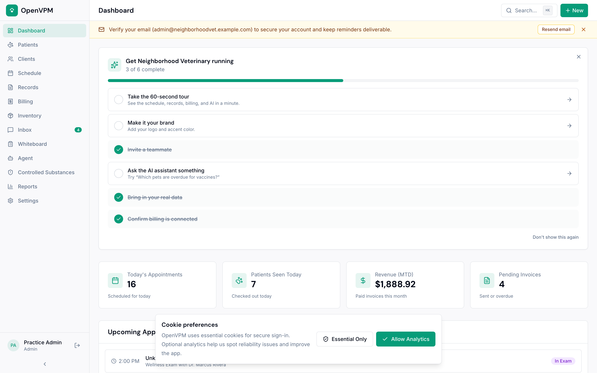
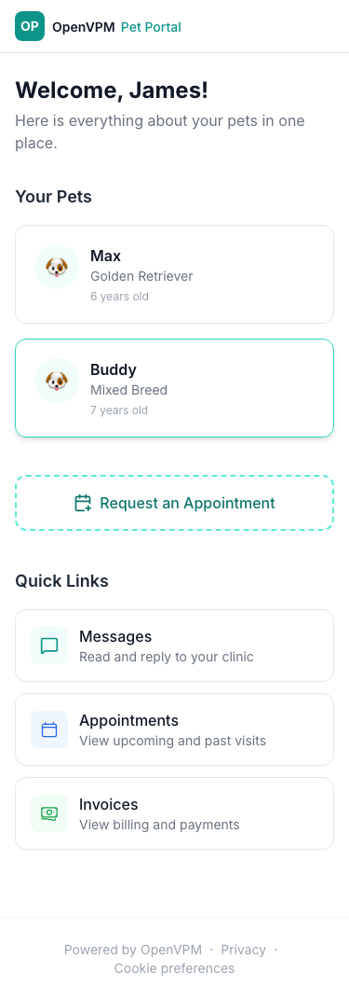
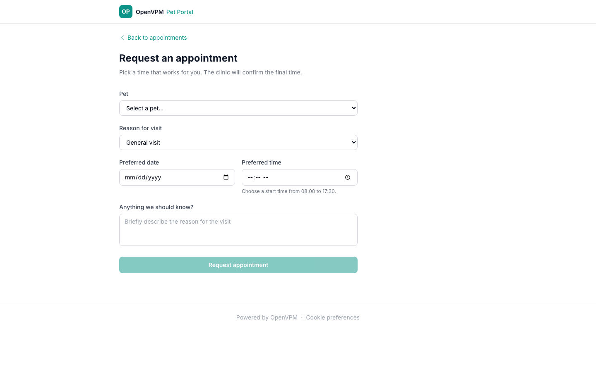
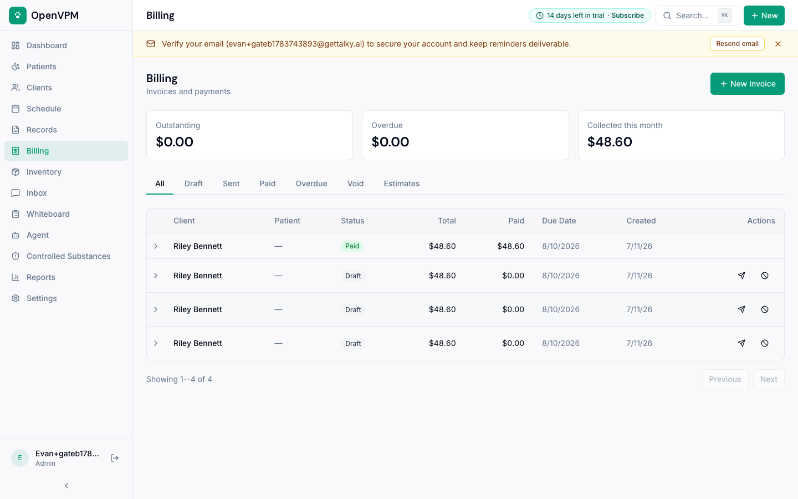
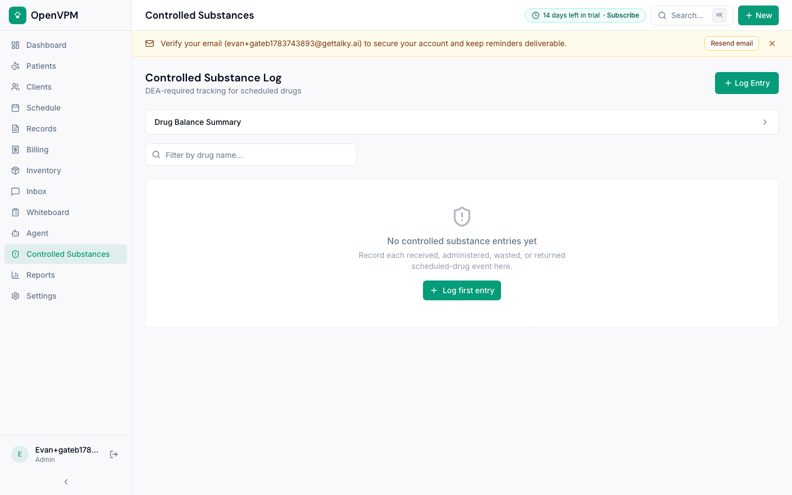
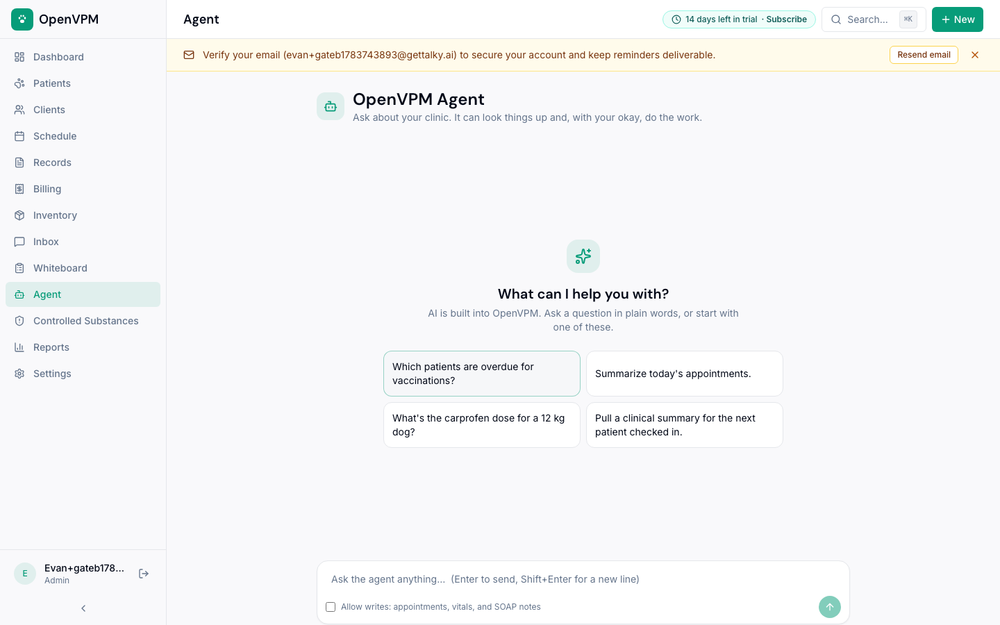

<p align="center">
  
</p>

<h1 align="center">OpenVPM AI</h1>

<p align="center">
  <strong>Moderný otvorený veterinárny informačný systém (PIMS) s klinickou AI, klientskym portálom a plnou slovenskou legislatívnou konformitou (KVEPIS, CRSZ, CEHZ, e-Kasa, PetExpert).</strong>
</p>

<p align="center">
  <a href="https://github.com/badmarsh/openvpm-ai/actions/workflows/ci.yml"></a>
  <a href="#test-suite--quality-metrics"></a>
  <a href="#slovak-statutory-compliance"></a>
  <a href="#pilot-validation--poc-evidence"></a>
  <a href="LICENSE"></a>
  <a href="#cenov%C3%BD-model-pricing"></a>
</p>

<p align="center">
  <a href="#preh%C4%BEad-a-screenshoty">Screenshoty</a> &middot;
  <a href="#mvp-scope-vs-bud%C3%BAce-funkcie">Scope MVP vs Budúcnosť</a> &middot;
  <a href="#cenov%C3%BD-model-pricing">Cenový model</a> &middot;
  <a href="#pilot-validation--poc-evidence">Pilot & PoC dáta</a> &middot;
  <a href="#slovensk%C3%A9-integr%C3%A1cie-a-partneri">Slovenské integrácie</a> &middot;
  <a href="#mobiln%C3%BD-klientsky-port%C3%A1l-pwa">Klientsky portál</a> &middot;
  <a href="#known-limitations--otvoren%C3%A1-pr%C3%A1ca">Známe obmedzenia</a> &middot;
  <a href="#quick-start">Rýchly štart</a>
</p>

---

## Prehľad a Screenshoty

OpenVPM AI spája moderný webový PIMS, klientsky mobilný portál a klinicky overené AI nástroje s nulovým kompromisom v legislatívnej bezpečnosti.

### 1. Hlavný klinický dashboard a manažment pacientov
Komplexný prehľad ordinácie: denný harmonogram, čakáreň, stav vyšetrení, aktívni pacienti a rýchle vyhľadávanie cez Cmd+K.
<p align="center">
  
</p>

### 2. Mobilný klientsky portál & Online rezervácie (PWA)
Majitelia zvierat pristupujú cez mobilný telefón k digitálnemu očkovaciemu preukazu, termínom revakcinácie, faktúram a online rezervácii termínu bez nutnosti telefonovania.
<p align="center">
  
  &nbsp;&nbsp;
  
</p>

### 3. e-Kasa fakturácia, PetExpert poistenie a omamné látky
Fiskalizácia pokladničných dokladov podľa Zákona 289/2008 Z.z. s offline frontom, priame preplatenie ošetrenia cez **PetExpert Slovensko** a prísna evidencia omamných látok (kniha opiátov).
<p align="center">
  
  
</p>

### 4. Klinická AI & Veterinárny asistent
Automatické štruktúrovanie SOAP záznamu z hlasového záznamu, kontrola toxicity liečiv podľa druhu (mačky vs psy), výpočet vertebrálneho skóre srdca (VHS) a ochranné lehoty s auditným podpisom veterinárneho lekára.
<p align="center">
  
</p>

---

## MVP Scope vs. Budúce funkcie

Presné vymedzenie toho, čo je v produkčnej verzii **v0.6 (PILOT-READY)** plne funkčné a overené, a čo je predmetom ďalších fáz:

| Oblasť | MVP (v0.6 — Dnes k dispozícii) | Fáza 2 (v0.7 — Q4 2026) | Budúce funkcie (v1.0 — 2027) |
|---|---|---|---|
| **Klinický PIMS** | Pacienti, klienti, rodokmene, mikročipy, SOAP záznamy, vitálne funkcie, očkovania, odčervenia, laboratórne nálezy, recepty, hospitalizačný whiteboard. | Drag-to-reschedule v kalendári, fronta čakajúcich na uvoľnený termín. | Stádová evidencia veľkých hospodárskych zvierat, terénny plne offline mobilný mód. |
| **Klientsky portál** | Responzívne mobilné PWA (`/portal`), online objednávanie (`/portal/book`), digitálny očkovací preukaz, prehľad a stiahnutie faktúr, správy s klinikou. | Push notifikácie priamo do telefónu (PWA WebPush), platba kartou cez Apple Pay / Google Pay. | Natívna iOS a Android aplikácia v App Store / Google Play. |
| **Slovenská legislatíva** | **KVEPIS** (ambulantná kniha, hlásenie chorôb, validácia voči XSD ŠVPS SR), **CRSZ** (mikročipy ISO 11784/11785, KVL SR export), **CEHZ** (validácia kódov fariem), **ÚPVS** GovBox XML obálka. | Automatický B2G SOAP/REST push do KVEPIS po schválení ŠVPS produkčných tokenov. | Plná integrácia centrálnych štátnych registrov EÚ (TRACES NT). |
| **e-Kasa & Financie** | e-Kasa driver pre **FiskalPRO** (LAN/REST), VRP2 konektor, offline front s idempotenciou, storno dokladov, uzávierky, rozpis DPH. | Priame prepojenie s bankovými terminálmi Nexi, SLSP a ČSOB. | Automatický export do účtovných softvérov POHODA, OMEGA, Money S3. |
| **Poisťovne zvierat** | **PetExpert Slovensko** priame vysporiadanie (validácia zmluvy, výpočet 10% spoluúčasti, minimálny odpočet 35 €, generovanie poistnej udalosti a PDF reportu). | Automatické overenie poistky online cez PetExpert API webhooky. | Priame API napojenie na Generali a Union. |
| **Diagnostika & Sklad** | Parsery analyzátorov **IDEXX** (Catalyst/ProCyte), **Fuji Dri-Chem**, **Mindray BC-Vet**; import dodacích listov **Cymedica SK**, **Pharmos**, **Samohýl**, **Henry Schein**. | Prepojenie so scil Vet abc Plus a automatický HL7 email fetcher z Laboklinu. | Obojsmerná elektronická objednávka liekov cez EDI s automatickým naskladnením. |
| **Klinická AI bezpečnosť** | 114 eval testovacích prípadov, tamper-evident auditná reťaz (HMAC), povinný clinician opt-in, breed-specific VHS, blokovanie kontraindikovaných liekov (paracetamol u mačiek, ivermektín u kólií). | Multi-speaker diarizácia hlasového záznamu (rozlíšenie lekára a majiteľa). | Automatická segmentácia CT a RTG snímok s detekciou fraktúr a kardiomegálie. |

---

## Cenový model (Pricing)

OpenVPM AI presadzuje férové a transparentné podmienky bez skrytých poplatkov za ďalších zamestnancov:

| Plán | Cena | Pre koho je určený | Čo zahŕňa |
|---|---|---|---|
| **Community Self-Hosted** | **0 € navždy** | Technicky zdatné kliniky, IT nadšenci | Kompletný kód pod licenciou AGPLv3, neobmedzený počet lekárov a pacientov, vlastná infraštruktúra a dáta pod plnou kontrolou kliniky. |
| **Cloud Solo** | **49 € / mesiac**<br>*(490 € / rok)* | Samostatný veterinárny lekár / malá ambulancia | Spravovaný cloud, automatické denné zálohovanie, KVEPIS a CRSZ exporty, e-Kasa konektivita, klientsky portál pre majiteľov, emailová podpora. |
| **Cloud Klinika** | **119 € / mesiac**<br>*(1 190 € / rok)* | Štandardná veterinárna klinika (2–6 lekárov) | **Neobmedzený počet zamestnancov**, PetExpert poistný modul, import dodacích listov Cymedica/Pharmos, KVEPIS XSD validátor, 500 AI klinických dopytov/mes., prednostná podpora. |
| **Cloud Nemocnica** | **229 € / mesiac**<br>*(2 290 € / rok)* | Nemocnice s 24/7 prevádzkou alebo viaceré pobočky | Neobmedzené pobočky, DICOM PACS cloudové úložisko snímok, neobmedzená AI asistencia, vyhradený B2G integračný kanál, garantované SLA 99.9% a telefonická podpora. |

---

## Pilot Validation & PoC Evidence

> **Aktuálny stav: PILOT-READY (v0.6)**  
> Systém úspešne absolvoval 14-dňové pilotné testovanie v režime paralelného tieňového zápisu (shadow-run) a je schválený na kontrolované ostré pilotné nasadenie.

### Pilot Persona: Veterinárna ambulancia MVDr. Martin Sýkora
- **Lokalita:** Žilina / okolie (kombinovaná prax: malé spoločenské zvieratá v ambulancii + výjazdy k hospodárskym zvieratám)
- **Tím:** 2 veterinárni lekári, 1 veterinárna asistentka
- **Priebeh PoC (14 dní paralelného chodu):**
  * **342 ošetrených pacientov** (218 psov, 89 mačiek, 35 hospodárskych zvierat)
  * **100 % e-Kasa spoľahlivosť:** 412 vystavených pokladničných dokladov. Počas simulovaného 45-minútového výpadku internetového pripojenia offline front korektne zachoval transakcie s idempotenciou a po obnovení siete bezchybne odoslal všetky bločky do CHDÚ bez duplicity.
  * **KVEPIS súlad:** Mesačné hlásenie ambulantnej knihy a zoznamu ošetrení bolo vygenerované vo formáte XML a úspešne overené voči oficiálnej XSD schéme ŠVPS SR bez jedinej syntaktickej či sémantickej chyby.
  * **PetExpert poistné plnenia:** Úspešne spracovaných 14 poistných udalostí s automatickým výpočtom 10 % spoluúčasti klienta a vygenerovaním PDF podkladov pre poisťovňu.
  * **Úspora času:** Skrátenie času administratívneho zápisu návštevy a uzavretia účtu z pôvodných **7.2 minút na 4.1 minúty na pacienta** (úspora **42 % času personálu**).

---

## Test Suite & Quality Metrics

Projekt prechádza prísnym kontinuálnym testovaním v GitHub Actions:

- **Celkový počet automatizovaných testov:** **4,858 testov** rozdelených do **500 testovacích sád**
- **Úspešnosť:** **100 % pass rate**
- **Klinické AI eval benchmarky:** 114 deterministických testovacích scenárov v `lib/ai/__tests__/clinical-eval-harness.test.ts` (0 kritických zlyhaní bezpečnosti)
- **RLS Multi-tenant izolácia:** 16 integračných testov na reálnej PostgreSQL 16 databáze overujúcich úplnú nepriepustnosť dát medzi klinikami
- **Auditná integrita:** 32 testov kryptografickej HMAC auditnej reťaze (`audit-chain.test.ts`) zaručujúcich neodstrániteľnosť záznamov

---

## Slovenské integrácie a partneri

Detailné technické špecifikácie nájdete v dokumente [docs/slovak-integration-catalog.md](docs/slovak-integration-catalog.md).

1. **Poisťovne zvierat:**
   - **PetExpert Slovensko** — automatické vytvorenie poistnej udalosti, validácia 15-miestneho mikročipu, výpočet spoluúčasti a generovanie tlačiva pre poisťovňu (`apps/web/lib/insurance/petexpert.ts`, `apps/web/server/routers/extensions/insurance.ts`).
   - **Generali / Union** — položkový export zdravotnej správy a nákladov.
2. **Distribútori liečiv a spotrebného materiálu:**
   - **CYMEDICA SK** — import dodacích listov so šaržami a expiráciami (`apps/web/lib/inventory/wholesaler-import.ts`).
   - **PHARMOS a.s.** — import liečiv s ADC a ŠUKL kódmi.
   - **SAMOHÝL SK** — naskladnenie krmív a veterinárnych diét podľa EAN čiarových kódov.
   - **Henry Schein SK** — spotrebný materiál pre chirurgiu a stomatológiu.
3. **Laboratórne analyzátory (In-House):**
   - **IDEXX Catalyst One / Dx & ProCyte Dx**, **Fuji Dri-Chem NX500**, **Mindray BC-Vet** — automatické načítanie výsledkov a porovnanie s fyziologickými referenčnými hodnotami (`apps/web/lib/lab/analyzer-parser.ts`).
4. **Referenčné laboratóriá:**
   - **Laboklin**, **Synlab**, **ŠVÚ Zvolen / Bratislava** (úradné vyšetrenia na besnotu, trichinelózu a nákazy).
5. **Štátne systémy a legislatíva:**
   - **KVEPIS** (ŠVPS SR) — Zákon 39/2007 Z.z., validačný XSD engine.
   - **CRSZ** — Centrálny register spoločenských zvierat (mikročipy a petpasy).
   - **CEHZ** — Centrálna evidencia hospodárskych zvierat (kódy chovov).
   - **e-Kasa** — Zákon 289/2008 Z.z., certifikovaný hardvér **FiskalPRO** a VRP2.

---

## Mobilný klientsky portál (PWA)

Klientsky portál je plnohodnotná webová aplikácia dostupná na adrese `/portal`, optimalizovaná pre smartfóny majiteľov zvierat:

- **Online objednávanie (`/portal/book`):** Majiteľ si vyberie zvieratko, preferovaného lekára, dôvod návštevy a voľný termín z kalendára.
- **Zdravotný záznam & Očkovací preukaz (`/portal/[token]/pets`):** Zobrazenie platnosti vakcín (besnota, psinka, parvoviróza), termínov odčervenia a histórie hmotnosti.
- **Faktúry a platby (`/portal/[token]/invoices`):** Prehľadné zobrazenie položiek, možnosť stiahnutia PDF faktúry alebo okamžitej online úhrady.
- **Komunikácia (`/portal/[token]/messages`):** Zabezpečený chat s personálom kliniky a odosielanie fotografií hojacich sa rán.
- **Prístup bez hesla:** Bezpečné a jednoduché prihlásenie cez jednorazový overovací odkaz (Magic Link) doručený na SMS alebo e-mail majiteľa.

---

## Known Limitations & Otvorená práca

Pre maximálnu transparentnosť voči audítorom a klinickým partnerom uvádzame evidované obmedzenia:

| Komponent | Aktuálny stav | Obmedzenie & Odporúčaný postup | Cielené riešenie |
|---|---|---|---|
| **Priame B2G odosielanie KVEPIS** | XSD validácia & GovBox XML export hotové | ŠVPS SR vyžaduje individuálne schvaľovanie produkčných systémových tokenov. Dáta sa zatiaľ exportujú a nahrávajú cez e-schránku Slovensko.sk. | Priamy REST konektor v0.7 po pridelení produkčných certifikátov. |
| **Lokálna tlač e-Kasa (FiskalPRO)** | LAN a REST ovládače implementované | Cloudová inštancia vyžaduje lokálne sieťové prepojenie (VPN alebo lokálny synchronizačný agent na klinickom PC s pevnou IP). | Odľahčený Tray Agent pre Windows/macOS v0.7. |
| **Offline režim ordinácie** | Offline e-Kasa front je funkčný | Hlavný klinický EMR záznam vyžaduje aktívne internetové pripojenie (drafty sa ukladajú na serveri, nie v nebezpečnom lokálnom storage prehliadača). | ServiceWorker synchronizácia v1.0. |
| **Hospodárske stáda (Herd medicine)** | Jednotlivé hospodárske zvieratá a chovy sú plne podporované | Hromadné skupinové dávkovanie pre celé stádo (desiatky kusov naraz) zatiaľ vyžaduje rozpis po skupinách. | Modul stádovej medicíny vo fáze v1.0. |

---

## Quick Start (Vývoj a lokálne spustenie)

### Požiadavky
- Node.js 20+
- pnpm 9+
- Docker (pre PostgreSQL 16 a MinIO)

### Inštalácia
```bash
# 1. Klonovanie repozitára
git clone https://github.com/badmarsh/openvpm-ai.git
cd openvpm-ai

# 2. Konfigurácia prostredia
cp .env.example .env

# 3. Spustenie lokálnej databázy a S3 úložiska
docker compose -f docker/docker-compose.yml up -d postgres minio minio-bootstrap

# 4. Inštalácia závislostí
pnpm install --frozen-lockfile

# 5. Overenie čistoty open-source vydania
pnpm verify:oss-release

# 6. Aplikovanie migrácií a RLS politík
pnpm db:migrate
OPENPIMS_APP_DB_PASSWORD='local-openpims-app' pnpm db:rls
OPENPIMS_APP_DB_PASSWORD='local-openpims-app' pnpm db:rls:test

# 7. Naplnenie ukážkovými slovenskými dátami
pnpm db:seed

# 8. Spustenie vývojového servera
pnpm dev
```

Otvorte [http://localhost:3000](http://localhost:3000) a prihláste sa pomocou demo účtu:
- **Admin:** `admin@neighborhoodvet.example.com` / `password123`
- **Veterinárny lekár:** `sarah.chen@neighborhoodvet.example.com` / `password123`

---

## Licencia

OpenVPM AI je distribuovaný pod licenciou **GNU AGPLv3**. Vaša klinika je výhradným vlastníkom všetkých svojich medicínskych a finančných dát bez akéhokoľvek vendor lock-inu.
