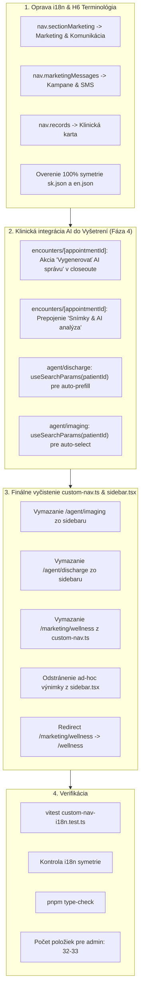

# Implementačný plán (Run 2): Konsolidácia IA, Klinické prepojenia a reštrukturalizácia navigácie v OpenVPM AI

**Baseline Commit:** `3fb64776` (alebo aktuálny merge HEAD) | **Stav:** Post-Fáza 1–3 + Fáza 5 (Quick Wins) hotové; Fáza 4 (Klinické toky & terminológia) a finálne čistenie v rozsahu tohto behu.
**Cieľ:** Dokončiť konsolidáciu informačnej architektúry (IA) a bočnej navigácie na základe auditu v `artifacts/ia-consolidation-2026-09-14/`. Zredukovať počet položiek pre rolu administrátora zo súčasných **35 na ~32**, opraviť kolízie v názvoch a sekciách (H6), prepojiť AI moduly (Snímky, Prepúšťacie správy) priamo do pracovného toku vyšetrení (`encounters`) a vyčistiť redundantné záznamy v `custom-nav.ts`.

---

## 0. Stav Codebase a rekapitulácia hotových zmien (Už implementované)

Predchádzajúce behy úspešne zrealizovali podstatnú časť reštrukturalizácie:
- [x] **Sekcia Marketing v sidebare:** Pridaná sekcia `marketing` do `sidebar.tsx` a `NavSectionId` v `custom-nav.ts`.
- [x] **Tabové vnorenie v Marketingovom štúdiu:** Vytvorený tabbar (`overview`, `calendar`, `queue`, `competitors`) v `apps/web/app/(dashboard)/marketing/page.tsx` a rozdelenie na `_marketing-studio.tsx`.
- [x] **Vnorenie Centra potlačení:** Tab `suppression` s tRPC metrikami pridaný do `apps/web/app/(dashboard)/marketing/automations/page.tsx`.
- [x] **Spätná kompatibilita a klientske presmerovania:** Vytvorené plynulé redirecty pre `/marketing/plan`, `/marketing/content-queue`, `/vet-intel`, `/marketing/suppression` a `/admin/pilot`.
- [x] **Vyčistenie Admin modulov:** Odstránené `/marketing/brand-kit`, `/admin/pilot`, `/admin/support` z `customNavItems`. Správa & Manažment má len 3 položky (`/admin`, `/settings`, `/agent`).
- [x] **Nová sekcia Preventívna starostlivosť:** Pridaná sekcia `preventive` do `sidebar.tsx` obsahujúca `/vaccinations` a `/wellness`.
- [x] **Quick Wins (Fáza 5):** 
  - Invoice status badge (`whiteboard.invoicePending`) na prevádzkovej tabuli `whiteboard/page.tsx`.
  - Vitals snapshot v karte pacienta `records/page.tsx`.
  - Banner a tlačidlo dennej uzávierky v `billing/ekasa/page.tsx`.
  - Odstránená duplicita `/whiteboard` v účtovníctve (ostáva v Recepcia & Tok).

---

## User Review Required

> [!IMPORTANT]
> **1. Korekcia prehodených kľúčov v i18n (`sectionMarketing` vs `marketingMessages`):**
> V predošlej fáze bol kľúč `nav.sectionMarketing` nastavený na `"Kampane & SMS"`, čo spôsobilo, že celá sekcia v sidebare sa volá "Kampane & SMS" namiesto "Marketing & Komunikácia". Zároveň položka `/marketing/messages` ostala `"Správy & SMS"`, čo koliduje s internou schránkou "Správy" (`/inbox`). V tomto behu prehodíme hodnoty na správne: sekcia = **"Marketing & Komunikácia"**, položka = **"Kampane & SMS"**.
>
> **2. Spätná kompatibilita URL adries pre AI moduly:**
> Pôvodné URL trasy `/agent/imaging` a `/agent/discharge` zostávajú **100% zachované a funkčné**. Odstránením z `custom-nav.ts` sa iba odľahčí bočný panel, pričom lekár k nim pristupuje priamo z vyšetrenia pacienta (`/encounters/[appointmentId]`) s automaticky predvyplneným pacientom.
>
> **3. Wellness plány de-duplikácia:**
> V `sidebar.tsx` už existuje položka `/wellness` v sekcii `preventive`. V `custom-nav.ts` zmažeme redundantnú položku `/marketing/wellness` a zabezpečíme klientsky redirect na `/wellness`, čím odstránime ad-hoc filter v `sidebar.tsx`.

---

## Rozsah prác pre tento beh (Zostávajúce úlohy)



---

### Krok 1: Oprava prekladov a H6 terminológie

Oprava chybného priradenia kľúčov a zosúladenie terminológie podľa auditu.

#### [MODIFY] [apps/web/messages/sk.json](file:///c:/Users/marek/Documents/Vet/openvpm-ai/apps/web/messages/sk.json) & [apps/web/messages/en.json](file:///c:/Users/marek/Documents/Vet/openvpm-ai/apps/web/messages/en.json)
- **`nav.sectionMarketing`**:
  - `sk.json`: `"Marketing & Komunikácia"` (oprava z "Kampane & SMS")
  - `en.json`: `"Marketing & Communications"` (oprava z "Campaigns & SMS")
- **`nav.marketingMessages`**:
  - `sk.json`: `"Kampane & SMS"` (odlíšenie od internej schránky správ)
  - `en.json`: `"Campaigns & SMS"`
- **`nav.records`**:
  - `sk.json`: `"Klinická karta"` (zjednotenie klinického pojmu podľa H6)
  - `en.json`: `"Clinical Records"`
- **`encounters.closeout.generateAiDischarge`**:
  - `sk.json`: `"Vygenerovať AI správu"`
  - `en.json`: `"Generate AI discharge"`
- **`encounters.workspace.imagingAi`**:
  - `sk.json`: `"Snímky & AI analýza"`
  - `en.json`: `"Imaging & AI analysis"`

---

### Krok 2: Klinické toky & prepojenie AI nástrojov do Vyšetrenia

Priame prepojenie AI asistentov do kontextu vyšetrovaného pacienta namiesto ich izolácie v bočnej navigácii.

#### [MODIFY] [apps/web/app/(dashboard)/encounters/[appointmentId]/page.tsx](file:///c:/Users/marek/Documents/Vet/openvpm-ai/apps/web/app/(dashboard)/encounters/[appointmentId]/page.tsx)
1. **Akcia v procese ukončenia vyšetrenia (Closeout):**
   - V sekcii klinického odovzdania / closeoutu (vedľa tlačidla `downloadDischarge`) pridať tlačidlo:
     ```tsx
     <Button variant="outline" size="sm" asChild>
       <Link href={`/agent/discharge?patientId=${appointment.patientId}&appointmentId=${appointmentId}`}>
         <Sparkles className="mr-2 h-4 w-4 text-purple-600" />
         {t("encounters.closeout.generateAiDischarge", "Vygenerovať AI správu")}
       </Link>
     </Button>
     ```
2. **Klinické skratky vyšetrenia (Snímky & RTG):**
   - V hlavičke alebo klinickom paneli pacienta doplniť tlačidlo s odkazom na DICOM/RTG vyšetrenie:
     ```tsx
     <Button variant="ghost" size="sm" asChild>
       <Link href={`/agent/imaging?patientId=${appointment.patientId}`}>
         <ImageIcon className="mr-1.5 h-4 w-4 text-primary" />
         {t("encounters.workspace.imagingAi", "Snímky & AI analýza")}
       </Link>
     </Button>
     ```

#### [MODIFY] [apps/web/app/(dashboard)/agent/discharge/page.tsx](file:///c:/Users/marek/Documents/Vet/openvpm-ai/apps/web/app/(dashboard)/agent/discharge/page.tsx)
- Načítať `patientId` z `useSearchParams()`.
- Ak je `patientId` prítomné:
  - Automaticky nastaviť `selectedPatient` načítaním z `trpc.patients.getById`.
  - Predvyplniť `petName` a `species`.

#### [MODIFY] [apps/web/app/(dashboard)/agent/imaging/page.tsx](file:///c:/Users/marek/Documents/Vet/openvpm-ai/apps/web/app/(dashboard)/agent/imaging/page.tsx)
- Zabezpečiť čítanie `patientId` z `useSearchParams()` a predvybratie pacienta pre analýzu snímky.

---

### Krok 3: Finálne vyčistenie navigácie (`custom-nav.ts` & `sidebar.tsx`)

#### [MODIFY] [apps/web/config/custom-nav.ts](file:///c:/Users/marek/Documents/Vet/openvpm-ai/apps/web/config/custom-nav.ts)
- Vymazať z `customNavItems`:
  - `/agent/imaging` (prístupné z vyšetrenia a karty pacienta)
  - `/agent/discharge` (prístupné z closeoutu vyšetrenia)
  - `/marketing/wellness` (plne nahradené `/wellness` v sekcii `preventive`)
- Počet položiek v `customNavItems` klesne zo 14 na **11 položiek**:
  - 9 položiek v `marketing`
  - 1 položka v `clinical` (`/agent/voice` - Hlasové diktovanie)
  - 1 položka v `billing` (`/billing/ekasa` - e-Kasa doklady)

#### [MODIFY] [apps/web/components/layout/sidebar.tsx](file:///c:/Users/marek/Documents/Vet/openvpm-ai/apps/web/components/layout/sidebar.tsx)
- Odstrániť ad-hoc podmienku `!(section.id === "preventive" && item.href === "/marketing/wellness")` z filtrovania položiek, keďže `custom-nav.ts` už `/marketing/wellness` neobsahuje.

#### [MODIFY] [apps/web/app/(dashboard)/marketing/wellness/page.tsx](file:///c:/Users/marek/Documents/Vet/openvpm-ai/apps/web/app/(dashboard)/marketing/wellness/page.tsx)
- Zabezpečiť bezproblémové presmerovanie na `/wellness` pre staré záložky (alebo ponechať importovaný komponent bez zmeny).

---

## Výsledná bilancia položiek navigácie (Rola Administrátor)

| Sekcia | Pôvodný stav (pred auditom) | Aktuálny stav | Stav po Run 2 |
|---|---|---|---|
| **Prehľad** (top-level) | 1 | 1 | 1 |
| **Klinika & Pacienti** | 7 | 8 (vrátane voice, imaging) | 7 (`/patients`, `/records`, `/encounters`, `/lab-results`, `/care-reminders`, `/recalls`, `/agent/voice`) |
| **Recepcia & Tok** | 5 | 5 | 5 (`/schedule`, `/waiting-room`, `/whiteboard`, `/clients`, `/inbox`) |
| **Preventívna starostlivosť** | 0 | 2 | 2 (`/vaccinations`, `/wellness`) |
| **Lekáreň & Sklad** | 2 | 2 | 2 (`/inventory`, `/controlled-substances`) |
| **Účtovníctvo & Predpisy** | 4 | 4 | 4 (`/billing`, `/statutory`, `/reports`, `/billing/ekasa`) |
| **Marketing & Komunikácia** | 0 | 9 | 9 (`/marketing`, `/reviews`, `/handouts`, `/messages`, `/website`, `/tv`, `/automations`, `/consents`, `/media`) |
| **Správa & Manažment** | 23 | 4 (vrátane discharge) | 3 (`/admin`, `/settings`, `/agent`) |
| **Spolu (Admin viditeľné)** | **~42–44** | **35** | **33 položiek** (Redukcia o ~25% oproti pôvodnému stavu!) |

---

## Verification Plan

### Automated Tests
```bash
# 1. Validácia custom navigácie a lokalizačných kľúčov
pnpm --filter @openpims/web test config/__tests__/custom-nav-i18n.test.ts

# 2. Kontrola 100% symetrie slovníkov sk.json a en.json
node -e "const en=require('./apps/web/messages/en.json'); const sk=require('./apps/web/messages/sk.json'); function diff(a,b,p=''){let r=[]; for(let k in a){const np=p?p+'.'+k:k; if(!(k in b)) r.push(np); else if(typeof a[k]==='object' && a[k]!==null && typeof b[k]==='object') r.push(...diff(a[k],b[k],np));} return r;} const mEn=diff(en,sk); const mSk=diff(sk,en); if(mEn.length||mSk.length){console.error('Mismatch!',mEn,mSk);process.exit(1);}else{console.log('Symmetry OK');}"

# 3. TypeScript type check web aplikácie
pnpm --filter @openpims/web type-check

# 4. Spustenie integračných testov dotknutých modulov
pnpm --filter @openpims/web test responsive-tables server/__tests__/marketing
```

### Manual Verification
1. **Navigačný panel (Sidebar):**
   - Skontrolovať názov sekcie Marketing: musí byť `"Marketing & Komunikácia"`, nie `"Kampane & SMS"`.
   - Skontrolovať položku pod Marketingom: musí byť `"Kampane & SMS"`, nie `"Správy & SMS"`.
   - Skontrolovať sekciu Klinika & Pacienti: záznamy sú pomenované `"Klinická karta"`, v sekcii je len Hlasové Diktovanie (Analýza Snímkov bola integrovaná do vyšetrení).
   - Skontrolovať Správa & Manažment: má presne 3 položky (`Platform Admin`, `Nastavenia`, `Agent`).
   - Skontrolovať Preventívna starostlivosť: položka Wellness plány sa nezobrazuje dvakrát.
2. **Klinický tok vyšetrenia (`/encounters/[appointmentId]`):**
   - Otvoriť ľubovoľné vyšetrenie: overiť prítomnosť odkazu na "Snímky & AI analýza" a tlačidla "Vygenerovať AI správu".
   - Kliknúť na tlačidlo: overiť prechod na `/agent/discharge?patientId=...` a overiť, že pacient a zviera sú automaticky načítaní.
3. **Spätná kompatibilita:**
   - Navštíviť priamo `/agent/imaging` a `/agent/discharge` – obe obrazovky fungujú na priamej URL bez 404.
