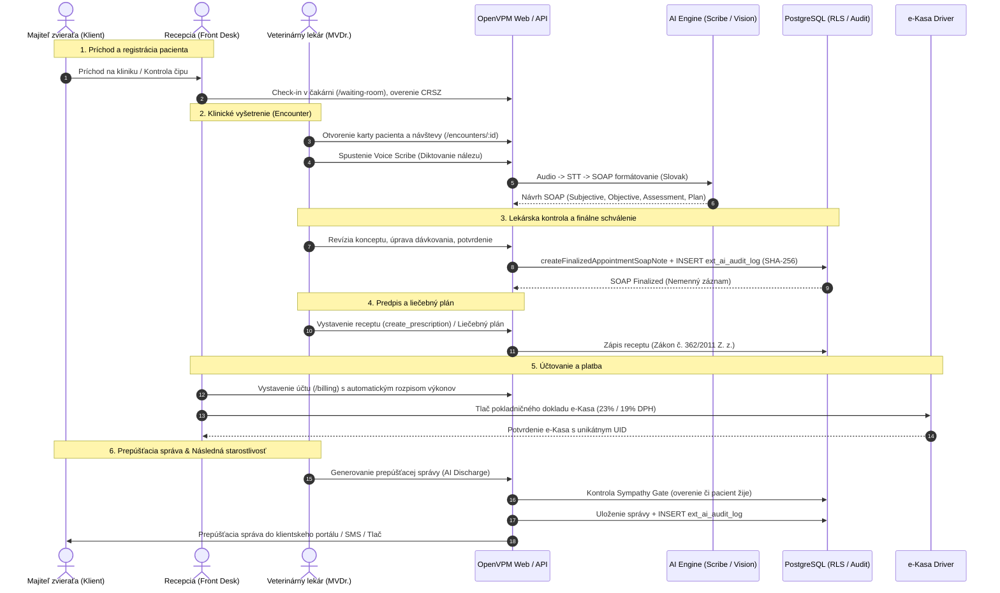

# OpenVPM AI — Clinic Pilot Workflow & State Machine

**Document version:** 1.0.0  
**Target Repository:** `badmarsh/openvpm-ai`  
**Date:** 2026-09-09  
**Status:** Primary Clinic Operational Journey (Phase 5 Deliverable)  

---

## 1. End-to-End Clinic Journey

This workflow specifies the primary day-to-day journey in a companion animal veterinary practice using OpenVPM AI.

---

## 2. Clinical Record Lifecycle State Machine

Every medical document transitions through distinct lifecycle states governed by human verification:

| State Identifier | Slovak UI Label | Clinical Meaning | Allowed Actions | Transitions To |
|---|---|---|---|---|
| `draft` | **Koncept** | Neoverený záznam alebo surový AI výstup. Môže byť upravovaný kýmkoľvek s klinickou rolou. | Editácia, prepisovanie, vymazanie | `clinician_edited_draft`, `finalized` |
| `clinician_edited_draft` | **Upravený koncept** | Koncept upravený veterinárom, avšak ešte formálne nepodpísaný. | Doplnenie sekcií, zmena plánu | `finalized` |
| `finalized` | **Schválené / Uzatvorené** | Právoplatný zdravotný záznam schválený lekárom (`clinicianConfirmed: true`). Zapísaný SHA-256 hash. | **Nemenný (Read-Only)**. Prípustné len dodatky. | `superseded` |
| `superseded` | **Nahradené dodatkom** | Pôvodný záznam nahradený opravným záznamom (`soapNoteReplacements`). Pôvodný audit trail zostáva zachovaný. | Auditné prehliadanie histórie | *(Koncový stav)* |
| `voided` | **Stornované** | Chybne vytvorený záznam stornovaný autorizovaným lekárom s uvedením zákonného dôvodu. | Auditné prehliadanie | *(Koncový stav)* |

---

## 3. Human Confirmation & Audit Contract (Sprint 9.3 Hardened)

When an AI-generated draft transitions from `draft` to `finalized`:
1. **Replay-Safe Confirmation Envelope:**
   - Review modal calls `prepareConfirmation` to issue an actor-bound, practice-bound, revision-bound envelope in `ext_clinician_confirmations` with a 15-minute TTL.
   - Alternatively, direct transactional confirmation (`clinicianConfirmed: true`) generates an inline nonced envelope in transaction.
2. **Actor Authorization:** User must have role `veterinarian` or `admin` (enforced fail-closed via `assertAgentRole()` and `requireRole()`).
3. **Optimistic Concurrency:** Current entity revision is verified against `expectedRevision` (`FOR UPDATE` row lock) and incremented upon finalization.
4. **SHA-256 Fingerprinting:**
   - $H_{\text{original}} = \text{SHA-256}(\text{rawAiDraft})$
   - $H_{\text{confirmed}} = \text{SHA-256}(\text{finalClinicianContent})$
   - $\text{wasEdited} = (H_{\text{original}} \neq H_{\text{confirmed}})$
5. **Atomic Audit Append (`appendAiAuditEvent`):**
   - Transaction-scoped advisory lock (`pg_advisory_xact_lock`) serializes per-practice writes.
   - Strictly monotonic `sequenceNumber` incremented per practice.
   - Prior event's `eventHash` linked as `previousEventHash`.
   - Canonical payload hashed with SHA-256 (`canonicalizationVersion: 1`).
   - If audit append fails, the entire clinical transaction rolls back.
