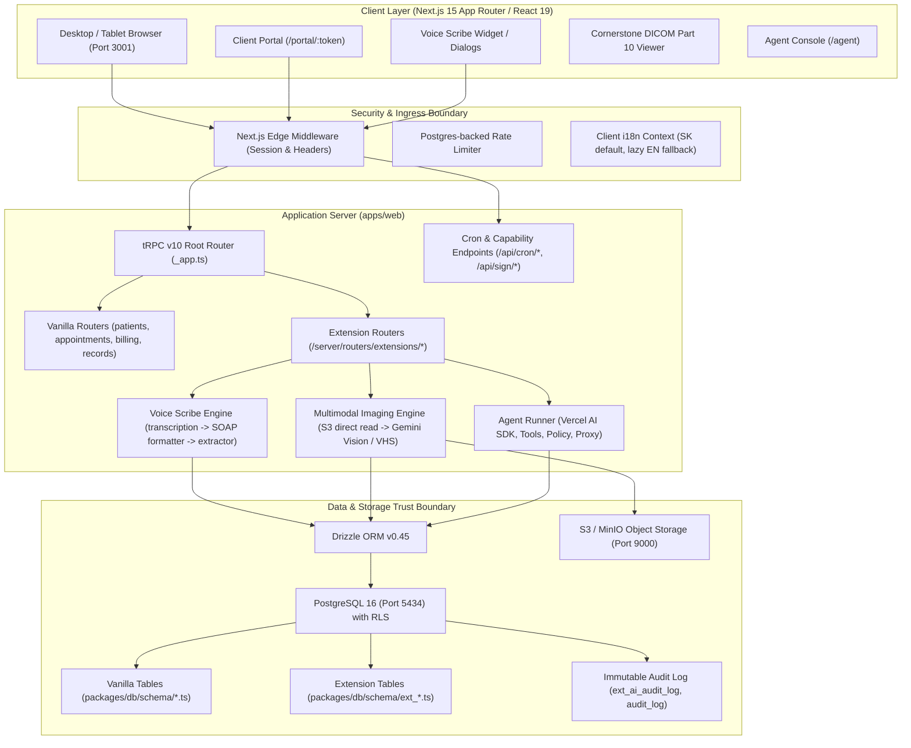

# OpenVPM AI — Pilot Readiness & Clinical AI Trust Audit

**Document version:** 1.0.0  
**Target Repository:** `badmarsh/openvpm-ai`  
**Date:** 2026-09-09  
**Status:** In-depth Pre-Implementation Audit (Phase 0)  
**Authors:** Principal Staff Engineer, Security Architect & Clinical-AI Safety Lead  

---

## 1. Executive Summary

This audit evaluates the codebase of **OpenVPM AI** (`badmarsh/openvpm-ai`) against the requirements for a production-hardened, verifiably pilot-ready veterinary Practice Information Management System (PIMS).

OpenVPM AI builds upon the open-source OpenVPM core, introducing an extensive clinical AI suite (Vercel AI SDK, Gemini/Vertex AI, Anthropic Claude, voice dictation, multimodal imaging/DICOM, automated discharge letters, and marketing engine), while adhering to Slovak veterinary regulations (Zákon č. 39/2007 Z. z., Zákon č. 362/2011 Z. z., Zákon č. 289/2008 Z. z.).

This document identifies confirmed technical controls, security boundaries, and gaps that must be closed prior to a live clinic pilot.

---

## 2. Current-State Architecture Map

### Component Breakdown
- **Web Application (`apps/web`):** Next.js 15.5 with React 19, TailwindCSS, Radix UI. Runs on port 3001. Configured with strict production-only package imports, CSP/HSTS security headers, and lazy-loaded English dictionary (`en.json` ~290 KB separated from initial bundle).
- **Database (`packages/db`):** PostgreSQL 16 with Row-Level Security (`packages/db/rls/enable-rls.sql`). Schema partitioned into vanilla upstream tables and zero-conflict extensions (`ext_ai_audit_log.ts`, `ext_statutory.ts`, `ext_voice.ts`, `ext_imaging.ts`, `ext_ekasa.ts`, `ext_marketing.ts`, `ext_support.ts`, `ext_crsz.ts`).
- **Clinical AI Engine:** Vercel AI SDK (`ai`), Google Vertex AI (Gemini), Anthropic Claude, custom inference proxy.
- **Storage Layer:** S3-compatible object store (MinIO for dev, AWS S3 / Cloudflare R2 in prod). All file access uses tenant-scoped keys and presigned capability URLs.

---

## 3. Trust Boundaries & Data-Flow Map

1. **Internet / Browser to Middleware:**
   - Public capability endpoints (`/portal/:token`, `/sign/:token`, `/capture/:token`) use high-entropy unguessable capability tokens.
   - Dashboard routes require authenticated session with cookie `authjs.session-token`.
2. **Middleware to tRPC / Route Handlers:**
   - User identity (`ctx.user.id`), practice scope (`ctx.practiceId`), and role (`ctx.user.role`) are injected into `protectedProcedure`.
   - `practiceId` is strictly extracted from session context, NEVER trusted from request body.
3. **Application Server to Postgres (RLS):**
   - Database connection executes `SET LOCAL app.current_practice_id = :practiceId`.
   - Least-privilege role `openpims_app` cannot alter tables or read across tenants.
4. **AI Generation to Medical Record (Clinical Safety Gate):**
   - Raw AI draft is returned to the client browser in a `draft` state.
   - Writing to official clinical records (`soapNotes`, `dischargeReports`, `prescriptions`) strictly requires `clinicianConfirmed: true` and non-empty clinician ID.
   - Hashes (`originalDraftHash` vs `confirmedContentHash`) are calculated via SHA-256 and written to `ext_ai_audit_log`.

---

## 4. Existing Security Controls (Confirmed in Code)

| Control | Implementation Location | Verified Status |
|---|---|---|
| **RLS Isolation** | `packages/db/rls/enable-rls.sql`, `packages/db/test-rls.ts` | Active (tested against real PG) |
| **Strict i18n Symmetry** | `apps/web/messages/sk.json`, `en.json` | 4,902 / 4,902 keys identical |
| **Sympathy Flow Gate** | `apps/web/server/routers/extensions/_safety.ts` | Blocks marketing/reminders for deceased |
| **Controlled Substances Role Gate** | `apps/web/lib/agent/tools.ts` (`getControlledSubstancesLogTool`) | Restricted to veterinarian / admin |
| **GDPR 24h Audio Retention** | `apps/web/app/api/cron/voice-audio-retention/route.ts`, `retention.ts` | Registered hourly in `vercel.json` |
| **AI Audit Trail Schema** | `packages/db/schema/ext_ai_audit_log.ts` | Table deployed in Postgres |
| **App Router Export Safety** | `apps/web/app/(dashboard)/agent/page.tsx` | Cleaned (zero illegal page exports) |
| **Monorepo Type Checking** | Root `turbo type-check` | 0 errors in `@openpims/web`, `@openpims/db`, `@openpims/email` |
| **Production Build** | `turbo build` (`apps/web`) | Successfully compiled (104 kB shared JS) |

---

## 5. Confirmed Gaps & Weaknesses

1. **Audit Record Persistence Decoupling:** While `ext_ai_audit_log` table exists and `buildAiConfirmationAuditTrail` helper is unit-tested, mutations in `apps/web/server/routers/extensions/imaging.ts`, `voice.ts`, and `discharge.ts` do not yet execute `db.insert(extAiAuditLog)`.
2. **Missing Standalone Hash Chain Verification Script:** There is no CLI command (e.g. `pnpm audit:verify-ai`) to systematically crawl and verify SHA-256 chain integrity across audit records.
3. **Agent Loop Cancellation & Budgeting:** `runAgent` in `apps/web/lib/agent/runner.ts` enforces `MAX_ITERATIONS = 12` and `MAX_OUTPUT_TOKENS = 4096`, but lacks an explicit runtime wall-clock timeout (e.g., 30 seconds) and tool-call cost limits.
4. **Deterministic Evaluation Harness:** Existing tests (`tools.test.ts`, `runner.test.ts`) test tool wiring, but there is no dedicated provider-independent synthetic benchmark for Slovak clinical terminology, negation ("bez zvracania"), and brachycephalic VHS intervals.
5. **Formal Authorization Matrix:** Role permissions are implemented in individual routers via `requireRole(...)`, but lack a single canonical reference document (`docs/authorization-matrix.md`).

---

## 6. Prioritized Risk Register

| ID | Category | Description | Severity | Likelihood | Mitigation |
|---|---|---|---|---|---|
| **R-01** | Clinical AI | AI mutations finalized without recording SHA-256 hash in `ext_ai_audit_log` | **High** | Medium | Wire `extAiAuditLog` inserts directly into `discharge.ts`, `voice.ts`, `imaging.ts` on finalization. |
| **R-02** | Security | Front-desk or technician executing unauthorized prescription via raw tRPC call | **High** | Low | Add explicit `requireRole("veterinarian", "admin")` check on `createPrescriptionTool` and prescription procedures. |
| **R-03** | Operations | Agent runner getting stuck in infinite loop or exceeding LLM cost during complex prompt | **Medium** | Medium | Implement `AbortSignal` with 30s timeout and tool budget counter in `runner.ts`. |
| **R-04** | Compliance | Audio retention cron failing silently on missing environment variables | **Medium** | Low | Add heartbeat telemetry and automated failure alerting in `/api/cron/voice-audio-retention`. |
| **R-05** | Clinical Safety | Falsely diagnosing cardiomegaly in brachycephalic dog breeds (Boxer, French Bulldog) | **Medium** | Low | Breed-specific VHS reference ranges integrated into `vhs-calculator.ts` (Already addressed in PR #6). |

---

## 7. Assumptions Requiring Legal / Clinical Review

1. **Zákon č. 362/2011 Z. z. (OPL):** Electronic logging of controlled substances must be validated by the clinic's designated supervising veterinarian before replacing paper registers.
2. **e-Kasa Integration (Zákon č. 289/2008 Z. z.):** Physical chránené dátové úložisko (CHDÚ) / certified fiscal printer connection must be tested on site with the clinic's hardware.
3. **GDPR Audio Deletion Window:** 24-hour purge is appropriate for dictation audio, provided transcripts are safely committed to the medical record prior to deletion.
