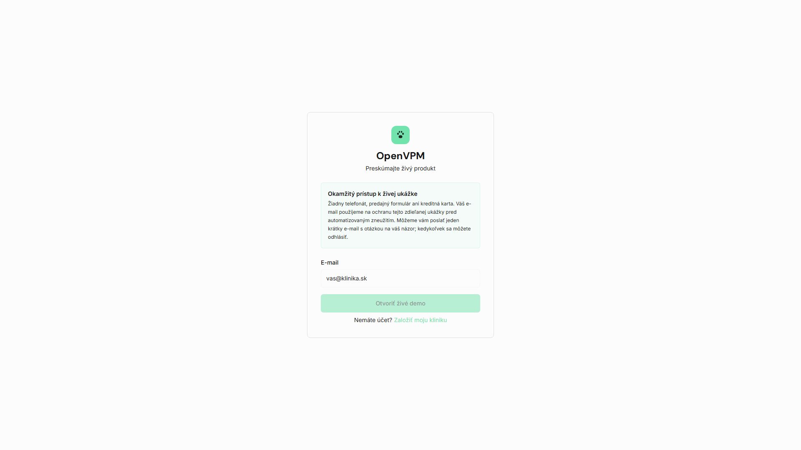
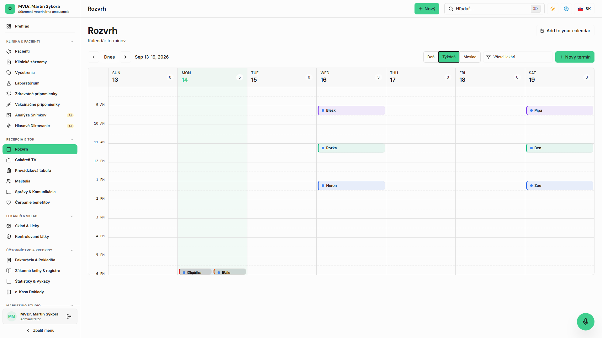
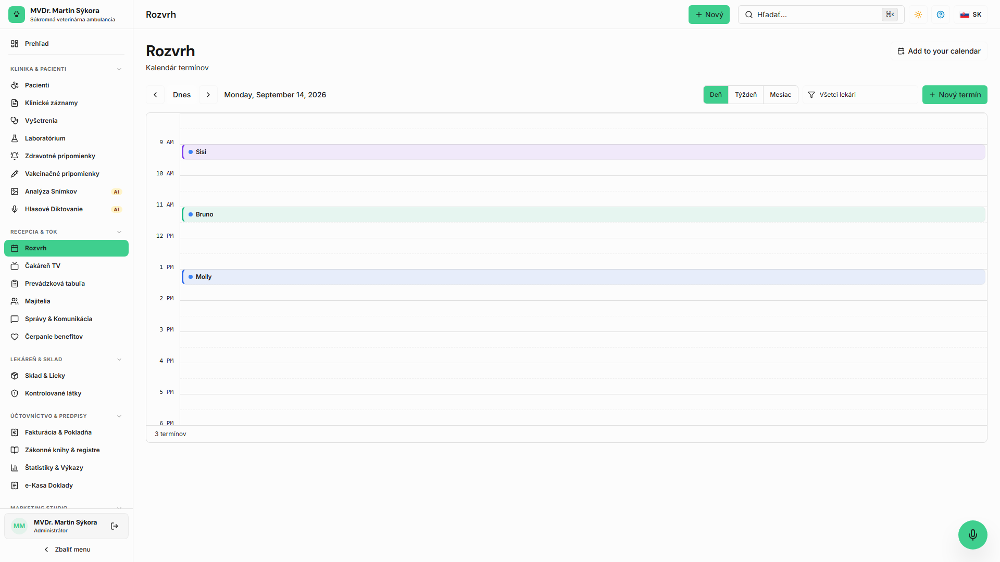
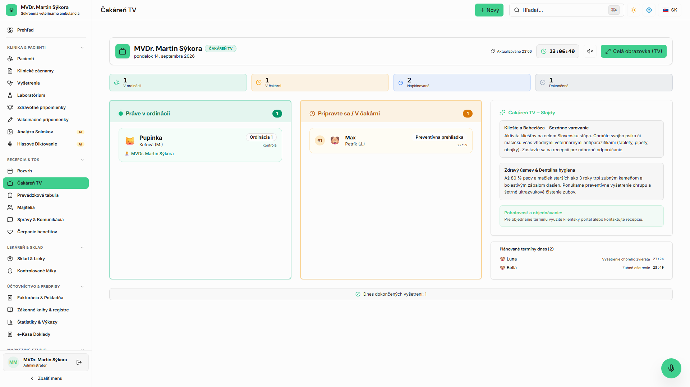
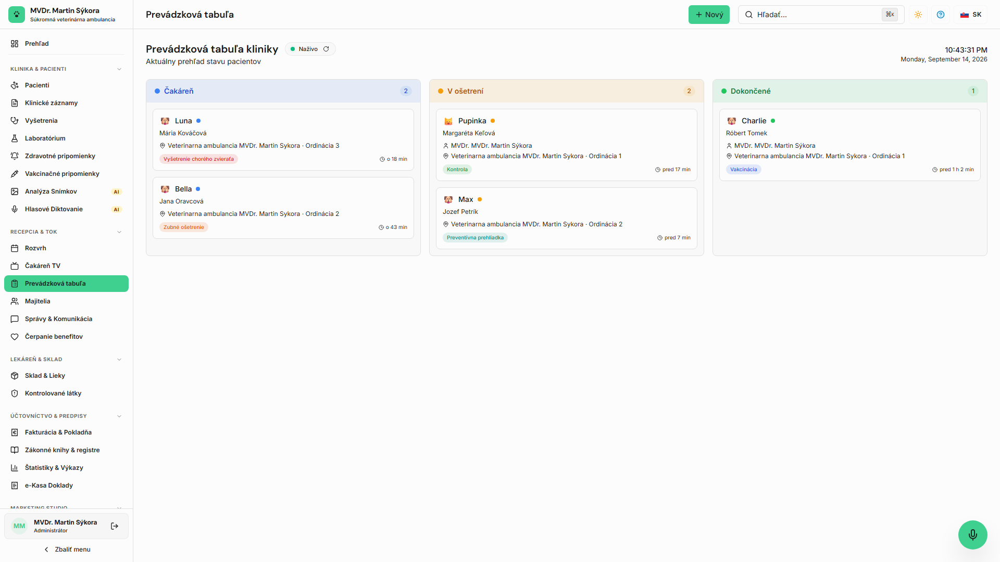
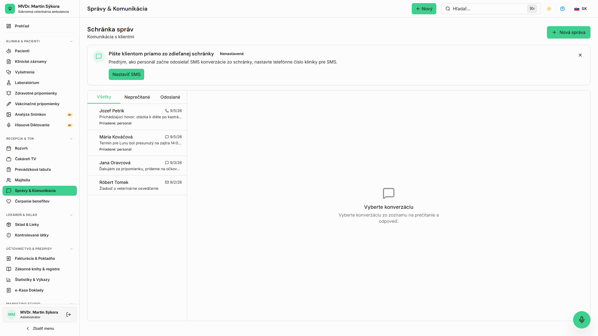

<!-- Outline ID: ba969e88-27b4-4d4f-a2ea-16fcd4d02e02 | URL: https://outline.dev.significa.sk/doc/1-zaciname-s-openvpm-ai-qzYh7UQqJ8 -->
# 🚀 1. Začíname s OpenVPM AI

Vítajte v používateľskej príručke systému **OpenVPM AI** — moderného veterinárneho informačného systému (PIMS) navrhnutého pre potreby slovenských veterinárnych ambulancií a kliník. Táto kapitola vás prevedie prvým prihlásením, rolami personálu a efektívnym riadením denného chodu ambulancie.

---

## 1. Prvé prihlásenie do systému

Prístup do systému je zabezpečený prostredníctvom webového prehliadača (odporúčaný Google Chrome, Mozilla Firefox alebo Apple Safari).

1. Otvorte URL adresu vašej klinickej inštancie (napr. `https://app.openvpm.sk` alebo lokálnu IP adresu servera).
2. Zadajte pridelený pracovný e-mail a heslo.
3. Pri prvom prihlásení v cloudovom prostredí je vyžadované overenie e-mailovej adresy kliknutím na odkaz doručený do schránky.
4. Po prihlásení sa zobrazí denný prehľad ambulancie.

> [!NOTE] Pre rýchle vyhľadávanie v celom systéme (pacienti, majitelia, lieky, faktúry) kedykoľvek stlačte klávesovú skratku **Cmd + K** (macOS) alebo **Ctrl + K** (Windows).

---

## 2. Roly personálu a prístupové oprávnenia

Systém OpenVPM AI striktne oddeľuje kompetencie jednotlivých členov tímu podľa veterinárnej legislatívy a zásady minimálnych oprávnení (*least privilege*):

| Rola v systéme | Slovenský názov | Kľúčové právomoci | Obmedzenia a bezpečnostné limity |
|----------------|-----------------|-------------------|----------------------------------|
| `admin`        | **Správca praxe** | Úplná konfigurácia kliniky, správa používateľov, cenníky, šablóny, daňové nastavenia, auditný log | Bez obmedzení                    |
| `veterinarian` | **Veterinárny lekár** | Plná klinická autorita: zápis do zdravotnej karty (SOAP), podpisovanie nálezov, predpisovanie Rx liekov, výdaj a evidencia OPL, e-Kasa | Nemôže meniť systémové nastavenia organizácie |
| `technician`   | **Veterinárny asistent / technik** | Príjem zvierat, záznam vitálnych funkcií a váhy, príprava návrhov záznamov, podávanie liekov podľa pokynu lekára | **Zákaz prístupu k OPL**, nemôže potvrdzovať diagnózy ani vystavovať recepty |
| `front_desk`   | **Recepcia**    | Plánovanie kalendára, registrácia majiteľov a pacientov, vystavovanie faktúr a bločkov e-Kasa | Žiadny prístup k OPL, bez možnosti klinických zápisov |
| `viewer`       | **Prehliadajúci** | Náhľad na vybrané štatistiky a harmonogram | Prístup len na čítanie           |
| `client`       | **Klient (portál)** | Prístup do klientskeho portálu cez jednorazový zabezpečený token | Prístup len k vlastným zvieratám a dokladom |

> [!IMPORTANT] Všetky bezpečnostné pravidlá rolí sú vynucované na serverovej vrstve (tRPC a databázové RLS). Vizuálne skrytie tlačidiel v rozhraní je len ergonomickým prvkom, nie bezpečnostnou hranicou.

---

## 3. Denný prehľad a harmonogram (`/schedule`)

Denný modul na adrese `/schedule` a hospitalizačná tabuľa na adrese `/whiteboard` zabezpečujú hladký prechod pacienta ambulanciou bez zbytočného čakania:

1. **Harmonogram návštev (**`**/schedule**`**):**
   * Prehľad objednaných pacientov podľa lekárov a vyšetrovní.
   * Kliknutím na voľné časové okno vytvoríte novú rezerváciu s výberom klienta, pacienta a dôvodu návštevy.
   * Možnosť prepínania denného, týždenného a stĺpcového zobrazenia pre jednotlivých lekárov.

2. **Príjem pacienta (Check-in) a čakáreň (**`**/waiting-room**`**):**
   * Po príchode majiteľa do čakárne recepcia označí návštevu ako **Prítomný v čakárni (Checked In)**.
   * Modul čakárne poskytuje prehľadný rad čakajúcich zvierat s časom ich príchodu.

3. **Hospitalizačná a ordinačná tabuľa (**`**/whiteboard**`**):**
   * Poskytuje lekárom a asistentom okamžitý prehľad o tom, kto sa nachádza v čakárni, kto je na vyšetrovni a kto čaká na odchod domov.
   * Zmena stavu prebieha jedným kliknutím: *Čakáreň → Vyšetrenie → Hospitalizácia / Zákrok → Pripravený na prepustenie*.

4. **Ukončenie návštevy:**
   * Po dokončení klinického záznamu lekár uzavrie návštevu, čím sa automaticky pripraví podklad pre fakturáciu a e-Kasu na recepcii.

---

## 4. Interná pošta a notifikácie personálu (`/inbox`)

Pre plynulú komunikáciu medzi recepciou, lekármi a asistentmi slúži vstavaný poštový priečinok ambulancie:

* Prehľad prichádzajúcich správ z klientskeho portálu a SMS odpovedí od majiteľov.
* Interné pripomienky k hospitalizovaným pacientom a plánovaným zákrokom.
* Systémové upozornenia na kritické laboratórne výsledky a zákonné lehoty.

