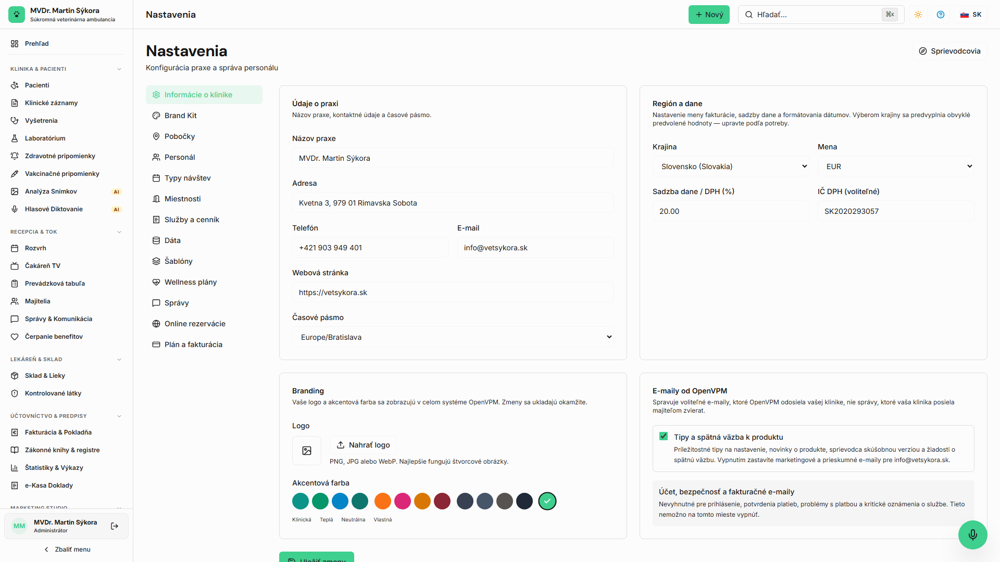

<!-- Outline ID: 6cd936d0-a577-472e-9c83-76fd507974bc | URL: https://outline.dev.significa.sk/doc/10-administratorske-nastavenia-kliniky-4FbZ750jB9 -->
# ⚙️ 10. Administrátorské nastavenia kliniky

Modul **Nastavenia** (`/settings`) predstavuje centrálny riadiaci a konfiguračný panel celej veterinárnej praxe. Plný prístup ku všetkým konfiguračným parametrom má výhradne rola **Správca praxe** (`admin`); rola **Veterinárny lekár** (`veterinarian`) má štandardne prístup na čítanie kľúčových klinických číselníkov a šablón.

---

## 1. Štruktúra nastavení ambulancie

Administrácia systému je organizovaná do logických, prehľadných sekcií prístupných z bočného menu alebo priamo cez záložky na stránke `/settings`:

* **Informácie o praxi (`/settings`):** Oficiálny obchodný názov kliniky, identifikačné údaje (IČO, DIČ, IČ DPH), sídlo a korešpondenčná adresa, kontaktný telefón a e-mail, časové pásmo a nahrávanie grafického loga pre tlačové hlavičky faktúr, lekárskych správ a receptov.
* **Používatelia a roly (`/settings/users`):** Pozývanie zamestnancov e-mailom, prideľovanie a správa používateľských rolí (`admin`, `veterinarian`, `technician`, `front_desk`, `viewer`), okamžitá aktivácia a blokovanie prístupov s uchovaním auditnej stopy.
* **Služby a produkty (`/settings/services`):** Katalóg veterinárnych úkonov, anestéziologických a chirurgických procedúr, liečiv a zdravotníckeho materiálu vrátane predvolených sadzieb DPH a prepojenia na skladovú evidenciu.
* **Šablóny dokumentov (`/settings/templates`):** Preddefinované klinické texty pre štruktúrované SOAP záznamy, prepúšťacie správy, receptúrne formuláre, operačné protokoly a klientske informované súhlasy.
* **Pravidlá upomienok a automatizácie (`/automations`):** Riadenie automatických preventívnych pripomienok, očkovacích kalendárov a bezpečnostného dohľadu *Clinical Guardian*.
* **e-Kasa konfigurácia (`/billing/ekasa`):** Výber a parametrizácia certifikovaného fiškálneho riešenia (FiskalPRO LAN / VRP2 Cloud), nahratie autentifikačného balíčka z Finančnej správy SR a diagnostika online/offline komunikácie.
* **Umelá inteligencia a modely (`/settings/ai`):** Konfigurácia AI providerov, výber jazykových a vizuálnych modelov, mapovanie klinických funkcií a správa šifrovaných API kľúčov.
* **Predplatné a fakturácia:** Správa cloudového plánu OpenVPM AI a prepojenie platobnej brány Stripe Connect.

---

## 2. Správa personálu a bezpečnostné zásady

1. V sekcii `Nastavenia → Používatelia` kliknite na tlačidlo **Pozvať člena tímu**.
2. Zadajte pracovný e-mail zamestnanca a zvoľte rolu zodpovedajúcu jeho klinickým a prevádzkovým kompetenciám.
3. Pozvanému pracovníkovi systém automaticky odošle jednorazový overovací odkaz na nastavenie bezpečného hesla.
4. **Ukončenie pracovného pomeru:** Pri odchode zamestnanca zvoľte **Deaktivovať účet**. Prístup sa okamžite zablokuje, avšak všetky jeho historické podpisy, záznamy v kartách pacientov a fiškálne pohyby zostanú legislatívne nedotknuté a plne auditovateľné.

> [!NOTE]
> V klinickom prostredí nikdy nepoužívajte generické zdieľané kontá (napr. spoločný účet „recepcia@klinika.sk“). Každý člen personálu musí mať vlastné menné prihlasovacie údaje kvôli právnej zodpovednosti a auditu úkonov podľa Zákona č. 39/2007 Z. z.

---

## 3. Konfigurácia AI a správa modelov (`/settings/ai`)

Sekcia **AI Nastavenia** poskytuje vedeniu kliniky plnú kontrolu nad tým, aké modely umelej inteligencie a externí poskytovatelia sú v ambulancii nasadení.

### 3.1 Podporovaní poskytovatelia (AI Providers)

Systém umožňuje flexibilné pripojenie a kombináciu viacerých poskytovateľov:

1. **Google Vertex AI / Gemini API:** Primárny poskytovateľ pre rýchle klinické uvažovanie, štruktúrovanie SOAP nálezov a multimodálnu diagnostiku.
2. **Alibaba Cloud / AliProxy (DashScope):** Špecializovaný poskytovateľ pre pokročilú medicínsku vizualizáciu, generovanie edukačných videí a spracovanie obrazových dát.
3. **OpenRouter & Vlastné OpenAI-kompatibilné proxy (`AI_BASE_URL`):** Možnosť nasadenia lokálnych open-source modelov alebo privátnych cloudových inference klastrov v súlade so striktnými požiadavkami na dátovú suverenitu.

### 3.2 Používateľské rozhranie ModelPicker

Výber modelov v administrácii je zabezpečený komponentom **ModelPicker**:
* **Interaktívny vyhľadávací combobox:** Umožňuje okamžité fulltextové vyhľadávanie medzi desiatkami dostupných modelov.
* **Kategorizácia a odznaky (Badges):** Modely sú vizuálne rozlíšené podľa schopností — textové a reasoning modely, multimodálne (Vision), modely na generovanie obrázkov a videí.
* **Plynulá navigácia:** Rozhranie obsahuje pomocné navigačné tlačidlá na jednoduché listovanie v zoznamoch modelov bez zasekávání dropdownu.
* **Dynamické načítanie (`Fetch Models`):** Po zadaní a uložení platného API kľúča vie systém cez tRPC procedúru načítať aktuálny zoznam podporovaných modelov priamo z API providera.
* **Test spojenia (`Test Connection`):** Tlačidlo okamžite otestuje validitu kľúča a odozvu endpointu bez nutnosti opustiť stránku nastavení.

### 3.3 Veterinárne mapovanie modelov pre klinické úlohy

OpenVPM AI umožňuje priradiť optimálny model pre každú konkrétnu úlohu na klinike:

| Klinická / Prevádzková funkcia | Predvolený model | Provider | Dôvod voľby a charakteristika |
| :--- | :--- | :--- | :--- |
| **Klinický asistent & Copilot** | `gemini-3.8-flash` | Google | Blesková odozva (< 800 ms), precízne dodržiavanie štruktúry SOAP a nulová miera halucinácií pri dávkovaní. |
| **RTG a vizuálna diagnostika** | `gemini-3.1-pro` / `qwen-vl-max` | Google / Alibaba | Vysoké rozlíšenie, presné meranie indexov (VHS, Norbergov uhol) a citlivá detekcia fraktúr a cudzích telies. |
| **Hlasové diktovanie (Voice SOAP)** | `gemini-3.8-flash` | Google | Odolnosť voči akustickému šumu v ambulancii a perfektné porozumenie slovenskej veterinárnej terminológii. |
| **Parser laboratórnych nálezov** | `gemini-3.8-flash` | Google | Okamžitá extrakcia hematologických a biochemických tabuliek z PDF/skenov do štruktúrovaných hodnôt. |
| **Medicínske ilustrácie** | `qwen-image-3.0` | Alibaba | Tvorba anatomických a patologických náčrtov pre lepšie porozumenie chovateľom. |
| **Edukačné klientske videá** | `wan3.0-video` | Alibaba | Generovanie krátkych inštruktážnych klipov pooperačnej starostlivosti (napr. toaleta rany, podávanie tabliet). |
| **Marketingové a osvetové texty** | `gemini-3.8-flash` | Google | Príprava článkov na web a príspevkov na sociálne siete pri dodržaní veterinárnej etiky. |
| **Hlbšia analýza (AI Konzílium)** | `gemini-3.1-pro` | Google | Deep Thinking režim pre zložité diferenciálne diagnózy a multiorgánové zlyhania. |

---

## 4. Bezpečnosť API kľúčov a kryptografická ochrana

Všetky citlivé prístupové kľúče k externým poskytovateľom podliehajú prísnemu bezpečnostnému protokolu:

* **Šifrovanie v PostgreSQL (AES-256-GCM):** API kľúče sa do databázy (`ext_ai_settings`) ukladajú výhradne v zašifrovanej podobe vo formáte `v1:<iv>:<tag>:<ciphertext>`. Šifrovací kľúč je odvodený pomocou SHA-256 z privátneho tajomstva `NEXTAUTH_SECRET` alebo explicitného `AI_SETTINGS_ENCRYPTION_KEY`.
* **Klientske maskovanie:** Kľúče sa nikdy neposielajú na frontend v čitateľnej podobe. V používateľskom rozhraní administrátor vidí iba bezpečnostnú masku (napr. `••••••••abcd`).
* **Ochranné spracovanie chýb (Graceful Error Handling):** Ak dôjde k nesúladu šifrovacích kľúčov (napríklad po obnove zálohy databázy z iného prostredia s iným tajomstvom), systém nezlyhá s fatálnou chybou 500. Namiesto toho bezpečne nahlási potrebu opätovného zadania kľúča a umožní klinike pokračovať v práci.

> [!WARNING]
> Nikdy nezdieľajte produkčné API kľúče cez nezabezpečené kanály. V prípade podozrenia na únik kľúča vykonajte jeho okamžitú rotáciu v konzole poskytovateľa a následne aktualizujte hodnotu v rozhraní OpenVPM AI.

---

## 5. Prepojenie na modul Automatizácií (`/automations`)

Nastavenia kliniky úzko spolupracujú s centrálnym modulom **Automatizácie**:
* **Klinické automatizácie:** Správa pravidiel bezpečnostného dohľadu *Clinical Guardian*, kontrola nebezpečných liekových interakcií a monitorovanie zákonných lehôt (besnota, ochranné lehoty mäsa a mlieka).
* **Klientske automatizácie:** Konfigurácia automatizovaných zákazníckych ciest (očkovacie kampane, follow-up po zákrokoch, reaktivácia pacientov) a prísne dodržiavanie pravidiel *Sympathy Gate* a nočného pokoja (*Quiet Hours*).