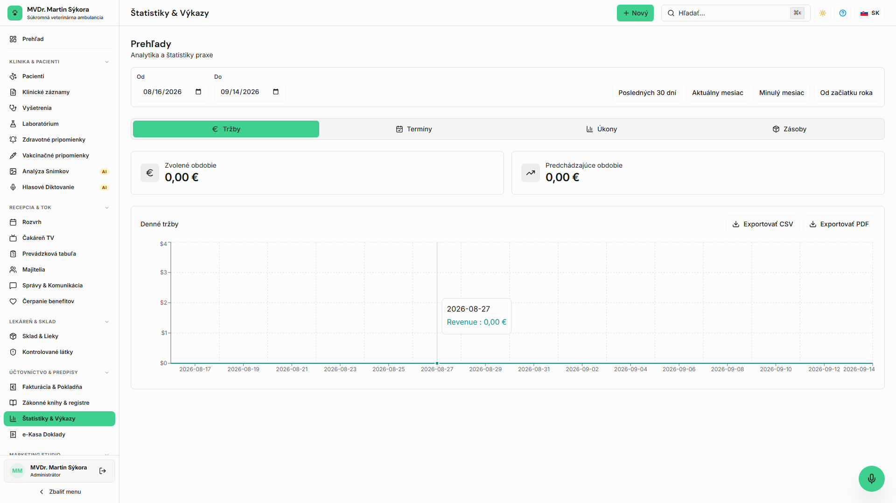

<!-- Outline ID: 9827e50e-f805-4e2a-bb84-d5b0aba6c729 | URL: https://outline.dev.significa.sk/doc/11-financne-a-prevadzkove-reporty-uxILviPuwm -->
# 📊 11. Finančné a prevádzkové reporty

Sekcia **Reporty** (`/reports`) poskytuje vedeniu kliniky finančné, prevádzkové a legislatívne prehľady v reálnom čase. Prístup je vyhradený pre roly **Správca praxe** a **Veterinárny lekár**.

---

## 1. Finančné reporty a tržby

* **Celkové tržby:** Súčet uhradených faktúr a e-Kasa dokladov za zvolené obdobie (deň, týždeň, mesiac, rok alebo vlastný rozsah).
* **Porovnanie s predchádzajúcim obdobím:** Automatické porovnanie rastu tržieb v percentách aj v absolútnej hodnote.
* **Rozpad podľa foriem úhrady:** Pomer platieb v hotovosti, platobnou kartou (terminál), bankovým prevodom a cez online klientsky portál.
* **Výkonnosť služieb a produktov:** Prehľad najziskovejších zákrokov a najpredávanejších liekov a veterinárnych diét.

---

## 2. Prevádzkové reporty ambulancie

* **Vyťaženosť lekárov:** Počet ošetrených pacientov a odpracovaných hodín na jednotlivých veterinárnych lekárov.
* **Štatistika termínov:** Pomer úspešne dokončených návštev, zrušených termínov a **miera neprítomnosti (No-Show rate)**.
* **Obrátkovosť zásob a exspirácie:** Zoznam liekov blížiacich sa k exspirácii alebo klesajúcich pod minimálnu skladovú hladinu.

---

## 3. Legislatívne reporty pre kontrolné orgány

Tento modul generuje podklady pre kontroly Štátnej veterinárnej a potravinovej správy SR (ŠVPS SR):

* Súhrn zaočkovaných zvierat proti besnote a stav ich odoslania na RVPS.
* Evidencia podaných liekov s ochrannými lehotami pri hospodárskych zvieratách.
* Kvartálny a ročný obrat omamných a psychotropných látok (OPL) pre štátny dozor.

> ⚠️ **Dôležité:** **EXPORT DO CSV VS. PDF:** Pre úradné a daňové účely vždy používajte export do **CSV**, ktorý garantuje presné zachovanie slovenskej diakritiky (č, š, ž, ľ, ä) a umožňuje import do účtovných softvérov (POHODA, OMEGA, KROS).