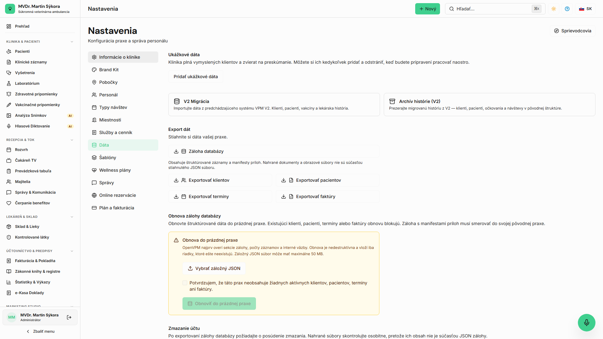

<!-- Outline ID: 70534d54-e45e-439b-b971-11dc8feed080 | URL: https://outline.dev.significa.sk/doc/13-sprava-dat-exporty-a-zalohy-ZB2OQGfKYh -->
# ☁️ 13. Správa dát, exporty a zálohy

Zásadou OpenVPM AI je **nulový vendor lock-in** — klinika je výhradným a nespochybniteľným vlastníkom všetkých svojich medicínskych, pacientskych a účtovných údajov.

---

## 1. Možnosti exportu údajov

Všetky exportné nástroje nájdete v `Nastavenia → Dáta`:

* **Exporty tabuliek do CSV:** Okamžité stiahnutie zoznamu klientov, pacientov, termínov, faktúr a skladových zásob v tabuľkovom formáte kompatibilnom s Excelom.
* **Kompletná štruktúrovaná JSON záloha:** Kliknutím na **Exportovať zálohu databázy** stiahnete celú prax v jednom súbore: každý pacient, anamnéza, SOAP záznam, laboratórne výsledky, recepty, očkovania a audity.
* **Fiškálny auditný export e-Kasy:** Dávkový export pokladničných dokladov pre účtovníka vrátane OKP, PKP a rozpadu DPH.

---

## 2. Obnova zo zálohy (Restore)

Záložný JSON súbor je možné kedykoľvek obnoviť do novej alebo vyčistenej inštancie OpenVPM AI. Proces obnovy kontroluje integritu záznamov, nikdy neprepíše novšie záznamy a rešpektuje väzby medzi majiteľmi a pacientmi.

---

## 3. Odstránenie demo dát pred ostrou prevádzkou

Skúšobné inštalácie obsahujú ukážkové dáta pre zoznámenie sa so systémom. Pred začiatkom reálnej prevádzky prejdite do `Nastavenia → Dáta → Odstrániť vzorové dáta`. Systém vyčistí databázu a pripraví čisté prostredie pre import vašich reálnych pacientov.