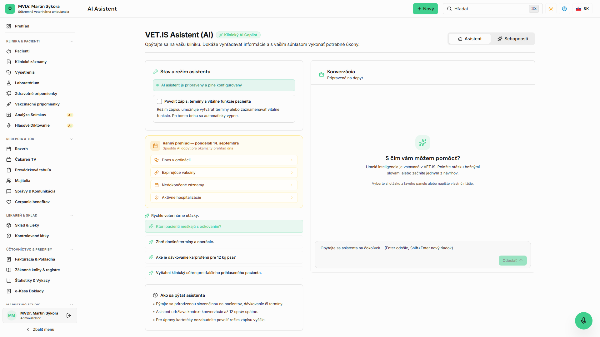

<!-- Outline ID: 6f172196-0044-4901-9db6-b18b14215e41 | URL: https://outline.dev.significa.sk/doc/14-prirodzena-komunikacia-s-ai-asistentom-j4HhA3yJL2 -->
# 🤖 14. Prirodzená komunikácia s AI asistentom

Modul **Klinický AI asistent** (`/agent`) poskytuje veterinárnym lekárom a personálu ambulancie inteligentného partnera na rýchle vyhľadávanie v kartotéke, prípravu konceptov lekárskych správ a riešenie náročných diferenciálno-diagnostických výziev v prirodzenom slovenskom jazyku.

---

## 1. Na čo je AI asistent určený

AI asistent eliminuje zdĺhavé manuálne preklikávanie databáz a formulárov. Do vstupného poľa môžete písať otázky a požiadavky presne tak, ako by ste komunikovali s kolegom v ambulancii:

* *„Ktorí pacienti s chronickým renálnym zlyhaním (CKD) meškajú s kontrolným odberom krvi viac ako 3 mesiace?“*
* *„Kedy bol naposledy ošetrený kocúr Muro majiteľky Kováčovej a aké antibiotiká mu boli aplikované?“*
* *„Aké je odporúčané dávkovanie marbofloxacínu pre mačku s hmotnosťou 3,8 kg pri infekcii močových ciest?“*
* *„Priprav návrh prepúšťacej správy a pokynov pre majiteľa po kastrácii sučky vrátane toalety rany a termínu vybratia stehov.“*
* *„Prepočítaj dávku propofolu na úvod do anestézie pre 25 kg labradora pri premedikácii butorfanolom a medetomidínom.“*

### 1.1 Bohaté Markdown formátovanie a prehľadnosť
Odpovede AI asistenta sa v chate vykresľujú s plnou podporou **Markdown syntaxe**:
* Členené odrážkové a číslované zoznamy s terapeutickými krokmi.
* Zvýraznené kľúčové varovania, liečivá a dávkovania tučným písmom.
* Prehľadné tabuľky pre diferenciálnu diagnostiku a porovnanie parametrov.
* Asistent striktne rešpektuje nastavenia poskytovateľa umelej inteligencie definovaného správcom kliniky v `/settings/ai`.

---

## 2. Režim Hlbšia analýza — AI Konzílium (Deep Thinking)

Pre náročné medicínske prípady disponuje asistent novým prepínačom **Hlbšia analýza (Konzílium)** s označením **Pro**.

### 2.1 Ako aktivovať AI Konzílium
V spodnom zadávacom paneli asistenta zaškrtnite políčko **Hlbšia analýza (Konzílium)**. 
* Systém prepne požiadavku z rýchleho modelu na dedikovaný uvažovací model (**Google Gemini 3.1 Pro** s nízkou teplotou `0.1` alebo **Qwen Max**).
* Model vykoná viacstupňovú logickú inferenciu (chain-of-thought) zohľadňujúcu všetky laboratórne nálezy, medikačnú históriu a plemenné predispozície.

### 2.2 Typické situácie pre režim Konzílium
1. **Polymorbidní a geriatrickí pacienti:** Pacient s kombináciou renálneho zlyhania, kardiálneho šelestu a endokrinopatie, kde bežná liečba jedného orgánu ohrozuje druhý.
2. **Nejasná diferenciálna diagnostika:** Zviera s chronickou hnačkou, chudnutím a apatiou nereagujúce na bežnú diétnu a antiparazitárnu terapiu.
3. **Protichodné laboratórne výsledky:** Interpretácia anomálií elektrolytov (napr. hyponatrémia + hyperkaliémia pri podozrení na hypoadrenokorticizmus).

> [!NOTE]
> Režim Konzílium vyžaduje približne 3 až 6 sekúnd na spracovanie kvôli hĺbkovému uvažovaniu nad medicínskymi súvislosťami. Výstup obsahuje štruktúrovaný strom diferenciálnych diagnóz a návrh cielenej konfirmačnej diagnostiky.

---

## 3. Prepojenie s modulom Clinical Guardian

AI asistent úzko spolupracuje s bezpečnostným systémom **Clinical Guardian**:
* Ak asistent analyzuje navrhovaný liečebný protokol a identifikuje **nebezpečnú kombináciu liekov** (napr. súčasné podanie meloxikamu a prednizolónu), výstup okamžite zvýrazní kritické varovanie pred ulceráciou žalúdka.
* Pri navrhovaní antibiotík u pacientov s elevovaným kreatinínom asistent automaticky upozorní na nefrotoxicitu (gentamicín, amikacín) a navrhne bezpečnejšiu alternatívu s renálnou elimináciou.
* Pri podozrení na besnotu asistent automaticky pripomenie zákonný postup a termíny vyšetrení v 1., 5. a 14. deň podľa Zákona č. 39/2007 Z. z.

---

## 4. Bezpečnostné oprávnenia: Čítanie vs. Zápis (Human-in-the-Loop)

Bezpečnostná architektúra striktne oddeľuje analytické čítanie od zápisu do databázy:

* **Predvolený režim (Iba čítanie a návrhy):** Asistent analyzuje dáta v kartotéke, pripravuje texty a vyhľadáva súvislosti. Nemôže nič samostatne zapísať ani zmeniť v karte pacienta.
* **Povolenie zápisových nástrojov (`Allow agent write tools`):**
  * Správca alebo veterinárny lekár môže explicitne povoliť asistentovi vykonávať akcie (napr. vytvorenie termínu v kalendári, založenie konceptu receptu, zápis pripomienky).
  * Každá takáto akcia je pred fyzickým zapísaním do databázy zobrazená lekárovi v potvrdzovacom dialógu.
  * Asistent **za žiadnych okolností nesmie** autonómne schváliť hotovú diagnózu, vydať e-Kasa doklad ani manipulovať s registrom omamných a psychotropných látok (OPL).

> [!IMPORTANT]
> Podľa platnej slovenskej legislatívy (Zákon č. 39/2007 Z. z. § 3) nesie konečnú odbornú a právnu zodpovednosť za každý liečebný krok ošetrujúci veterinárny lekár. AI asistent slúži ako vysoko erudovaný pomocník, ktorý šetrí čas a chráni pred medicínskymi omylmi.