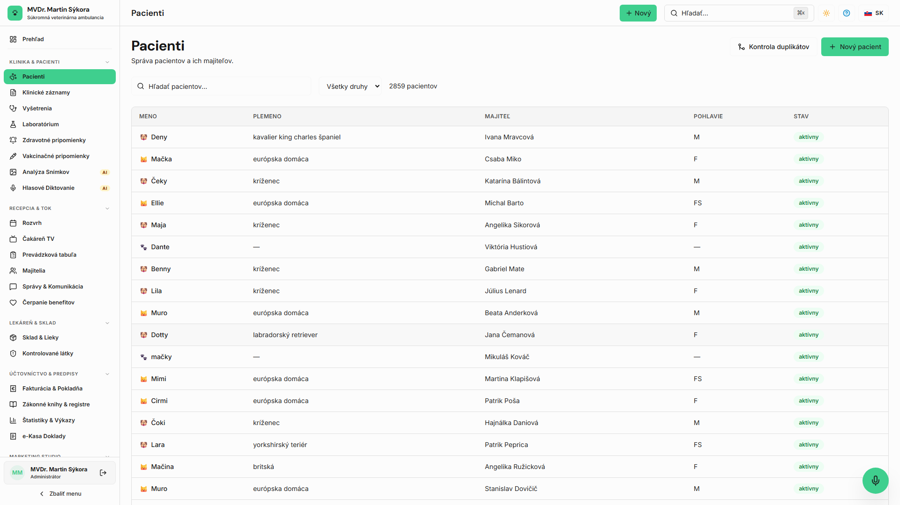
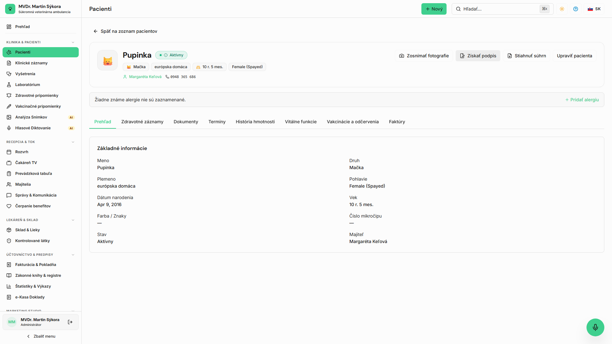
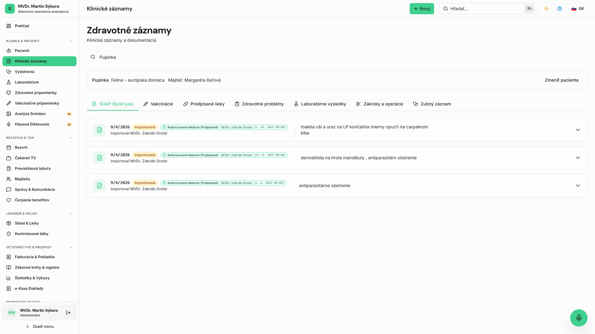
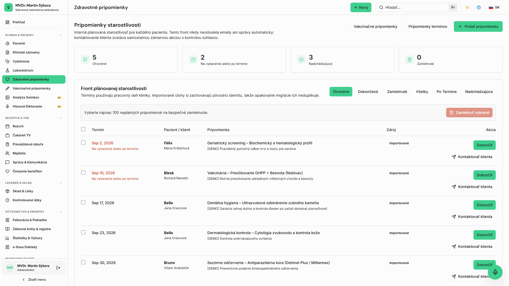

<!-- Outline ID: b90a6f85-2629-4502-955c-97515c3f40ef | URL: https://outline.dev.significa.sk/doc/2-kartoteka-a-zdravotne-zaznamy-j8LhcJo4hU -->
# 🐾 2. Kartotéka a zdravotné záznamy

Centrálnym pilierom OpenVPM AI je digitálna kartotéka pacientov a ich majiteľov. Systém podporuje komplexnú evidenciu spoločenských aj hospodárskych zvierat s dôrazom na rýchlosť zápisu a legislatívnu integritu.

---

## 1. Vyhľadávanie a evidencia pacientov

Kedykoľvek použite globálne vyhľadávanie (**Cmd + K** / **Ctrl + K**) alebo prejdite do sekcie **Pacienti** (`/patients`).

* **Vyhľadávacie kritériá:** Meno zvieraťa, priezvisko alebo telefónne číslo majiteľa, 15-miestne číslo mikročipu (ISO 11784/11785), číslo PetPasu.

* **Profil pacienta:** Zahŕňa druh zvieraťa, plemeno, pohlavie, reprodukčný stav (kastrovaný/nekastrovaný), dátum narodenia, číslo čipu, varovania pred alergiami a kontaktné údaje chovateľa.

> [!NOTE] Pri zvieratách s agresívnym správaním alebo vysokým stresom odporúčame zapnúť štítok **Fear-Free / Pozor pri manipulácii**, ktorý sa zobrazí v záhlaví karty výraznou výstražnou farbou.

---

## 2. Štruktúrovaný klinický záznam (SOAP)

Klinické vyšetrenie sa zaznamenáva podľa medzinárodného veterinárneho štandardu **SOAP**:

* **S (Subjektívne):** Dôvod návštevy uvádzaný majiteľom, anamnéza, príznaky, dĺžka trvania ťažkostí, správanie zvieraťa doma.
* **O (Objektívne):** Klinické vyšetrenie lekárom:
  * Trias: teplota (°C), tepová frekvencia (tepov/min), dychová frekvencia (dychov/min).
  * Hmotnosť (kg) a výživový stav (Body Condition Score 1–9).
  * Auskultácia srdca a pľúc, palpácia brucha, stav slizníc, miazgové uzliny, CRT.
* **A (Hodnotenie / Asessment):** Diferenciálna alebo definitívna diagnóza, interpretácia nálezov.
* **P (Plán):** Terapeutický postup, aplikované lieky (vrátane šarže a dávky), laboratórne vyšetrenia, plán ďalšej kontroly, odporúčania pre majiteľa.

---

## 3. Evidencia váhy a vitálnych funkcií

Pravidelné váženie pacienta pri každej návšteve je nevyhnutné pre presné dávkovanie farmák:

* Každá zadaná hmotnosť automaticky kreslí graf váhového vývoja v čase.
* Vstavaná dávkovacia kalkulačka automaticky preberá aktuálnu hmotnosť pacienta a prepočítava dávku v mg aj výsledný aplikačný objem v ml.
* Systém upozorní na náhly úbytok alebo prírastok hmotnosti o viac ako 10 % oproti predchádzajúcej návšteve.

---

## 4. Očkovania a odčervenia

Záložka **Očkovania** poskytuje prehľad o aktívnej imunizácii zvieraťa:

1. **Záznam vakcinácie:** Výber typu vakcíny (napr. besnota Rabisin/Nobivac R, kombinácie DHPPi-L), zadanie výrobcu, čísla šarže a exspirácie.
2. **Výpočet revakcinácie:** Systém automaticky vypočíta odporúčaný termín nasledujúceho preočkovania (1 rok, 2 roky alebo 3 roky podľa SPC výrobcu).
3. **Prepojenie s klientskym portálom:** Platné očkovanie sa okamžite premietne do digitálneho očkovacieho preukazu v mobilnom klientskom portáli.

> [!IMPORTANT] Očkovanie proti besnote aktivuje automatický zápis do **Knihy besnoty** a spúšťa zákonnú 3-dňovú lehotu na elektronické nahlásenie na príslušnú Regionálnu veterinárnu a potravinovú správu (RVPS).

---

## 5. Uzatvorenie a digitálny podpis záznamu

Podľa Zákona č. 39/2007 Z. z. musí byť každý veterinárny úkon autorizovaný ošetrujúcim lekárom. Po vyplnení údajov lekár klikne na **Finalizovať a podpísať**. Záznam sa uzamkne proti neoprávneným úpravám a opatrí sa časovou pečiatkou a menom lekára v auditnom reťazci. Prípadné neskoršie opravy sa zaznamenávajú ako dodatky (*addendum*).