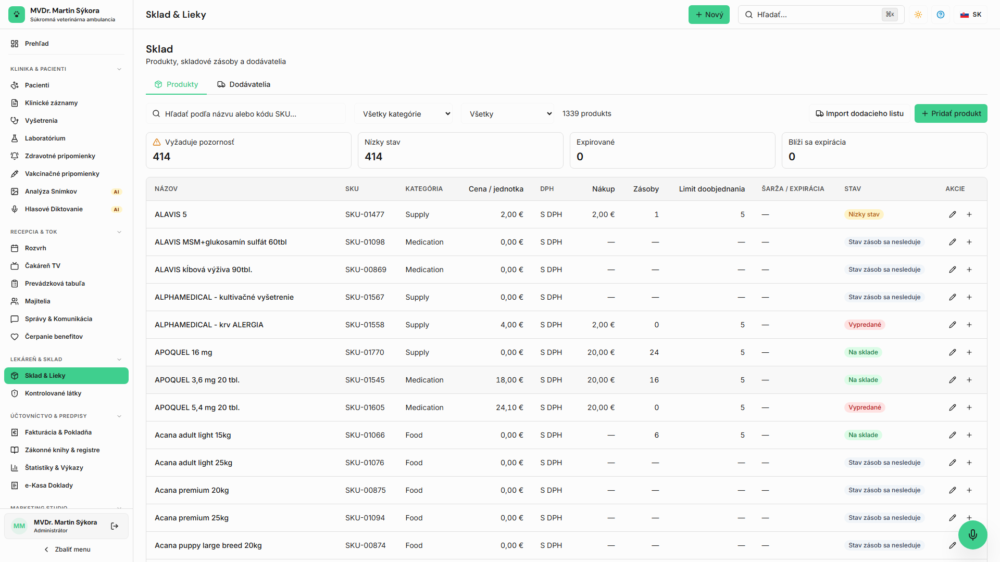
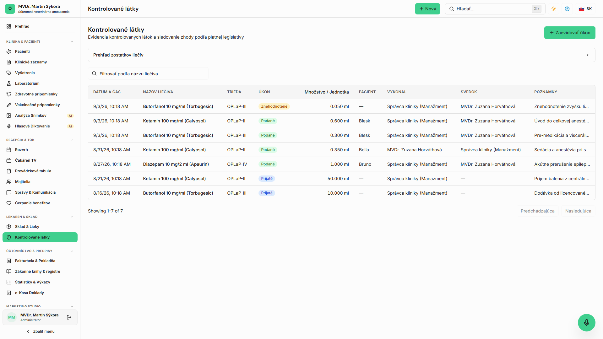

<!-- Outline ID: dce9ab2d-f1c2-4ff4-bb66-fb21029bd07a | URL: https://outline.dev.significa.sk/doc/4-sklad-a-lekaren-iwN7QMyHsq -->
# 💊 4. Sklad a lekáreň

Modul Sklad a lekáreň (`/inventory`) zabezpečuje presnú evidenciu liečiv, biologických prípravkov, spotrebného materiálu a prísne regulovaných substancií.

---

## 1. Správa skladových zásob a príjem tovaru

Každá položka v sklade obsahuje detailnú identifikáciu:

* **Názov liečiva / tovaru, kategória a jednotka:** (tablety, ampulky, ml, balenia).
* **Číslo šarže (Batch Number) a dátum exspirácie:** Systém eviduje každú naskladnenú dávku samostatne.
* **Nákupná cena, DPH a predajná cena:** Automatický prepočet marže.
* **Minimálna hladina zásob:** Systém automaticky upozorňuje na položky vyžadujúce objednanie.

**Príjem a úprava zásob:**

1. V sekcii `/inventory` kliknite na **Príjem tovaru** alebo pri konkrétnom produkte zvoľte **Upraviť množstvo**.
2. Zadajte počet prijatých jednotiek, číslo šarže, exspiráciu a dodávateľa.
3. Každý pohyb zásob zaznamenáva čas, meno prihláseného používateľa a dôvod pohybu.

> 📝 **Poznámka:** Vo verzii v0.7 je pripravovaný automatický elektronický import dodacích listov od hlavných distribútorov: **Cymedica SK**, **Pharmos a.s.**, **Samohýl SK** a **Henry Schein**.

---

## 2. Výdaj liekov a odpis zo skladu

Výdaj liečiv prebieha priamo počas vyšetrenia pacienta v SOAP zázname:

1. V pláne vyšetrenia lekár zvolí liek zo skladového katalógu.
2. Zadá podané alebo vydané množstvo a zvolí šaržu.
3. Po uložení a schválení záznamu sa množstvo okamžite odpíše zo skladu a priradí sa do faktúry pacienta.

---

## 3. Kniha omamných a psychotropných látok (Kniha OPL)

Evidencia regulovaných substancií (Zákon č. 139/1998 Z. z. o omamných a psychotropných látkach) prebieha v špecializovanom module **Omamné látky** na adrese `/controlled-substances`.

Podliehajú jej prípravky Schedule I/II používané vo veterinárnej anestézii a analgézii: **ketamín, propofol, butorfanol, fentanyl, opiáty, diazepam**.

### Prísne prevádzkové pravidlá pre OPL:

1. **Autorizovaný prístup:** Modul OPL je prístupný **výhradne pre roly Správca praxe a Veterinárny lekár**. Recepcia ani asistenti k nemu nemajú prístup.
2. **Záznam podania:** Každé podanie vyžaduje: presný dátum a čas, pacienta, indikáciu, podanú dávku (mg/ml), číslo šarže a zostatok na sklade.
3. **Evidencia znehodnotenia (odpadu):** Ak sa z ampulky nespotrebuje celé množstvo, znehodnotený zbytok musí byť zaevidovaný s uvedením **mena svedka (druhého lekára alebo oprávneného asistenta)** a jeho podpisom.
4. **Nemenný auditný záznam:** Záznamy v knihe OPL nie je možné spätne mazať ani modifikovať.

> ⚠️ **Upozornenie:** **STRIKTNÝ ZÁKAZ AI PREDFLŇOVANIA:** AI asistent má systémovo zablokované akékoľvek predvyplňovanie polí týkajúcich sa omamných a psychotropných látok. Všetky záznamy v knihe OPL musí manuálne a vedome zadať licencovaný veterinárny lekár!

---

## 4. Dávkovacia kalkulačka a kontrola druhovej toxicity

Vstavaná kalkulačka dávkovania pomáha predchádzať fatálnym chybám pri aplikácii liekov:

* Automaticky zohľadňuje hmotnosť a druh zvieraťa.
* **Bezpečnostné blokácie:**
  * Okamžité varovanie a blokácia pri pokuse predpísať **paracetamol mačkám** (akútna methemoglobinémia a zlyhanie pečene).
  * Varovanie pri podaní **permetrínu mačkám**.
  * Varovanie pri podaní **ivermektínu kóliám a príbuzným plemenám** s mutáciou génu MDR1.