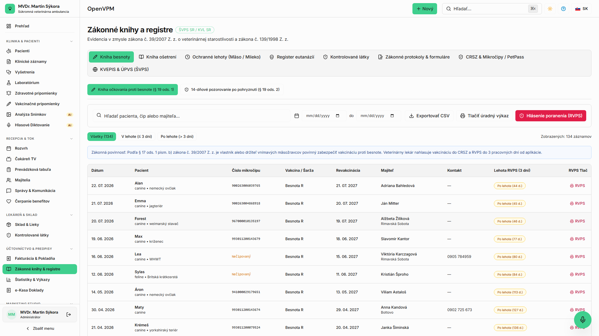
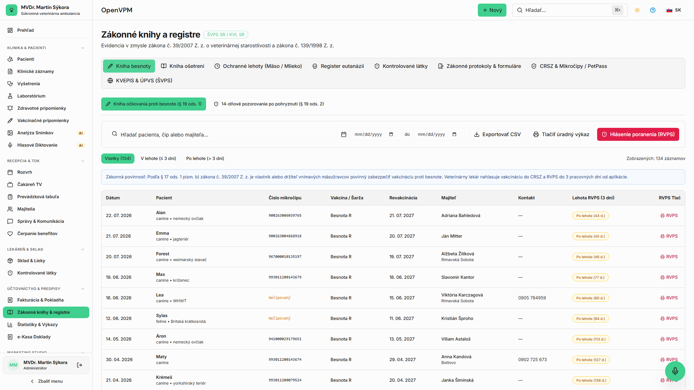

<!-- Outline ID: 1e7538c3-415c-43e7-9842-48527ff5990c | URL: https://outline.dev.significa.sk/doc/5-legislativa-a-statne-hlasenia-K4T4SZeOJb -->
# 📋 5. Legislatíva a štátne hlásenia

Slovenská veterinárna legislatíva ukladá lekárom prísne evidenčné a oznamovacie povinnosti. Modul **Legislatíva** (`/statutory`) integruje všetky zákonné registre do jedného rozhrania.

---

## 1. Zákonný rámec

Systém pokrýva požiadavky kľúčových slovenských a európskych predpisov:

* **Zákon č. 39/2007 Z. z.** o veterinárnej starostlivosti v znení neskorších predpisov.
* **Zákon č. 139/1998 Z. z.** o omamných látkach, psychotropných látkach a prípravkoch.
* **Nariadenie EP a Rady (EÚ) 2019/6** o veterinárnych liekoch (evidencia ochranných lehôt).
* Vyhlášky Ministerstva pôdohospodárstva a rozvoja vidieka SR o identifikácii a registrácii zvierat.

---

## 2. Kniha besnoty a 3-dňová oznamovacia lehota

Besnota je nebezpečná nákaza prenosná na človeka s osobitným režimom dohľadu.

1. **Automatický záznam:** Po zadaní očkovania proti besnote v karte pacienta systém automaticky vygeneruje záznam v **Knihe besnoty** (`/statutory/rabies`).
2. **Zákonná lehota:** Záznam obsahuje odpočítavanie zákonnej **3-dňovej lehoty** na nahlásenie úkonu príslušnej Regionálnej veterinárnej a potravinovej správe (RVPS).
3. **Elektronické podanie:** Veterinárny lekár autorizuje záznam a exportuje hlásenie do formátu požadovaného štátnou správou.

> [!IMPORTANT] Lehota na nahlásenie vakcinácie proti besnote na RVPS je **3 pracovné dni**. Systém v prehľade legislatívy farebne zvýrazňuje blížiace sa a prekročené termíny.

---

## 3. Ochranné lehoty pri potravinových zvieratách

Pri ošetrení hospodárskych zvierat, ktorých produkty (mäso, mlieko, vajcia, med) sú určené na ľudskú spotrebu, je lekár povinný stanoviť a evidovať ochrannú lehotu:

* **Zadanie údajov:** Názov podaného liečiva, číslo šarže, kód hospodárstva v CEHZ (6-miestny kód farmy), dátum a čas aplikácie.
* **Výpočet ochrannej lehoty:** Lekár zadá lehotu pre mäso a mlieko podľa SPC lieku. Systém vypočíta presný dátum a hodinu **Bezpečné od (**`**safeUntil**`**)**.
* Informácia o ochrannej lehote je povinne vytlačená na doklade pre chovateľa.

> [!WARNING] Návrhy ochranných lehôt generované AI asistentom majú len informatívny charakter. Právnu a odbornú zodpovednosť za dodržanie ochrannej lehoty nesie ošetrujúci veterinárny lekár overením v oficiálnom SPC lieku.

---

## 4. Kafiléria a evidencia likvidácie mŕtvych tiel

Evidencia uhynutých a eutanazovaných zvierat odovzdaných na asanáciu prebieha v registri **Likvidácia mŕtvych zvierat** (`/statutory/carcass-disposal`):

* Zaznamenáva sa: identifikácia zvieraťa, dátum a príčina úhynu/eutanázie, hmotnosť kadáveru, asanačný podnik (kafiléria, napr. ASANÁCIA s.r.o. Mojšová Lúčka), číslo zvozového lístka a dátum odvozu.
* Register generuje podklady pre hlásenia Štátnej veterinárnej správy a kontrolu biologického odpadu.

---

## 5. Informované súhlasy chovateľov

V module šablón a legislatívy sú pripravené vzory informovaných súhlasov v súlade so slovenskou legislatívou:

* Súhlas s anestéziou a chirurgickým zákrokom.
* Súhlas s hospitalizáciou a intenzívnou starostlivosťou.
* Protokol o eutanázii zvieraťa s potvrdením dôvodu a spôsobu naloženia s kadáverom.
* Všetky protokoly je možné vytlačiť na podpis alebo podpísať digitálne na klinickom tablete.