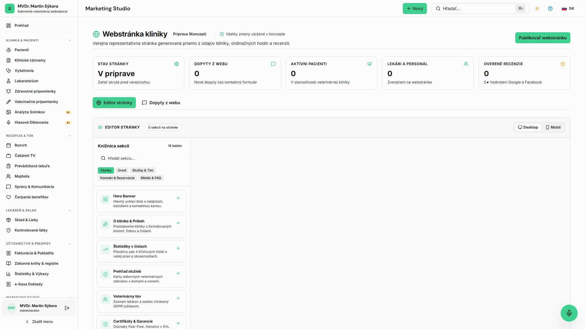

<!-- Outline ID: fa3ec56d-aff1-4d98-8783-a9ad6b48ed1a | URL: https://outline.dev.significa.sk/doc/7-tvorba-webu-kliniky-website-builder-QKKyOmn5OS -->
# 🌐 7. Tvorba webu kliniky (Website Builder)

Novinkou vo verzii OpenVPM AI je integrovaný vizuálny **Editor webstránky kliniky** (Website Builder). Umožňuje ambulancii vytvoriť modernú, reprezentatívnu a plne responzívnu webstránku bez nutnosti najímať externých webdeveloperov.

---

## 1. Prístup k editoru a Brand Kit

Editor nájdete v bočnom menu pod položkou **Editor webu** (`/marketing/website-builder`).

* **Automatické prepojenie s Brand Kitom:** Webstránka automaticky preberá identitu vašej kliniky nastavenú v Brand Kite:
  * Primárna farba (`--wb-primary`) a sekundárna farba (`--wb-secondary`).
  * Automatický výpočet vysoko kontrastnej farby textu (`--wb-on-primary`) zabezpečuje čitateľnosť podľa štandardov prístupnosti.
  * Logo kliniky, názov a kontaktné údaje sa načítajú z hlavných nastavení ambulancie.

---

## 2. Knižnica 17 sekčných šablón

Editor obsahuje 17 stavebných blokov navrhnutých špecificky pre veterinárne praxe:

 1. **Hero Banner:** Pútavý úvodný blok s uvítacím nadpisom, fotografiou a tlačidlom na objednanie.
 2. **O klinike & Príbeh:** Predstavenie histórie ambulancie, hodnôt a prístupu k pacientom.
 3. **Štatistiky v číslach:** Číselný pás úspechov (napr. *15 rokov praxe, 12 000 ošetrených pacientov*).
 4. **Prehľad služieb:** Mriežka poskytovaných služieb (vakcinácie, chirurgia, stomatológia, RTG/sono) s cenami a ikonami.
 5. **Veterinárny tím:** Medailóniky lekárov a sestier s ich špecializáciou, chránené GDPR súhlasom zamestnanca (`photo_web`).
 6. **Certifikáty & Garancie:** Odznaky Fear-Free, členstvo v Komore veterinárnych lekárov SR (KVL SR) a štátne garancie.
 7. **Recenzie klientov:** Overené referencie majiteľov v podobe mriežky alebo posuvného karuselu.
 8. **Sociálne siete:** Odkazy na Facebook, Instagram alebo TikTok profil kliniky.
 9. **Edukačné letáky:** Odborné rady pre chovateľov priamo z klinickej databázy (napr. príprava na operáciu, odčervovací kalendár).
10. **Online rezervácia CTA:** Výrazná výzva na online objednanie cez klientsky portál.
11. **Pohotovostný banner:** Zvýraznené výstražné upozornenie s okamžitým tlačidlom na núdzové volanie pri akútnych stavoch.
12. **Kontaktný formulár:** Zabezpečený formulár na otázky majiteľov.
13. **Ordinačné hodiny & Mapa:** Tabuľka otváracích hodín a interaktívna Google / OpenStreetMap mapa s navigáciou.
14. **Fotogaléria:** Zábery z vyšetrovní, operačnej sály a čakárne z integrovanej mediálnej knižnice.
15. **Video prezentácia:** Responzívne vstavané video (YouTube / Vimeo) predstavujúce kliniku.
16. **Časté otázky (FAQ):** Rozbaľovacia harmonika s odpoveďami na najčastejšie otázky pred prvou návštevou.
17. **Vlastný textový blok:** Ľubovoľný formátovaný obsah podporujúci bezpečný Markdown.

---

## 3. Vizuálny Drag-and-Drop a izolácia konceptu

* **Usporiadanie stránky:** Sekcie je možné jednoducho presúvať myšou potiahnutím za úchytku.
* **Rýchle akcie sekcie:** Každý blok je možné jedným klikom duplikovať, dočasne skryť (ikona oka) alebo vymazať.
* **Prepínač zobrazenia:** Prepínajte medzi náhľadom na počítači (Desktop) a na smartfóne (Mobile) pre overenie responzivity.
* **Koncept (Draft) vs. Publikovaná stránka (Published):**
  * Všetky zmeny sa ukladajú priebežne do konceptu (`ext_marketing_website_config`).
  * Verejnosť vidí zmeny až v momente, keď kliknete na **Publikovať zmeny**. Pôvodný publikovaný web funguje nepretržite bez výpadku.

> 📝 **Poznámka:** Webstránka je priamo napojená na online objednávkový systém OpenVPM AI — termíny rezervované cez web sa ihneď zobrazujú v ordinačnom kalendári.