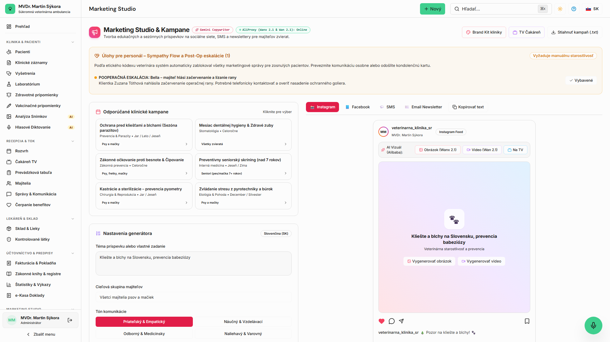

<!-- Outline ID: 42a0cc57-2041-418f-9ad7-f45b63391eb1 | URL: https://outline.dev.significa.sk/doc/8-marketingove-studio-a-pripomienky-su5LpGodiF -->
# 📣 8. Marketingové Štúdio a pripomienky

Modul **Marketingové Štúdio** (`/marketing`) automatizuje komunikáciu s majiteľmi zvierat, sleduje termíny preventívnej starostlivosti a buduje reputáciu kliniky pri plnom rešpektovaní veterinárnej etiky.

---

## 1. Automatická CRM segmentácia klientov

Systém v reálnom čase triedi databázu do 12 preddefinovaných CRM segmentov:

* **Noví klienti:** Zaregistrovaní za posledných 30 dní.
* **Aktívni klienti:** Návšteva za posledných 6 mesiacov.
* **Neaktívni (6 mesiacov / 12 mesiacov):** Klienti vyžadujúci pripomenutie preventívnej prehliadky.
* **Po operácii:** Pacienti po chirurgickom výkone v posledných 30 dňoch.
* **Vakcína čoskoro / po termíne:** Zvieratá s blížiacou sa alebo prekročenou expiráciou vakcín.
* **Seniori:** Psy a mačky staršie ako 7 rokov (odporúčaný geriatrický skríning).
* **Šteniatka a mačiatka:** Do 1 roka veku (vakcinačné schémy a odčervenie).
* **Chronickí pacienti & Dentálna starostlivosť:** Pacienti vyžadujúci pravidelný manažment liečby.
* **Vysokohodnotní VIP klienti:** Najaktívnejší chovatelia.

---

## 2. Päť automatizovaných zákazníckych ciest (Customer Journeys)

Správy sú doručované cez SMS (Telnyx) alebo profesionálne e-maily (Resend):

1. **Uvítanie nového klienta:** Uvítacia správa po registrácii s odkazom na mobilný portál a dotazník spokojnosti po 7 dňoch.
2. **Sledovanie po návšteve (Post-visit follow-up):** Poďakovanie za návštevu a po 24 hodinách žiadosť o Google recenziu (ak bolo ošetrenie bez komplikácií).
3. **Pripomienka očkovania:** Automatické notifikácie: **14 dní pred termínom**, **3 dni pred termínom** a upozornenie po prekročení termínu.
4. **Pooperačná starostlivosť:** SMS po 24 hodinách s overením celkového stavu zvieraťa, 3. deň pripomenutie kontroly rany a 10. deň výzva na vybratie stehov.
5. **Reaktivácia neaktívnych pacientov:** Jemné pripomenutie ročnej preventívnej prehliadky po 12 mesiacoch nečinnosti.

---

## 3. Sympathy Flow — etická bezpečnostná brána

Najcitlivejšou časťou veterinárnej komunikácie je úhyn alebo eutanázia zvieraťa.

> ⚠️ **Dôležité:** **SYMPATHY GATE JE POVINNÁ A NEVYPNUTEĽNÁ:** Akonáhle lekár v karte pacienta nastaví stav **Uhynutý / Eutanazovaný**, systém **okamžite a trvalo**:
>
> 
> 1. Zablokuje akékoľvek odosielanie SMS a e-mailov pre tohto pacienta (očkovania, follow-upy, marketing).
> 2. Automaticky zruší všetky otvorené pripomienky starostlivosti s dôvodom: *„Sympathy Gate: Pacient uhynul / bol eutanazovaný."*
> 3. Vytvorí internú úlohu pre personál na zaslanie osobnej kondolencie majiteľovi.
> 4. Každé zablokovanie správy je auditované v `ext_automation_suppression_log`.

---

## 4. Správa reputácie a recenzií

* Zber recenzií cez Google Business Profile.
* Systém sleduje 24-hodinový limit na odpoveď na recenziu.
* **Eskalácia nespokojnosti:** Negatívna recenzia (2 hviezdičky a menej) automaticky vytvorí prioritnú úlohu pre vedenie kliniky, aby situáciu s klientom bezodkladne vyriešilo.

---

## 5. TV obrazovka do čakárne (`/tv`)

V čakárni môžete spustiť webovú prezentáciu na adrese `/tv`:

* Zobrazuje poradie v čakárni, edukačné tipy, informácie o personále a novinky kliniky.
* Nevyžaduje špeciálny hardvér — funguje na akejkoľvek Smart TV alebo minipočítači pripojenom cez HDMI.