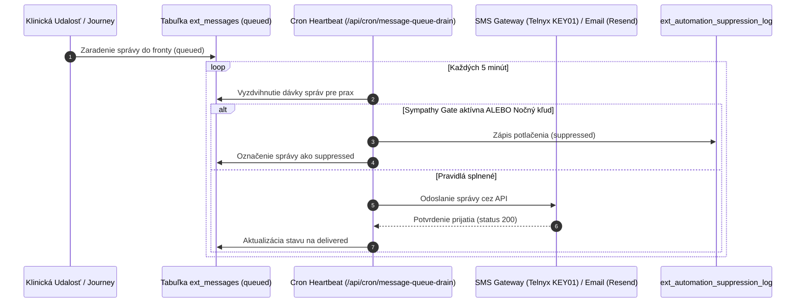

<!-- Outline ID: 42a0cc57-2041-418f-9ad7-f45b63391eb1 | URL: https://outline.dev.significa.sk/doc/8-marketingove-studio-a-pripomienky-su5LpGodiF -->
# 📣 8. Marketingové Štúdio a pripomienky

Modul **Marketingové Štúdio** (`/marketing`) v kombinácii s centrálnym modulom **Automatizácie** (`/automations`) zabezpečuje inteligentnú, etickú a plne automatizovanú komunikáciu s majiteľmi zvierat, včasné sledovanie preventívnych prehliadok a budovanie reputácie veterinárnej ambulancie.

---

## 1. Architektúra modulov a navigácia

Systém rozdeľuje starostlivosť o vzťahy s klientmi a automatizáciu do dvoch komplementárnych sekcií:

1. **Marketingové Štúdio (`/marketing`):**
   * Prehľad aktívnych kampaní a odoslaných správ.
   * **Recenzie (`/marketing/reviews`):** Manažment hodnotení z Google Business Profile s 24-hodinovým eskalačným limitom.
   * **Edukačné letáky (`/marketing/handouts`):** Tlač a digitálne zdieľanie odborných letákov pre majiteľov.
   * **Správy & SMS (`/marketing/messages`):** História odoslaných SMS a e-mailov, stavy doručenia a auditné záznamy.
   * **Web kliniky (`/marketing/website`):** Integrovaný drag-and-drop Website Builder s podporou Brand Kitu.
   * **Knižnica médií (`/marketing/media`):** Úložisko obrázkov a edukačných videí vygenerovaných cez Alibaba Wan 3.0.
   * **Skripty recepcie (`/marketing/consents`):** Podklady pre recepčný personál a informované súhlasy.
2. **Centrálne Automatizácie (`/automations`):**
   * Umiestnené v kategórii Správa / Admin.
   * **Klinické automatizácie:** Bezpečnostné pravidlá modulu *Clinical Guardian* (liekové interakcie, OPL, lehoty besnoty).
   * **Klientske automatizácie:** Nastavenie a sledovanie zákazníckych ciest (Customer Journeys) a pravidiel automatického zápisu.

---

## 2. Segmentácia pacientov podľa životného cyklu (Lifecycle CRM)

Základom modernej veterinárnej prevencie je adresná komunikácia prispôsobená veku a zdravotnému stavu pacienta. Systém v reálnom čase triedi databázu do 12 kanonických CRM segmentov:

| Segment | Cieľová skupina | Kľúčové preventívne zameranie |
| :--- | :--- | :--- |
| **Šteniatka a mačiatka (Juniors)** | Psy a mačky do 1 roka veku | Primovakcinačné schémy (DHPPi/L, Tricat), odčervovací protokol každé 2 týždne, povinné čipovanie do 12 týždňov a výživové poradenstvo. |
| **Dospelé zvieratá (Adults)** | Pacienti vo veku 1 – 7 rokov | Pravidelné ročné revakcinácie, celoročná ektoparazitárna prevencia (kliešte, blchy) a kontrola dentálneho plaku a zubného kameňa. |
| **Geriatrickí pacienti (Seniors)** | Zvieratá staršie ako 7 rokov | Preventívny geriatrický skríning: vyšetrenie moču, biochemický profil krvi (SDMA, močovina, kreatinín, pečeňové enzýmy), meranie krvného tlaku a kardiologická auskultácia. |
| **Chronickí pacienti (Chronics)** | Pacienti s dlhodobými diagnózami | Manažment pacientov s CKD, diabetom mellitus, endokrinopatiami, artrózou či epilepsiou. Automatické pripomienky kontrolných odberov a výdaja liekov. |
| **Pooperační pacienti (Post-op)** | Pacienti po chirurgickom zákroku | Kontrola zdravotného stavu po prebudení (24 h), kontrola operačnej rany (3. deň) a pripomienka vybratia stehov (10. – 12. deň). |
| **Noví klienti** | Registrácia za posledných 30 dní | Uvítacia správa, link na stiahnutie Klientskeho portálu (PWA) a orientačný sprievodca ambulanciou. |
| **Aktívni klienti** | Návšteva za posledných 6 mesiacov | Pravidelná edukatívna a sezónna komunikácia (napr. jarná ochrana pred kliešťami). |
| **Neaktívni (6m / 12m)** | Bez návštevy 6 resp. 12 mesiacov | Jemné reaktivačné správy s výzvou na preventívnu prehliadku. |
| **Vakcína čoskoro / po termíne** | Expirácia do 30 dní / po expirácii | Prísne cielené trojstupňové notifikácie o povinných a odporúčaných očkovaniach. |
| **VIP chovatelia** | Klienti s vysokou frekvenciou návštev | Prednostná starostlivosť a personalizované ponuky balíčkov. |

### Cielené presadzovanie v zákazníckych cestách (`targetSegmentKeys`)
Všetky zákaznícke cesty (Journeys) umožňujú prísne zacielenie na konkrétne segmenty cez atribút `targetSegmentKeys`. Klienti mimo cieľového segmentu sú automaticky preskočení, čím sa zabraňuje zasielaniu nerelevantných správ (napr. geriatrické vyšetrenie nebude ponúkané majiteľovi polročného šteniatka).

---

## 3. Zákaznícke cesty (Customer Journeys)

Správy sú doručované cez SMS (Telnyx) alebo značkové e-maily (Resend) podľa preddefinovaných scenárov:

1. **Uvítanie nového klienta:** Automatická SMS po prvej registrácii s priamym odkazom na mobilný klientsky portál (PWA) a dotazník spätnej väzby po 7 dňoch.
2. **Sledovanie po ošetrení (Post-visit follow-up):** Poďakovanie za návštevu a po 24 hodinách výzva na ohodnotenie na Google Business Profile (výhradne ak vyšetrenie prebehlo bez komplikácií).
3. **Pripomienka očkovania:** Automatizovaná trojstupňová sekvencia: **14 dní vopred**, **3 dni vopred** a dôrazná výzva **7 dní po termíne expirácie**.
4. **Pooperačná starostlivosť:** 
   * Deň 1: Overenie celkového stavu, apetítu a príjmu tekutín po narkóze.
   * Deň 3: Kontrola operačnej rany (opuch, sekrécia).
   * Deň 10: Pozvánka na bezplatnú kontrolu a extrakciu stehov.
5. **Manažment chronikov:** Pravidelné kvartálne pripomenutie kontrolného vyšetrenia a predpisu dlhodobej medikácie.

---

## 4. Infraštruktúra rozosielania správ a správa fronty

Pre zaistenie 100 % spoľahlivosti a škálovateľnosti funguje odosielanie správ na báze asynchrónnej fronty:

### 4.1 Spracovanie odchádzajúcej fronty správ (`message-queue-drain`)
* Nová vyhradená cron trasa `/api/cron/message-queue-drain` beží každých **5 minút**.
* Zabezpečuje bezpečné vyprázdňovanie fronty zo stavu `queued` na `delivered` pre každú prax samostatne.
* Obsahuje integrovaný monitoring heartbeatov (`cron-heartbeat.ts`) s automatickým odosielaním prevádzkových alertov správcom v prípade zlyhania spojenia s bránou.

### 4.2 Poskytovatelia správ a podpora Telnyx `KEY01`
* **SMS brána Telnyx:** Systém plne podporuje modernú generáciu API kľúčov Telnyx začínajúcich na `KEY01` aj staršie prístupové tokeny s okamžitou validáciou pripravenosti (`hosted-sms-readiness.ts`).
* **E-mailové doručovanie Resend:** Zabezpečené odosielanie e-mailov s overenými DKIM, SPF a DMARC záznamami z domény kliniky.

---

## 5. Etické a legislatívne bezpečnostné brány

Automatizovaná komunikácia vo veterinárnej medicíne podlieha prísnym etickým normám a nariadeniu GDPR:

### 5.1 Sympathy Gate — etická poistka pri úhyne zvieraťa
Úhyn alebo eutanázia zvieraťa patrí k najťažším chvíľam každého majiteľa. Akákoľvek automatická pripomienka v takomto čase by bola pre chovateľa traumatizujúca a poškodila by reputáciu kliniky.

> [!IMPORTANT]
> **SYMPATHY GATE JE TRVALÁ A NEVYPNUTEĽNÁ:**
> Akonáhle veterinárny lekár v karte pacienta nastaví status **Uhynutý** (`deceased`) alebo zaeviduje eutanáziu:
> 1. Systém **okamžite a trvalo vymaže a zablokuje** všetky naplánované správy, upomienky očkovania a marketingové oslovenia pre daného pacienta.
> 2. Všetky otvorené úlohy a zákaznícke cesty sú ukončené s dôvodom: *„Sympathy Gate: Pacient uhynul / bol eutanazovaný."*
> 3. Vytvorí sa diskrétna interná úloha pre ošetrujúceho lekára na prípadné zaslanie osobnej písomnej kondolencie.
> 4. Každé zablokovanie je auditované v `ext_automation_suppression_log` s kódom dôvodu `sympathy_gate`.

### 5.2 Nočný pokoj (Quiet Hours)
Systém striktne rešpektuje nočný kľud majiteľov:
* Odosielanie SMS správ je automaticky pozastavené medzi **20:00 a 08:00** ráno.
* Správy vygenerované v nočných hodinách zostávajú bezpečne vo fronte a sú odoslané nasledujúci deň ráno po 08:05.
* Nočné zadržanie je evidované pod kódom `quiet_hours`.

### 5.3 Frekvenčné stropy (Frequency Capping) a GDPR Opt-Out
* **Maximálna frekvencia:** Majiteľ nedostane viac ako 2 automatické SMS v priebehu 7 dní (okrem akútnych pooperačných stavov).
* **Zákonný Opt-Out:** Každá SMS a e-mail obsahuje možnosť bezplatného odhlásenia z marketingových notifikácií. V prípade uplatnenia opt-outu systém rešpektuje vôľu klienta a správy loguje s kódom `opt_out`.