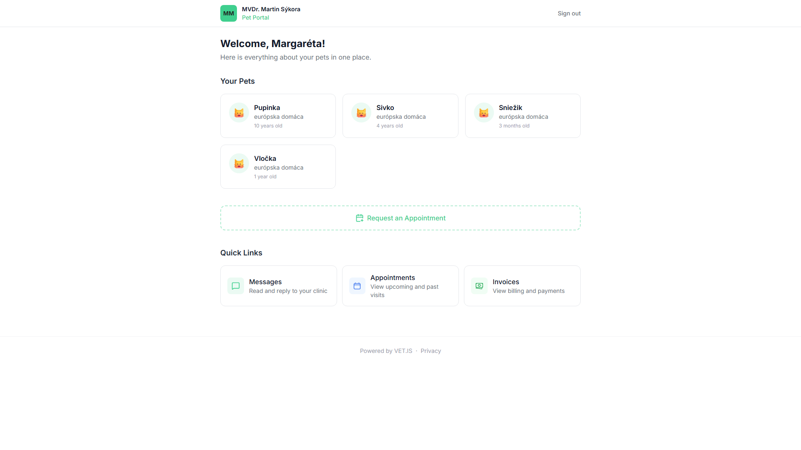
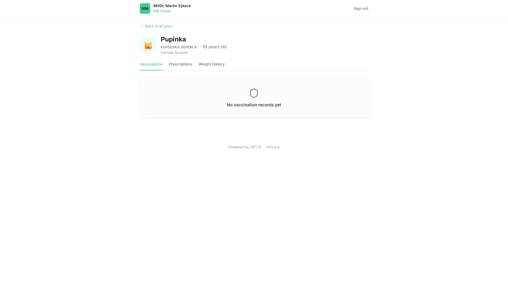
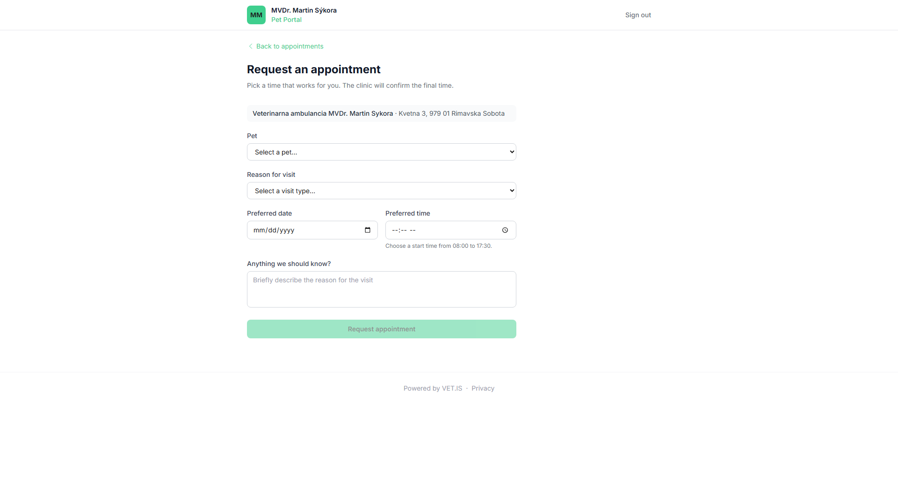

<!-- Outline ID: 6c466093-0d3a-4038-bcd5-e3737d760366 | URL: https://outline.dev.significa.sk/doc/9-klientsky-portal-pwa-coHzkcroCR -->
# 📱 9. Klientsky portál (PWA)

Klientsky portál je moderná progresívna webová aplikácia (PWA), ktorá dáva majiteľom zvierat prístup k zdravotným údajom ich miláčikov priamo z ich mobilného telefónu na adrese `/portal`.

---

## 1. Prístup bez hesla (Magic Link)

Klienti si nemusia vytvárať zložité účty ani si pamätať heslá:

1. Otvorte kartu klienta v systéme.
2. Kliknite na tlačidlo **Odoslať odkaz na portál**.
3. Klientovi príde SMS správa alebo e-mail s jednorazovým zabezpečeným odkazom (Magic Link).
4. Kliknutím na odkaz sa portál okamžite otvorí v mobilnom prehliadači a klient si môže pridať ikonu aplikácie priamo na plochu telefónu.

> [!NOTE] Odkaz využíva kryptografický capability token. Prístup je obmedzený výhradne na zvieratá a doklady daného majiteľa.

---

## 2. Čo klient v portáli nájde

* **Digitálny očkovací preukaz:** Prehľad absolvovaných vakcinácií, použité vakcíny, šarže a presné termíny nasledujúceho preočkovania.
* **História váhy a zdravia:** Prehľad vyšetrení, zaznamenaná hmotnosť a odporúčania lekára po vyšetrení.
* **Faktúry a platby:** Prehľad vystavených dokladov, možnosť stiahnuť faktúru v PDF alebo zaplatiť nedoplatok online cez Apple Pay / Google Pay / kartu (Stripe).
* **Zabezpečená komunikácia:** Možnosť poslať ambulancii správu alebo fotografiu hojacej sa rany po operácii.

---

## 3. Online rezervácia termínov (`/portal/book`)

Majitelia sa môžu objednať na ošetrenie kedykoľvek, aj mimo ordinačných hodín ambulancie:

1. Klient si vyberie svoje zvieratko.
2. Zvolí dôvod návštevy (napr. *Vakcinácia, Bežná kontrola, Strihanie pazúrikov, Konzultácia*).
3. Vyberie preferovaného veterinárneho lekára.
4. Zvolí si vyhovujúci deň a voľný časový slot.
5. Rezervácia sa okamžite zapíše do klinického kalendára OpenVPM AI a personálu príde notifikácia.

> [!IMPORTANT] Systém pri online objednávaní obsahuje **Triage filter pre akútne stavy**: Pri príznakoch ako dusenie, kolaps, kŕče, nafúknuté brucho alebo krvácanie portál objednanie zablokuje a zobrazí telefónne číslo na okamžitú pohotovosť!