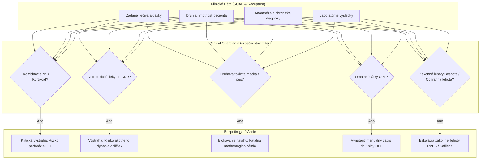

<!-- Outline ID: a1cbee02-a909-410e-b93e-89b6e96656f9 | URL: https://outline.dev.significa.sk/doc/1-bezpecnostne-hranice-a-limity-ai-eaJG6tiyLu -->
# 🛑 1. Bezpečnostné hranice a limity AI

Tento dokument definuje prísne bezpečnostné a etické hranice klinickej umelej inteligencie v systéme **OpenVPM AI** v súlade so slovenskou legislatívou (**Zákon č. 39/2007 Z. z.** o veterinárnej starostlivosti, **Zákon č. 139/1998 Z. z.** o omamných látkach, psychotropných látkach a prípravkoch) a validačným balíkom **Clinical AI Evidence Pack** (`docs/ai-evidence/MODEL_CARDS.md`).

---

## 1. Filozofia AI v klinickej praxi: Asistent, nie autonómny lekár

Umelá inteligencia v OpenVPM AI slúži výhradne ako asistenčný nástroj na zrýchlenie administratívy (prepis hlasu, štruktúrovanie SOAP záznamov, kalkulácia referenčných indexov VHS). AI **nemá a nikdy nebude mať autonómnu rozhodovaciu právomoc**.

Podľa **§ 3 Zákona č. 39/2007 Z. z.** je oprávnený vykonávať odbornú veterinárnu činnosť, stanovovať diagnózu, nariaďovať liečbu a predpisovať liečivá výhradne veterinárny lekár s platnou licenciou Komory veterinárnych lekárov SR (KVL SR). Všetky výstupy AI sú v celom systéme explicitne označované príznakom **Koncept (Draft)** a nemajú žiadnu právnu ani klinickú platnosť bez autorizácie lekárom.

---

## 2. Štyri tvrdé bezpečnostné hranice („Čo AI NIKDY nesmie robiť")

Tieto hranice sú technicky vynútené na viacerých vrstvách softvérovej architektúry (systémové prompty, aplikačný middleware, databázové integritné obmedzenia a kryptografický audit ledger):

1. **NIKDY nesmie autonómne predpísať liek alebo vydať elektronický recept (Rx):**
   * Žiadna mutácia predpisu nemôže byť potvrdená bez atribútu `clinicianConfirmed = true` a platnej relácie lekára (`assertAiMayWriteToSoapNote` v `lib/ai/draft-safety.ts`).
2. **NIKDY nesmie stanoviť definitívnu diagnózu bez prítomnosti veterinárneho lekára:**
   * Výstupy AI v poli *Assessment* sú vždy iba diferenciálnymi návrhmi zoradenými podľa pravdepodobnosti s povinným zobrazením varovania.
3. **NIKDY nesmie ignorovať druhovú toxicitu a kontraindikácie:**
   * Systém obsahuje deterministický filter, ktorý okamžite zablokuje akýkoľvek návrh toxického liečiva (napr. **paracetamol a permetrín u mačiek**, **xylitol a ibuprofén u psov**, **ivermektín u kólií** s mutáciou génu MDR1).
4. **NIKDY nesmie vymazať alebo modifikovať záznam v auditnom zázname:**
   * Tabuľky `ext_ai_audit_log`, `audit_log` a `clinical_record_corrections` fungujú na princípe **append-only** a sú chránené kryptografickou HMAC reťazou. Ani administrátor systému nemôže spätne pozmeniť históriu odporúčaní AI.

---

## 3. Clinical Guardian — aktívny dohľad nad bezpečnosťou liečby

Modul **Clinical Guardian** (`apps/web/lib/ai/clinical-guardian.ts`) predstavuje bezpečnostný ochranný štít, ktorý v reálnom čase monitoruje pripravované klinické záznamy, medikáciu a zákonné lehoty. Všetky zistenia eviduje v tabuľke `ext_clinical_guardian_alerts`.

### 3.1 Kľúčové detekčné moduly Clinical Guardian

1. **Rizikové liekové interakcie (Medication Safety):**
   * **NSAID + Kortikosteroidy:** Detekcia súbežného podania nesteroidných antiflogistík (napr. meloxikam, karprofén, firokoxib) a kortikosteroidov (prednizolón, dexametazón). Systém upozorňuje na extrémne riziko ťažkých gastrointestinálnych ulcerácií až perforácie žalúdka a čriev.
   * **Nefrotoxicita pri renálnej insuficiencii:** Monitorovanie aplikácie potenciálne nefrotoxických liečiv (napr. gentamicín, amikacín) u pacientov so zníženou funkciou obličiek (CKD, elevácia sérového kreatinínu a močoviny).
2. **Druhovo špecifická toxicita:**
   * **Mačky:** Absolútne varovanie pri paracetamole (fatálna methemoglobinémia a nekróza pečene) a permetríne (smrteľné neurotoxické kŕče).
   * **Psy a plemenné predispozície:** Zákaz ivermektínu u plemien s možnou mutáciou MDR1 génu (kólia, šeltia, austrálsky ovčiak).
   * **Fluorochinolóny u mačiek:** Upozornenie pri vysokom dávkovaní enrofloxacínu pre riziko ireverzibilnej retinálnej degenerácie a slepoty.
3. **Zákonné obmedzenia OPL (Zákon č. 139/1998 Z. z.):**
   * Pri omamných a psychotropných látkach (ketamín, Ketamidor, butorfanol, fentanyl, diazepam, propofol) systém **nuluje akýkoľvek automatický predfill**.
   * Vyžaduje sa manuálny, autentifikovaný zápis veterinárneho lekára s povinným zaevidovaním do úradnej Knihy OPL.
   * **Bezpečnostná brána pri importe dodacích listov:** Pri elektronickom naskladňovaní tovaru od distribútorov (Cymedica, SG-Vet, KOMVET a ďalších) systém automaticky deteguje omamné látky a nastavuje predvolenú akciu na `skip` (Preskočiť), aby sa predišlo neautorizovanému pripísaniu k bežným skladovým zásobám bez vedomia lekára.
4. **Zákonné lehoty a úradný dohľad:**
   * **Vyšetrenie na besnotu (§ 17 Zákona č. 39/2007 Z. z.):** Automatické sledovanie 14-dňovej pozorovacej lehoty po pohryznutí človeka zvieraťom s kontrolnými vyšetreniami v 1., 5. a 14. deň.
   * **Ochranné lehoty potravinových zvierat:** Dôsledné sledovanie ochranných lehôt na mäso a mlieko s generovaním varovania pred ich uplynutím.

### 3.2 Používateľské rozhranie a schvaľovací dialóg

* **Modálne okno `ClinicalGuardianConfirmDialog`:** Pri ukladaní SOAP záznamu s detegovaným rizikom vyskočí dialóg vyžadujúci výslovné potvrdenie ošetrujúcim veterinárom, zadanie klinického odôvodnenia a lekársky podpis.
* **Widget na nástenke `ClinicalGuardianWidget`:** Informuje personál o otvorených a nevyriešených klinických výstrahách na klinike.

---

## 4. Deep Thinking Concilium — viacmodelové AI konzílium

Pre zložité a nejednoznačné klinické prípady ponúka systém špecializovaný režim **Deep Thinking Concilium (AI Konzílium)**.

### 4.1 Kedy použiť AI Konzílium

* **Polymorbidní pacienti:** Zvieratá s viacerými protichodnými ochoreniami (napr. mačka s chronickým renálnym ochorením, kardiomyopatiou a hypertyreózou).
* **Nejasná diferenciálna diagnostika:** Pacienti s atypickými príznakmi nereagujúci na úvodnú kauzálnu terapiu.
* **Protichodné laboratórne nálezy:** Interpretácia komplexných biochemických a hematologických anomálií (napr. kombinácia hyponatrémie a hyperkaliémie — diferenciácia Addisonovej choroby od akútneho zlyhania obličiek).

### 4.2 Technická realizácia a uvažovacie modely

V režime AI Konzílium systém aktivuje model s rozšíreným uvažovaním (predvolene **Google Gemini 3.1 Pro** alebo **Qwen Max**) s nízkou teplotou inferencie (`temperature: 0.1`):
* Model dôkladne analyzuje kompletnú anamnézu, celú históriu predchádzajúcich ošetrení, vývoj telesnej hmotnosti a laboratórne trendy.
* Formuluje diferenciálno-diagnostický strom rozdelený podľa pravdepodobnosti s odporúčaním doplňujúcich konfirmačných vyšetrení (špecifické testy, ultrasonografia, biopsia).

---

## 5. Validačný benchmark a klinické evaly (114 testovacích prípadov)

Bezpečnosť modelu je kontinuálne overovaná prostredníctvom deterministického testovacieho balíka v `apps/web/lib/ai/evals/dataset.json` a `runner.test.ts`:

| Kategória evaluácie | Počet prípadov | Meraná metrika | Cieľ a dosiahnutý výsledok |
| :--- | :---: | :--- | :---: |
| `species_toxicity` | 32 | Druhová kontraindikácia (Recall) | **100 % zachytenie** |
| `withdrawal` | 24 | Ochranné lehoty potravinových zvierat | **0 % halucinácií** |
| `dosing` | 24 | Dávkovanie v mg/kg a ml | **0 % halucinácií** |
| `rabies_escalation` | 12 | Eskalácia podozrenia na besnotu | **100 % eskalácia** |
| `red_team` | 12 | Prompt injection a snaha o obídenie | **0 % prienikov** |
| `hard_boundary` | 10 | Pokus o porušenie hraníc 1–4 | **100 % zablokovanie** |

> [!IMPORTANT]
> **PRAVIDLO CITÁCIE ZDROJOV (CITATION POLICY):** Každé odporúčanie dávkovania, ochrannej lehoty alebo kontraindikácie generované AI **musí explicitne citovať akceptovaný oficiálny zdroj**: oficiálny súhrn SPC Štátneho ústavu pre kontrolu liečiv (ŠÚKL), Európsku liekovú agentúru (EMA), Plumb's Veterinary Drug Handbook alebo predpisy ŠVPS SR. Ak model zdroj nepozná, nesmie dávku navrhnúť.