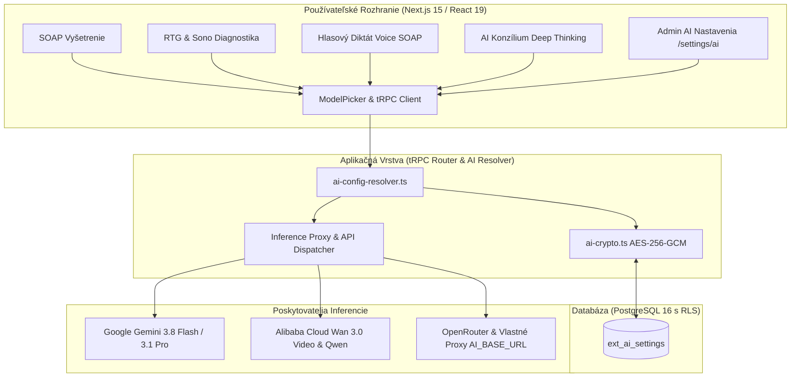

<!-- Outline ID: cc382c04-35b9-4ca1-a35c-8928fd53255e | URL: https://outline.dev.significa.sk/doc/11-konfiguracia-ai-agenta-a-modelov-openvpm-ai-pMvQ2xn48k -->
# 🤖 11. Konfigurácia AI agenta a modelov (OpenVPM AI)

Tento dokument predstavuje autoritatívnu technickú a medicínsku špecifikáciu multimodálnej architektúry umelej inteligencie v systéme **OpenVPM AI**. Popisuje integráciu poskytovateľov, schému ukladania a šifrovania v databáze PostgreSQL, používateľské rozhranie `ModelPicker`, mapovanie špecializovaných veterinárnych modelov a princípy dátovej suverenity.

---

## 1. Multimodálna architektúra AI v OpenVPM AI

OpenVPM AI integruje hybridnú infraštruktúru navrhnutú pre špecifické potreby slovenskej veterinárnej praxe:

Architektúra oddeľuje rýchle textové spracovanie od výpočtovo náročného klinického uvažovania a multimediálnej syntézy, čím dosahuje optimálny pomer medzi bleskovou odozvou a maximálnou diagnostickou presnosťou.

---

## 2. Databázová vrstva a kryptografická ochrana (`ext_ai_settings`)

Konfigurácia AI pre každú kliniku je perzistovaná v tabuľke `ext_ai_settings` chránenej striktnou multitenant izoláciou PostgreSQL Row-Level Security (RLS).

### 2.1 Schéma tabuľky `ext_ai_settings`

Kľúčové atribúty tabuľky:
* `practice_id` (UUID): Väzba na konkrétnu ambulanciu.
* `openai_compatible_enabled` (boolean): Prepínač pre vlastné OpenAI-kompatibilné endpointy.
* `openai_compatible_base_url` (text): URL adresa vlastného inference klastra alebo proxy.
* `openai_compatible_api_key_encrypted` (text): Zašifrovaný prístupový kľúč.
* `gemini_enabled` & `gemini_api_key_encrypted`: Konfigurácia pre Google Vertex / Gemini API.
* `alibaba_enabled` & `alibaba_api_key_encrypted`: Konfigurácia pre Alibaba Cloud (DashScope).
* `alibaba_proxy_url`: Privátny AliProxy endpoint pre optimalizované smerovanie video požiadaviek.
* `feature_mappings` (JSONB): Priradenie konkrétnych modelov a teploty inferencie pre jednotlivé klinické úlohy.
* `cached_models` (JSONB): Zoznam dynamicky načítaných a overených modelov z API providera.

### 2.2 Symetrické šifrovanie AES-256-GCM (`ai-crypto.ts`)

Všetky citlivé API kľúče sú šifrované pred zápisom do databázy pomocou overeného štandardu **AES-256-GCM** (Galois/Counter Mode):

* **Formát uloženia v DB:** `v1:<iv_b64>:<tag_b64>:<ciphertext_b64>`
  * `v1`: Identifikátor verzie šifrovacieho formátu.
  * `iv`: Náhodný inicializačný vektor o dĺžke 12 bajtov generovaný cez `crypto.randomBytes(12)`.
  * `tag`: 16-bajtový autentifikačný tag garantujúci integritu šifrovaného textu.
  * `ciphertext`: Samotný zašifrovaný API kľúč.
* **Odvodenie šifrovacieho kľúča:** 32-bajtový symetrický kľúč sa odvodzuje hashovacou funkciou SHA-256 zo systémovej premennej `NEXTAUTH_SECRET` (alebo dedikovaného `AI_SETTINGS_ENCRYPTION_KEY`).
* **Klientske maskovanie:** Kľúče nikdy neopúšťajú server v dekódovanej podobe. Klient dostáva výhradne maskovaný reťazec (napr. `••••••••8f9a`).

### 2.3 Ochranné spracovanie chýb dešifrovania (Graceful Error Handling)

V praxi dochádza k situáciám, keď sa databáza obnoví z dumpu do prostredia s iným tajomstvom `NEXTAUTH_SECRET` (napr. prenos zo stagingu na produkciu alebo rotácia systémových kľúčov). 

Modul `ai-crypto.ts` a resolver `ai-config-resolver.ts` implementujú ochranný mechanizmus:
* Chyba dešifrovania vyvolá špecifickú výnimku `AiSettingsEncryptionError`.
* Router `aiSettings` a resolver túto výnimku bezpečne zachytia, zalogujú varovanie a vrátia bezpečný fallback (napr. prázdnu hodnotu alebo premenné z prostredia).
* **Výsledok:** Stránka nastavení `/settings/ai` a klinické moduly **nikdy nespadnú do fatálnej chyby HTTP 500**. Administrátor vidí upozornenie a môže kľúč jednoducho znovu zadať a uložiť.

---

## 3. Používateľské rozhranie ModelPicker a správa modelov

Administrátorské rozhranie na `/settings/ai` obsahuje pokročilý komponent **ModelPicker** navrhnutý pre intuitívnu a bezchybnú konfiguráciu:

1. **Fulltextové vyhľadávanie a filtre:** Okamžité filtrovanie v zoznamoch desiatok modelov podľa názvu, ID alebo určenia.
2. **Kategorizačné odznaky (Badges):**
   * `Vision`: Multimodálne modely schopné interpretovať RTG a ultrasonografické snímky.
   * `Image`: Modely špecializované na generovanie medicínskej infografiky.
   * `Video`: Modely generujúce inštruktážne videá pre klientov.
   * `Pro / Reasoning`: Modely s rozšírenou logickou kapacitou pre klinické konzílium.
3. **Rolovacie tlačidlá (Scroll Navigation):** Zabraňujú zasekávaniu rozmerných výberových zoznamov v prehliadačoch a umožňujú pohodlné posúvanie na dotykových obrazovkách veterinárnych tabletov.
4. **Dynamické načítanie modelov (`fetchModels`):** Stlačením tlačidla *Načítať modely* systém kontaktuje API daného poskytovateľa a aktualizuje zoznam dostupných modelov o najnovšie verzie bez nutnosti aktualizácie aplikácie.
5. **Test spojenia (`testConnection`):** Okamžitá verifikácia sieťovej konektivity, platnosti zadaných tokenov a latencie odozvy.

---

## 4. Veterinárne mapovanie modelov pre klinické úlohy

Systém obsahuje optimalizované predvoľby (`DEFAULT_PRACTICE_FEATURE_MAPPINGS`), ktoré spájajú najmodernejšie svetové modely s konkrétnymi klinickými scenármi:

| Funkcia v systéme | Predvolený model | Teplota (Temp) | Význam pre veterinárnu ambulanciu |
| :--- | :--- | :---: | :--- |
| **`assistant`** (Copilot & SOAP) | `gemini-3.8-flash` | `0.2` | Bleskové generovanie štruktúrovaného vyšetrenia SOAP, kontrola liekových interakcií a súhrn anamnézy. |
| **`imagingRtg`** (RTG & Sono) | `gemini-3.1-pro` *(alt: `qwen-vl-max`)* | `0.1` | Detailná priestorová a denzitná analýza digitálnych snímok, meranie vertebrálneho indexu srdca (VHS) a dysplázie bedrových kĺbov. |
| **`voiceSoap`** (Hlasové diktovanie) | `gemini-3.8-flash` | `0.0` | Okamžitý prepis reči lekára do presných sekcií S-O-A-P priamo pri vyšetrovacom stole. |
| **`labParser`** (Extrakcia laboratória) | `gemini-3.8-flash` | `0.0` | Prevzatie biochemických a hematologických parametrov z analyzátorov a skenov do databázovej karty pacienta. |
| **`deepThinking`** (AI Konzílium) | `gemini-3.1-pro` | `0.1` | Hĺbková syntéza dát polymorbidných pacientov, komplikovaná diferenciálna diagnostika a riešenie nejasných stavov. |
| **`imageGeneration`** (Ilustrácie) | `qwen-image-3.0` | — | Generovanie zrozumiteľných schém a anatomických nákresov pre majiteľa pacienta. |
| **`videoGeneration`** (Edukačné video) | `wan3.0-video` | — | Krátke inštruktážne videosekvencie (5 sekúnd) zobrazujúce pooperačnú starostlivosť a techniku podávania liekov. |
| **`marketingCopy`** (Komunikácia) | `gemini-3.8-flash` | `0.4` | Tvorba klientskych newsletterov, edukačných letákov a preventívnych výziev. |

---

## 5. Zákonný rámec a etické pravidlá (Human-in-the-Loop)

Integrácia umelej inteligencie v OpenVPM AI striktne podlieha ustanoveniam **Zákona č. 39/2007 Z. z. o veterinárnej starostlivosti**:

1. **Princíp asistencie:** AI je výhradne administratívnym a analytickým asistentom. Všetky návrhy sú označené ako `draft` (koncept).
2. **Klinická zodpovednosť:** Za diagnózu, preskripciu liečiv a zvolenú terapiu nesie plnú a výhradnú právnu zodpovednosť ošetrujúci veterinárny lekár s platnou licenciou Komory veterinárnych lekárov SR (KVL SR).
3. **Zákaz autonómneho zápisu OPL:** Pri omamných a psychotropných látkach (Zákon č. 139/1998 Z. z.) je akýkoľvek autonómny návrh predpisu zablokovaný a vyžaduje sa výhradne manuálny zápis lekára.
4. **Zero Data Retention & GDPR:** Dáta slovenských pacientov a majiteľov nie sú poskytovateľmi modelov využívané na trénovanie verejných neurónových sietí. Audiozáznamy hlasového diktátu sa likvidujú do 24 hodín od autorizácie záznamu.