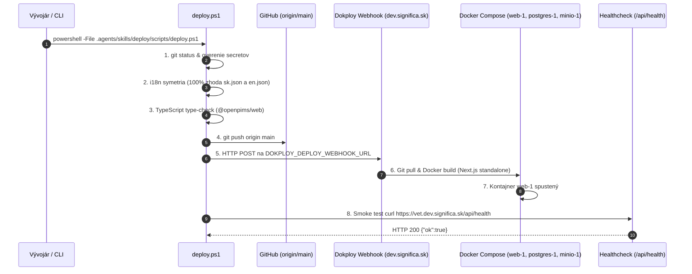

<!-- Outline ID: 6236e6ac-a298-4651-9a72-08c05ccf3dea | URL: https://outline.dev.significa.sk/doc/16-dokploy-deployment-a-serverovy-runbook-8BMzyb1D1I -->
# 🚀 16. Dokploy Deployment a Serverový Runbook

Tento dokument je autoritatívnym prevádzkovým a technickým sprievodcom pre nasadzovanie (deployment), správu kontajnerov a riešenie incidentov systému **OpenVPM AI** na produkčnom cloudovom serveri Dokploy (`dev.significa.sk`).

---

## 1. Architektúra serverového prostredia (`dev.significa.sk`)

Aplikácia beží v plne izolovanej multi-kontajnerovej Docker Compose infraštruktúre spravovanej platformou Dokploy s automatickým TLS smerovaním cez reverzné proxy Traefik:

* **Host & SSH prístup:** `root@dev.significa.sk`
* **Verejná produkčná doména:** [https://vet.dev.significa.sk](https://vet.dev.significa.sk) (automatické Let's Encrypt TLS na externej sieti `dokploy-network`)
* **Dokploy Project ID:** `DcWUBuOSe4H0UfF-OpLPb` (*OpenVPM AI*)
* **Dokploy Environment ID:** `dgpMIXk6UxZf_nS2fH3xU` (*production*)
* **Dokploy Compose App ID:** `pvdhIxlCIhYTKvnmrZ8Mk` (`openvpm-ai`)
* **Cesta ku kódu na serveri:** `/etc/dokploy/compose/compose-parse-online-port-wdunfq/code/`
* **Cesta k logom nasadenia:** `/etc/dokploy/logs/compose-parse-online-port-wdunfq/`

### 1.1 Prehľad služieb Docker Compose stacku

| Služba | Názov kontajnera | Obraz / Base | Porty | Účel a objem dát |
| :--- | :--- | :--- | :---: | :--- |
| **`web`** | `compose-parse-online-port-wdunfq-web-1` | `apps/web/Dockerfile` (runner) | `3000` (Traefik) | Produkčný Next.js 15 standalone server. |
| **`postgres`** | `compose-parse-online-port-wdunfq-postgres-1` | `postgres:16-alpine` | `5432` | PostgreSQL 16 databáza, volume `postgres_data`. |
| **`minio`** | `compose-parse-online-port-wdunfq-minio-1` | `quay.io/minio/minio:latest` | `9000` / `9001` | S3 privátne úložisko pre RTG, sono a prílohy, volume `minio_data`. |
| **`minio-bootstrap`** | `compose-parse-online-port-wdunfq-minio-bootstrap-1` | `minio/mc:latest` | — | Jednorazový kontajner na inicializáciu bucketu `openpims`. |
| **`db-init`** | `compose-parse-online-port-wdunfq-db-init-1` | `apps/web/Dockerfile` (builder) | — | Inicializátor: `pnpm db:setup` (bootstrap + RLS + slovenské referenčné dáta). |

---

## 2. Stav pilotnej databázy (MVDr. Martin Sýkora)

Na produkčnom serveri `dev.significa.sk` sú úspešne migrované a v plnej prevádzke nasadené kompletné historické aj aktuálne dáta pilotnej veterinárnej kliniky **MVDr. Martin Sýkora (Rimavská Sobota)**:

* **2 185 evidovaných klientov / majiteľov**
* **2 952 registrovaných pacientov (zvierat)**
* **6 664 štruktúrovaných SOAP záznamov a vyšetrení**
* **50 MB RTG a ultrasonografických snímok** bezpečne perzistovaných v MinIO S3 úložisku
* Všetky záznamy podliehajú striktnému vynucovaniu PostgreSQL Row-Level Security (RLS).

---

## 3. Deployment proces (Git `origin/main` → Dokploy Webhook)

Dokploy stavia aplikačný kontajner priamo z GitHub repozitára: `context: https://github.com/badmarsh/openvpm-ai.git#main`.



### 3.1 Príprava a pre-flight kontroly pred nasadením
Pred každým nasadením je povinné overiť:
1. **Absenciu tajomstiev:** `git diff --staged` nesmie obsahovať žiadne API kľúče ani heslá.
2. **Symetriu lokalizácie (i18n):**
   ```bash
   node -e "const en=require('./apps/web/messages/en.json'); const sk=require('./apps/web/messages/sk.json'); function keys(o,p=''){return Object.keys(o).flatMap(k=>{const path=p?p+'.'+k:k;return(typeof o[k]==='object'&&o[k]!==null)?keys(o[k],path):[path];});} const kEn=keys(en),kSk=keys(sk); if(kEn.length!==kSk.length){console.error('Mismatch!');process.exit(1);}else{console.log('✓ i18n 100% symmetric ('+kEn.length+' keys)');}"
   ```
3. **TypeScript kompiláciu:**
   ```bash
   pnpm --filter @openpims/web type-check
   ```

### 3.2 Spustenie deploymentu jedným príkazom
Nasadenie sa spúšťa cez pripravený skript zručnosti `deploy`:
```powershell
powershell -File .agents/skills/deploy/scripts/deploy.ps1
```
Skript načíta webhook z `.env` (`DOKPLOY_DEPLOY_WEBHOOK_URL`), overí čistotu gitu, odošle commity do vetvy `main`, vyvolá zostavenie na serveri a počká na úspešné dokončenie smoke testov.

> [!IMPORTANT]
> **Dokploy Compose architektúra (`sourceType: raw`):**
> Dokploy spravuje stack ako raw definíciu vo svojej internej PostgreSQL databáze (`compose.composeFile`). Úpravy vykonané priamo v súbore `docker-compose.dokploy.yml` v gite sa prejavia na serveri až vtedy, keď sa nová definícia zosynchronizuje do Dokploy databázy alebo webového UI.

---

## 4. Databázový setup a inicializácia RLS (`pnpm db:setup`)

Pre bezchybné naštartovanie databázy a elimináciu schema driftu slúži konsolidovaný príkaz:

```bash
pnpm db:setup
```

Tento príkaz deterministicky vykoná:
1. `pnpm db:bootstrap`: vytvorenie schém, tabuliek, indexov a databázových funkcií.
2. `pnpm db:rls`: spustenie skriptu `packages/db/rls/enable-rls.sql` so zapnutím Row-Level Security (`relrowsecurity = true`) na všetkých tabuľkách.
3. `pnpm db:seed:sk`: naplnenie overených slovenských dát (čísla čipov, očkovacie schémy, sadzby DPH).

V compose konfigurácii na serveri musí mať služba `db-init` definované heslo aplikácie:
`OPENPIMS_APP_DB_PASSWORD: ${POSTGRES_PASSWORD}`.

---

## 5. Troubleshooting Runbook (Riešenie najčastejších porúch)

### 5.1 Schema Drift / Chýbajúce RLS politiky (HTTP 503 — „29 critical controls missing")
* **Príčina:** Po obnove zo zálohy alebo po čiastočnom zlyhaní inicializácie neboli zapnuté RLS príznaky na tabuľkách PostgreSQL (`relrowsecurity = false`). Endpoint `/api/health` automaticky kontroluje všetkých 29 tabuliek a pri absencii RLS odmietne prevádzku.
* **Okamžitá oprava cez SSH:**
  ```powershell
  Get-Content packages/db/rls/enable-rls.sql -Raw | ssh root@dev.significa.sk "docker exec -i compose-parse-online-port-wdunfq-postgres-1 psql -U openpims -d openpims"
  ```
* **Overenie nápravy:**
  ```bash
  curl -s https://vet.dev.significa.sk/api/health
  # Očakávaná odpoveď: {"ok":true,"checks":{"database":{"ok":true},"schema":{"ok":true}}}
  ```

### 5.2 Chyba dešifrovania API kľúčov (`Failed to decrypt AI API key`)
* **Príčina:** Pri importe databázy z iného servera alebo po rotácii tajomstiev bol obsah stĺpcov `gemini_api_key_encrypted` a `alibaba_api_key_encrypted` zašifrovaný inou hodnotou `NEXTAUTH_SECRET`, než akú má aktuálny produkčný server.
* **Správanie systému:** Vďaka ochrane v `ai-settings.ts` a `ai-config-resolver.ts` stránka `/settings/ai` nespadne. Aplikácia zaloguje varovanie a umožní kľúč bezpečne zadať a prešifrovať v používateľskom rozhraní.
* **Oprava cez UI:** Administrátor kliniky sa prihlási do `/settings/ai`, zadá platné API kľúče a klikne na **Uložiť zmeny**. Kľúče sa okamžite zašifrujú platným produkčným kľúčom.

### 5.3 Zlyhanie webhooku alebo zaseknutý build (Núdzový manuálny build cez SSH)
Ak Dokploy webové rozhranie nereaguje alebo webhook zlyhá na timeout, je možné vyvolať plnohodnotný build priamo cez SSH:

```bash
ssh root@dev.significa.sk "cd /etc/dokploy/compose/compose-parse-online-port-wdunfq/code/ && docker compose build --no-cache web && docker compose up -d --remove-orphans web"
```

### 5.4 Prehliadanie systémových a nasadzovacích logov na serveri
```bash
# Zobrazenie najnovších logov nasadenia v Dokploy
ssh root@dev.significa.sk "ls -lt /etc/dokploy/logs/compose-parse-online-port-wdunfq/ | head -n 5"

# Živé sledovanie logov produkčného kontajnera web
ssh root@dev.significa.sk "docker logs -f --tail=100 compose-parse-online-port-wdunfq-web-1"

# Kontrola stavu všetkých kontajnerov v projekte
ssh root@dev.significa.sk "docker ps --filter name=compose-parse-online-port-wdunfq"
```

---

## 6. Post-Deploy overenie (Smoke Verification)

Po každom nasadení povinne vykonajte sériu overovacích dopytov:

```bash
# 1. Kontrola healthchecku aplikácie a databázy
curl -s https://vet.dev.significa.sk/api/health
# Očakávané: {"ok":true,"checks":{"database":{"ok":true},"schema":{"ok":true}}}

# 2. Kontrola dostupnosti prihlasovacej stránky
curl -s -o /dev/null -w "%{http_code}" https://vet.dev.significa.sk/login
# Očakávané: 200 (alebo 307 pri presmerovaní prihláseného používateľa)

# 3. Kontrola celistvosti záznamov v PostgreSQL
ssh root@dev.significa.sk "docker exec -i compose-parse-online-port-wdunfq-postgres-1 psql -U openpims -d openpims -c 'SELECT count(*) FROM patients;'"
# Očakávané: 2952 (alebo vyššie po nových registráciách)
```

> [!NOTE]
> V prípade akýchkoľvek neočakávaných incidentov kontaktujte technického správcu infraštruktúry a postupujte podľa havarijného plánu v kapitole **6. Riešenie výpadkov a Disaster Recovery**.
