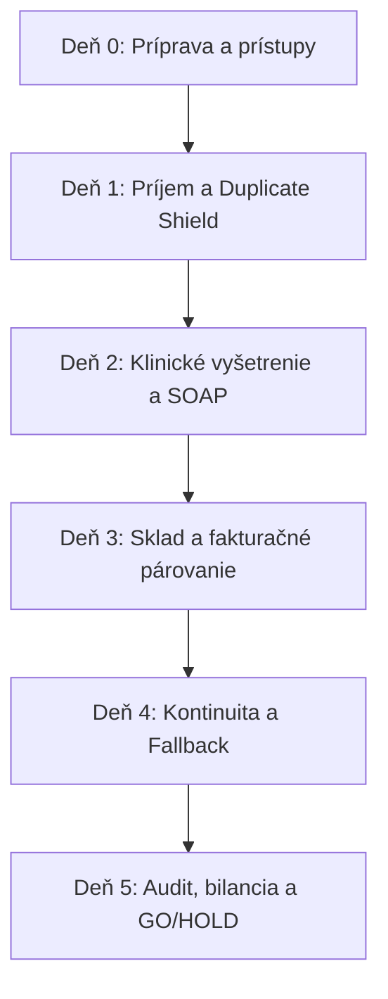

<!-- Outline ID: 06d22c33-1b13-4601-9805-6377d6460f0b | URL: https://outline.dev.significa.sk/doc/2-charakteristika-a-nezavisle-hodnotenie-systemu-glm52-ai-iYmdRebdf9 -->
# 🔍 2. Charakteristika a nezávislé hodnotenie systému (GLM5.2 AI)

Konsolidovaná syntéza dvoch nezávislých expertných hodnotení systému **OpenVPM AI** — hĺbkového technicko-legislatívneho auditu repozitára (Perplexity AI) a produktovo-klinickej analýzy PIMS s porovnaním slovenského trhu (GLM5.2 AI) k 14. septembru 2026.

---

## Základné identifikačné údaje

| Parameter | Hodnota |
|-----------|---------|
| **Ambulancia** | Súkromná veterinárna ambulancia MVDr. Martin Sýkora (Rimavská Sobota) |
| **Účel dokumentu** | Sprievodný analytický a metodický dokument k paralelnej testovacej prevádzke (shadow-run) popri VetSoftware v2 |
| **Stav hodnotenia** | 14. september 2026 |
| **Hodnotený zdroj** | Projekt [badmarsh/openvpm-ai](https://github.com/badmarsh/openvpm-ai) (commit `301d3d7`, verzia v0.6-PILOT-READY) |
| **Metodológia** | Syntéza priameho auditu kódu (68 routerov, ~65 schém, 4 971 testov, runbooky), legislatívneho rozboru SR a komparatívneho prieskumu vet trhu |

---

## Manažérsky súhrn a verdikt (Executive Summary)

OpenVPM-AI predstavuje na slovenskom veterinárnom trhu **technologický skok o celú generáciu dopredu**. Ide o moderný, cloudový, viacnájomnícky (multi-tenant) a API-first veterinárny informačný systém (PIMS) postavený na modernom technologickom stacku (Next.js 15, tRPC, PostgreSQL/Drizzle ORM s Row-Level Security), ktorý disponuje 68 API routermi, ~65 schémami, takmer 5 000 automatizovanými testami a prepracovanými operačnými runbookmi.

Systém sa od akejkoľvek slovenskej konkurencie odlišuje najmä tromi piliermi:
1. **Slovenský legislatívny layer zakomponovaný priamo v jadre** (kaskáda ochranných lehôt EÚ 2019/6, e-Kasa driver, KVEPIS router, vylúčenie OPL z AI asistencie, fail-closed klinické roly a tenant-scoping).
2. **Klinická AI s prísnou disciplínou (Human-in-the-Loop)** — hlasový diktát SOAP, forenzný hash-chain audit log pre každý AI zásah, jednorazové potvrdzovacie obálky a povinné schvaľovanie diffu veterinárnym lekárom podľa zákonov č. 39/2007 Z. z. a č. 139/1998 Z. z.
3. **Plná kontrola nad dátami a otvorenosť** — žiadny vendor lock-in, možnosť vlastného hostingu a pripravená migračná stopa zo systému VetSoftware v2 (Firebird DB).

> [!IMPORTANT]
> **Strategické rozhodnutie pre pilotnú fázu:**
> **GO pre kontrolovaný shadow-run. NO-GO pre okamžitú plnú náhradu VetSoftware v2.**
> 
> OpenVPM-AI nie je konzervatívna výmena „krabicového softvéru“, ale strategický modernizačný projekt. Jeho hlavné riziká nespočívajú v kvalite kódu, ale v prevádzkovej nezrelosti: **bus factor 1** (jeden hlavný vývojár), absencia viacročnej histórie v ambulancii a chýbajúca živá produkčná certifikácia štátnych integrácií (e-Kasa, CRSZ).
> 
> Počas pilotu musí VetSoftware v2 zostať nespochybniteľným zdrojom pravdy pre fiškálne doklady, úradné hlásenia a kritické zákroky, kým sa jednotlivé toky v OpenVPM-AI v praxi neodskúšajú.

---

## 1. Technický a funkčný kaliber systému

### 1.1 Architektonický profil

| Vrstva | Technologické riešenie | Dôkaz a implementácia v repozitári |
|--------|------------------------|-------------------------------------|
| **Frontend** | Next.js 15 (App Router), React 19, Tailwind CSS, i18n SK/EN | `apps/web/app` — kartotéka, whiteboard, klientsky portál, booking, TV kiosk |
| **API vrstva** | tRPC v11 (40 core + 28 extension routerov), REST endpointy | `apps/web/server/routers/` (celkovo 68 routerov pokrývajúcich všetky domény) |
| **Databáza** | PostgreSQL 16 + Drizzle ORM, ~65 schém, **Row-Level Security (RLS)** | `packages/db/schema/`, `apply-rls.ts`, `rls-preflight.ts` (prísna tenant izolácia) |
| **Testovacie pokrytie** | Vitest (4 971 unit/integration testov), Playwright E2E | 16 spec súborov vrátane automatizovaného disaster recovery restore-drillu |
| **CI/CD a kvalita** | GitHub Actions (`ci.yml`, `migrate.yml`), Dependabot, CODEOWNERS | Striktný TypeScript bez chýb, rekurzívny test tenant-scopingu všetkých routerov |
| **Build a infraštruktúra** | Turborepo monorepo, pnpm workspaces, Docker, Vercel ready | `turbo.json`, `docker-compose.yml`, produkčné optimalizácie bundlu |

### 1.2 Klinické jadro ambulancie

- **Ambulantný workflow návštevy:** Plnohodnotné moduly pre stretnutia (`encounters`, 93 KB), zdravotné záznamy (`records`, 164 KB), štruktúrované SOAP záznamy s históriou revízií, vitálne funkcie, pracovné zoznamy (work-lists) a priebežný klinický whiteboard so živým Server-Sent Events (SSE) tokom.
- **Liečebné plány a dôkazový rámec:** Modul `treatment-plan-evidence.ts` uchováva preukázateľné dôkazy k jednotlivým krokom liečby vrátane ochrany proti súbežným zápisom (optimistic concurrency).
- **Lekáreň a kontrolované látky:** Moduly `prescriptions` a `controlled-substances.ts` tvoria digitálnu „knihu omamných a psychotropných látok“ so slovenskými skupinami OPL a nemenným auditným záznamom.
- **Diagnostika a zobrazovanie:** Modul `imaging` (36 KB), DICOM príprava, zubný kríž (`ext_dental`), prepúšťacie správy (`ext_discharge`) a PDF import laboratórnych výsledkov s podporou AI extrakcie.
- **Ochrana pred duplicitami:** Modul `duplicate-shield` aktívne zabraňuje vzniku duplicitných pacientov a majiteľov pri ručnom nahadzovaní údajov, čo je kľúčový nástroj pre fázu migrácie.

### 1.3 Slovenský legislatívny modul (VET & SEC štandardy)

Audit kódu potvrdil implementáciu špecifických legislatívnych požiadaviek SR:
- **VET-01 (OPL filter v AI):** AI extraktory a asistenti majú striktne zakázané navrhovať alebo automaticky dopĺňať recepty na kontrolované látky (Zákon č. 139/1998 Z. z.).
- **VET-02 (Ochranné lehoty):** Funkcia `calculateStatutoryWithdrawal()` automaticky kalkuluje zákonné ochranné lehoty pre potravinové zvieratá podľa kaskády Nariadenia EÚ 2019/6.
- **VET-03 (CRSZ integrácia):** Modul `lookupCrszOnline` vracia transparentný status `UNVERIFIED_NO_API_CONNECTION`, nakoľko CRSZ nedisponuje verejným API; systém pripravuje dáta pre manuálny zápis povereným SVL.
- **VET-04 (e-Kasa architektúra):** Implementované rozhranie `EkasaDriver` s prepínateľným variantom Mock a Http driveru pre komunikáciu s chráneným dátovým úložiskom (CHDU).
- **SEC-01/02 (Klinické role a integrita pacienta):** Funkcia `requireClinicalActorRole` vynucuje rolové oprávnenia pre klinické zápisy; aktívny guard bráni neoprávnenému zápisu k uhynutému alebo archivovanému zvieraťu.
- **SEC-03 (Auditovaný sklad):** Pohyby tovaru a liekov (`adjustStock`) sú povolené výhradne cez auditované inventúrne procedúry.
- **KVEPIS router:** Samostatný router `kvepis.ts` (21,7 KB) a schéma `ext_kvepis` pre generovanie a validáciu XML hlásení pre štátny systém ŠVPS SR spustený od 1. 1. 2026.

### 1.4 Bezpečnosť AI a Human-in-the-Loop governance

- **Hlasové diktovanie (`voice.ts`):** Podpora štruktúrovaného prepisu anamnézy priamo do SOAP štruktúry s 24-hodinovým retenčným výmazom audio nahrávok (GDPR).
- **Klinické potvrdzovacie modály:** Rozhrania `ConfidenceScoreBadge` (trojstupňová kalibrácia: Zelená >= 92 %, Oranžová 75–91 %, Červená < 75 %) a `ClinicalDiffConfirmModal`. AI výstup predstavuje vždy iba návrh — lekár vidí porovnanie pôvodného a navrhovaného stavu a zmenu musí autorizovať (Zákon č. 39/2007 Z. z.).
- **Forenzný audit trail (`ext_ai_audit_log`):** Každý zásah AI modelu je kryptograficky viazaný cez hash-chain; testy verifikujú integritu logu voči neoprávnenej zmene či preusporiadaniu záznamov.
- **Autopilot a CRM s etickým filtrom:** 5 zákazníckych ciest (onboarding, prevencia, vakcinácie, post-op, reaktivácia), 12 segmentov a centrálne potlačovacie centrum (`ext_automation_suppression_log`) s automatickou **Sympathy Gate** — okamžité zastavenie všetkých pripomienok pri úhyne pacienta a vystavenie úlohy pre personál na kondolenčný kontakt.

---

## 2. Bodové hodnotenie zrelosti (Scorecard 1–10)

| Dimenzia | Hodnotenie | Odborné zdôvodnenie |
| :--- | :---: | :--- |
| **Architektúra a rozšíriteľnosť** | **8 / 10** | Moderné monorepo, striktné oddelenie web/API/DB balíkov, REST aj tRPC, plná Dockerizácia. Technologický základ výrazne prekonáva bežné desktopové aj staršie cloudové riešenia na trhu. |
| **Klinická základňa** | **7 / 10** | Kompletné ambulantné jadro: karty, SOAP, vakcinácie, vitály, sklad, fakturácia, whiteboard a portál. Pokročilé nemocničné toky (anestéziologický protokol, ICU monitoring, operačný protokol, triáž) zatiaľ chýbajú. |
| **Bezpečnostný dizajn** | **8 / 10** | Fail-closed roly, databázové RLS politiky, jednorazové potvrdzovacie obálky, optimistické zamykanie revízií, hash-chain audit log a hygiena repozitára (očistenie PII). |
| **AI governance** | **7 / 10** | Dôsledný Human-in-the-Loop mechanizmus, kalibrácia spoľahlivosti, ochrana OPL a fail-safe liekové kontroly. Chýba však externá klinická validácia eval datasetu a formálny red-teaming. |
| **Slovenská pripravenosť** | **6 / 10** | Perfektná terminológia, legislatívne moduly a dátové štruktúry pre e-Kasu, KVEPIS a PetExpert. Chýba však finálna hardvérová certifikácia pokladnice a živé produkčné prepojenia. |
| **Prevádzková vyspelosť** | **4 / 10** | Vynikajúca dokumentácia a runbooky, no systém zatiaľ nemá za sebou viacmesačnú ambulantnú prevádzku, nezávislý penetračný test ani vybudovanú komunitu/tím podpory (bus factor 1). |
| **Vhodnosť pre shadow-run** | **8 / 10** | Vynikajúca pripravenosť na paralelnú prevádzku: k dispozícii je duplicate-shield, nástroje na párovanie platieb a detailný 5-dňový pilotný protokol. |

---

## 3. Komparatívna analýza slovenského trhu

### 3.1 Porovnávacia matica systémov

| Kritérium | OpenVPM-AI | VetSoftware v2 | Vetbook | Veclis | VetPro (Medsoft) | Amadeo | VitalFox |
| :--- | :--- | :--- | :--- | :--- | :--- | :--- | :--- |
| **Architektúra** | Cloud Web (Next.js/Postgres) | Windows Desktop (Firebird DB) | Cloud Web PIMS | Cloud Web PIMS | Windows Desktop | Cloud Web PIMS | Komunikačná SaaS nadstavba |
| **Vzdialený prístup** | Áno (plne responzívny) | Nie (lokálna sieť / RDP) | Áno | Áno | Plánovaný na rok 2027 | Áno | Áno |
| **AI integrácia** | Hlasový diktát, SOAP, audit, Human-in-the-Loop | Nie | Deklarovaný asistent a AI rádiológ | Nie | Nie | Nie | Automatizácia komunikácie |
| **SK legislatíva** | e-Kasa driver, KVEPIS router, kaskáda EÚ 2019/6 | Overená rokmi praxe | Deklarovaná | Deklarovaná (sklad, doklady) | Základná fiškálna evidencia | Deklarovaná | Nie je PIMS |
| **Bezpečnosť dát** | Multi-tenant RLS, hash-chain audit, 4 971 testov | Lokálne zálohy | Štandard SaaS | Štandard SaaS (2FA, SSL) | Lokálne súbory | Štandard SaaS | Štandard SaaS |
| **Klientsky portál** | Áno (booking, záznamy, PWA) | Nie | Áno | Čiastočne | Nie | Čiastočne | Zameranie na SMS/email |
| **Otvorený kód / Suverenita** | **Áno (vlastné dáta i kód)** | Nie | Nie | Nie | Nie | Nie | Nie |
| **API a integrácie** | tRPC + REST, vysoká rozšíriteľnosť | Uzavreté (iba DB exporty) | Nejasné z verejných zdrojov | Laboratórne prístroje, žiadanky | Fiškálne tlačiarne | PetExpert partnerstvo | Otvorené API pre PIMS |
| **Cenový model** | Open-source (hosting + podpora) | Licencia / podpora | Mesačný paušál 50–280 € | Mesačný paušál | Jednorazovo 175 € + moduly | Mesačný paušál | Mesačný paušál |
| **Trhová zrelosť** | Nový pilot (v0.6-PILOT-READY) | Dlhoročný etalón v ústupe | Etablovaný komerčný cloud | 12+ rokov, 900+ lekárov | Dlhoročná desktopová báza | Zavedený dodávateľ | Zavedená služba |

### 3.2 Odborná interpretácia postavenia na trhu

- **Voči VetSoftware v2:** VetSoftware v2 je overený, robustný, no technologicky zastaraný desktopový systém. OpenVPM-AI prináša moderné webové rozhranie, prístup z tabletu, AI diktovanie a automatizácie. VetSoftware v2 však zatiaľ vyhráva v stopercentnej istote fiškálnych uzávierok a zažitých postupoch personálu.
- **Voči Vetbooku:** Vetbook je najbližší funkčný konkurent, ktorý rovnako deklaruje cloud a AI asistenciu. OpenVPM-AI však ponúka vyššiu úroveň dátovej suverenity, otvorený kód, prísnejšiu preukázateľnosť AI auditu (hash-chain) a moderné monorepo bez závislosti od jediného komerčného dodávateľa.
- **Voči Veclisu:** Veclis je etablovaný líder slovenského trhu s obrovskou používateľskou bázou (900+ veterinárov) a preverenými laboratórnymi napojeniami. OpenVPM-AI je technologicky modernejší a flexibilnejší v AI, no musí dokázať prevádzkovú stabilitu, ktorú Veclis budoval vyše dekády.
- **Voči VetPro a Amadeu:** Tradičné ambulantné systémy pokrývajúce štandardnú administratívu. Oproti nim prináša OpenVPM-AI klientsky portál, prepracované CRM, moderný whiteboard a AI schopnosti, ktoré v starších architektúrach nie je možné jednoducho dobudovať.

---

## 4. Analýza nedostatkov a limitov (Gap Analysis)

Nedostatky systému sú rozdelené do troch kategórií podľa závažnosti a času riešenia:

### 4.1 Priorita P0 — Podmienky pre štart pilotu (Týždeň 1)

1. **Overenie e-Kasy v reálnej prevádzke:**
   - *Stav:* Architektúra `EkasaDriver` (Mock/Http) a dokumentovaný runbook certifikovaného hardvéru existujú. Od 1. 1. 2026 platí zákon č. 384/2025 Z. z. (povinné bločky pre všetky tržby vrátane kariet; od 1. 3. 2026 povinnosť prijímať bezhotovostné platby nad 1 €; sankcie 500 až 15 000 €).
   - *Riešenie:* Počas pilotu tlačiť oficiálne doklady cez existujúcu pokladnicu VetSoftware v2. OpenVPM-AI viesť v režime testovacieho párovania súm.
2. **Proces zápisov do CRSZ:**
   - *Stav:* CRSZ nemá verejné API (`UNVERIFIED_NO_API_CONNECTION`). Zákon ukladá povinnosť zápisu do 24 hodín pri čipovaní a vakcinácii proti besnote (zmena majiteľa a úhyn do 21 dní).
   - *Riešenie:* Vytvoriť v ambulancii denný checklist pre manuálny prepis údajov cez portál `crsz.sk`.
3. **Vyčistenie git histórie (PII hygiena):**
   - *Stav:* Z verejného repozitára bolo odstránených 58 interných skriptov s testovacími údajmi, no staršie git commity ich môžu stále obsahovať.
   - *Riešenie:* Vykonať dôsledný prepis histórie cez `git-filter-repo` pred uvoľnením ďalších prístupov.

### 4.2 Priorita P1 — Požiadavky počas pilotného behu (2. až 8. týždeň)

4. **Klinická validácia AI na reálnych prípadoch:**
   - Viesť pilotný log úspešnosti AI návrhov (pomer: prijaté bez zmeny / upravené lekárom / zamietnuté).
   - Zabezpečiť odborné posúdenie 114-prípadového eval datasetu licencovaným veterinárnym lekárom.
5. **Chýbajúce ústavné a špecializované workflowy:**
   - *Anestézia:* Chýba kontinuálny anesteziologický protokol, monitoring SpO2/EKG/tlaku.
   - *Hospitalizácia a ICU:* Chýba flowsheet infúznej terapie a intenzívneho sledovania.
   - *Chirurgia:* Chýba štruktúrovaný operačný protokol (predoperačná príprava, výkon, pooperačná starostlivosť).
   - *Triáž:* Chýba validovaný systém kategorizácie urgentných pacientov.
   - *Pravidlo:* Tieto úkony viesť počas pilotu primárne vo VetSoftware v2.
6. **Riešenie výpadku konektivity (Offline / Paper Failover):**
   - Systém vyžaduje internetové pripojenie. V ambulancii musí byť k dispozícii jasný „papierový formulár“ a postup jeho spätného zaevidovania pri výpadku siete.
7. **Riziko jediného vývojára (Bus Factor 1):**
   - Najväčšie prevádzkové riziko ambulancie. Je nevyhnutné nastaviť eskalačný reťazec, záložné prístupy a dokumentované kontakty pre prípad technickej nedostupnosti autora.

### 4.3 Priorita P2 — Dlhodobé strategické úlohy

8. **Optimalizácia modulov:** Marketingové štúdio (143 KB router) a hromadné SMS kampane ponechať počas pilotu vypnuté, aby nezaťažovali pozornosť ambulancie.
9. **GDPR dokumentácia pre prax:** Formalizovať zmluvu o spracúvaní osobných údajov (DPA) medzi ambulanciou a poskytovateľom hostingu.
10. **Formálny bezpečnostný pentest:** Realizovať nezávislý penetračný test zameraný na RLS politiky a autorizačné mechanizmy pred komerčným škálovaním.

---

## 5. Slovenský legislatívny a regulačný checklist (2026)

| Oblasť | Právna norma | Stav v OpenVPM-AI | Pokyn pre pilotnú prevádzku |
| :--- | :--- | :--- | :--- |
| **e-Kasa** | Zákon č. 289/2008 Z. z. v znení zákona č. 384/2025 Z. z. | Ovládač pripravený, CHDU netestované naživo | Doklady vystavovať vo VetSoftware v2; v OpenVPM-AI párovať tržby |
| **Centrálny register (CRSZ)** | Zákon č. 39/2007 Z. z., § 19 | Dátová príprava hotová, API nedostupné | Manuálny zápis do 24 hodín cez portál `crsz.sk` povereným lekárom |
| **Štátny systém KVEPIS** | ŠVPS SR (spustené 1. 1. 2026) | XML export a XSD validátor v `kvepis.ts` | Podania realizovať manuálne cez ÚPVS (slovensko.sk) / kvepis.sk |
| **Ochranné lehoty liekov** | Nariadenie EÚ 2019/6 | Implementovaná kaskáda v `statutory.ts` | Kontrola správnosti výpočtu pri hospodárskych zvieratách lekárom |
| **Omamné látky (OPL)** | Zákon č. 139/1998 Z. z. | `controlled-substances.ts`, zákaz AI prefillu | Viesť papierovú knihu OPL paralelne s digitálnou evidenciou |
| **Ochrana údajov (GDPR)** | Nariadenie EÚ 2016/679 | Hash-chain audit, Sympathy Gate, 24h audio purge | Zabezpečiť informovaný súhlas klientov na spracovanie údajov |
| **Poistenie PetExpert** | Zmluvné podmienky partnera | Pripravený a validovaný claim payload | Neodosielať naživo; poistné udalosti riešiť štandardnou cestou |

---

## 6. Metodika a harmonogram pilotného testovania (5 dní)

Pilotný test prebieha formou kontrolovaného **shadow-runu** (paralelného behu). Noví pacienti a zmeny sa zaznamenávajú do oboch systémov, pričom OpenVPM-AI slúži na testovanie používateľskej ergonómie a AI asistencie.

### 6.1 Štruktúra testovacích dní

- **Deň 0 — Príprava a konfigurácia:**
  - *Náplň:* Overenie používateľských účtov a rolí (lekár, sestra/asistent, recepcia), test tlače, kontrola cenníka a overenie obnovy databázy zo zálohy.
  - *Kritérium úspechu:* Funkčné prihlásenie personálu bez zdieľania hesiel a overený testovací restore.
- **Deň 1 — Príjem pacienta a klientska agenda:**
  - *Náplň:* Založenie nového klienta a zvieraťa, vyhľadanie existujúceho záznamu, test funkcie `duplicate-shield` pri zámernom zadaní podobného mena a kontrola check-in toku na whiteboarde.
  - *Kritérium úspechu:* Žiadny vznik nežiaducej duplicity; personál zvládne príjem do 3 minút.
- **Deň 2 — Klinické vyšetrenie a AI diktovanie:**
  - *Náplň:* Vedenie ambulantnej návštevy, hlasové diktovanie anamnézy, kontrola extrakcie SOAP záznamu, aplikácia vakcinácie s kontrolou šarže a revízia diffu v potvrdzovacom modále.
  - *Kritérium úspechu:* Lekár potvrdí vecnú správnosť a čitateľnosť SOAP zápisu; AI neurobí neoprávnený zápis bez potvrdenia.
- **Deň 3 — Skladové hospodárstvo a fakturácia:**
  - *Náplň:* Priradenie úkonov a materiálu k návšteve, kontrola odpisu zo skladu, vygenerovanie návrhu účtu a porovnanie výslednej sumy a DPH voči dokladu z VetSoftware v2.
  - *Kritérium úspechu:* Stopercentná zhoda finančných súm a správne odpočítanie skladových zásob.
- **Deň 4 — Kontinuita starostlivosti a výpadkový scenár:**
  - *Náplň:* Nastavenie pripomienky vakcinácie, odoslanie kontrolného e-mailu cez portál, simulácia krátkodobého odpojenia internetu (overenie správania aplikácie a prechod na paper failover).
  - *Kritérium úspechu:* Dáta zostanú konzistentné; po obnove spojenia personál záznam bez straty dokončí.
- **Deň 5 — Týždenná uzávierka a vyhodnotenie:**
  - *Náplň:* Export kompletnej JSON/CSV zálohy, kontrola zhody počtu ošetrených pacientov medzi systémami, debrief s personálom a zápis nájdených odchýlok do GitHub Issues.
  - *Kritérium úspechu:* Spoločné vyhodnotenie pilotného týždňa a rozhodnutie o pokračovaní.

### 6.2 Sledované metriky pilotu

1. Priemerný čas potrebný na zaevidovanie nového klienta a pacienta.
2. Priemerný čas zaznamenania a uzavretia štandardného ambulantného vyšetrenia.
3. Počet nejasností personálu pri obsluhe jednotlivých obrazoviek.
4. Celkový počet a charakter odchýlok zistených voči systému VetSoftware v2.
5. **AI miera akceptácie:** Pomer návrhov prijatých bez zmeny, s úpravou a zamietnutých lekárom.
6. Bezchybnosť finančných súčtov a skladových odpisov.

### 6.3 Striktné STOP podmienky pilotného testu

Ak počas prevádzky nastane ktorákoľvek z nasledujúcich udalostí, testovanie daného modulu sa **okamžite prerušuje** a pracovisko sa vracia výhradne k VetSoftware v2:
- Zistenie straty dát alebo narušenie väzby medzi majiteľom a zvieraťom.
- Nesprávny finančný výpočet, chyba v sadzbe DPH alebo chybný odpis skladovej šarže.
- Bezpečnostný incident (zobrazenie údajov inej kliniky alebo narušenie tenant izolácie).
- Neuloženie alebo strata klinického záznamu po potvrdení lekárom.
- Nekontrolované správanie AI asistenta, ktoré by bez korekcie lekára viedlo k ohrozeniu zdravia zvieraťa.
- Pokus o vyslanie neoverených ostrých dát do systémov e-Kasa alebo KVEPIS bez certifikácie.

---

## 7. Podmienky pre prechod do ostrej prevádzky

Prechod zo shadow-runu do plnej produkčnej prevádzky (odstavenie VetSoftware v2) je možný až po splnení všetkých 8 podmienok:
1. **Písomná klinická akceptácia:** MVDr. Martin Sýkora písomne potvrdí stopercentnú vecnú a formálnu správnosť klinickej dokumentácie za celé pilotné obdobie.
2. **Dátová parita:** Kompletná zhoda počtu klientov, pacientov, vakcinácií a otvorených záznamov medzi novým a starým systémom.
3. **Finančná a daňová zhoda:** Nezávislá kontrola finančných súčtov a skladových pohybov voči účtovným knihám.
4. **Preverené zálohovanie a obnova:** Úspešne vykonaný a zdokumentovaný praktický test obnovy produkčnej databázy zo zálohy (RTO < 30 minút, RPO < 1 hodina).
5. **Autentifikácia a roly:** Všetci pracovníci pristupujú pod vlastnými menovanými účtami s primeranými rolami (žiadne zdieľané heslá).
6. **Oficiálna fiškálna certifikácia:** Úspešná integrácia a certifikovaný test e-Kasa hardvéru podľa zákona č. 384/2025 Z. z.
7. **Klinický AI dohľad:** Nastavené a zaškolené interné pravidlo: AI výstup je vždy iba návrh podliehajúci podpisu lekára.
8. **Vyriešené P0/P1 incidenty:** Všetky incidenty nahlásené v GitHube majú priradené riešenie, test a overenú nápravu v kóde.

---

## Záverečné stanovisko

Systém **OpenVPM AI** predstavuje pre ambulanciu MVDr. Martina Sýkoru mimoriadnu príležitosť získať technologický náskok, plnú dátovú suverenitu a zbaviť sa obmedzení starých desktopových aplikácií. Nejde o hotový sterilný produkt z police, ale o živý a mimoriadne kvalitný inžiniersky systém.

Navrhovaný **5-dňový shadow-run** poskytuje bezpečný priestor na overenie všetkých výhod bez ohrozenia denného chodu kliniky či zákonných povinností. Ak pilot potvrdí očakávania, OpenVPM-AI sa stane špičkovým digitálnym pilierom ambulancie.

---

## Zdroje a referenčné dokumenty

- Repozitár projektu: [badmarsh/openvpm-ai](https://github.com/badmarsh/openvpm-ai) (vetva `main`)
- Pilotná dokumentácia: `docs/clinic-pilot-readiness.md`, `docs/clinic-pilot-workflow.md`
- Bezpečnosť a obnova: `docs/production-readiness/GAP_ANALYSIS_POST_PILOT_READY.md`, `docs/backup-restore-runbook.md`
- Legislatívne zdroje SR:
  - Zákon č. 39/2007 Z. z. o veterinárnej starostlivosti
  - Zákon č. 289/2008 Z. z. a zákon č. 384/2025 Z. z. o používaní elektronickej registračnej pokladnice
  - Zákon č. 139/1998 Z. z. o omamných látkach, psychotropných látkach a prípravkoch
  - Nariadenie Európskeho parlamentu a Rady (EÚ) 2019/6 o veterinárnych liekoch
  - Štátny veterinárny systém KVEPIS (ŠVPS SR, www.kvepis.sk)
  - Centrálny register spoločenských zvierat (CRSZ SR, crsz.sk)
- Prieskum trhu: Verejne dostupné materiály a špecifikácie systémov VetSoftware v2, Vetbook, Veclis, VetPro (Medsoft), Amadeo (ArisCom) a VitalFox.