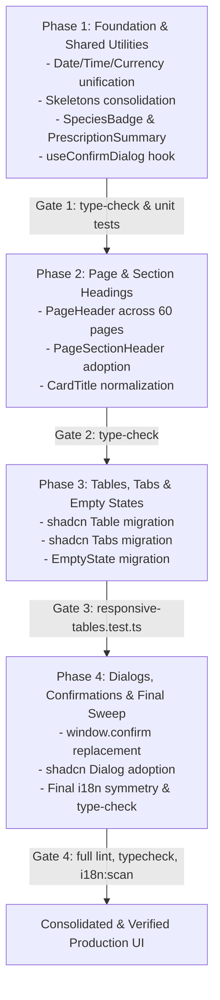

# UI Consolidation Prompt — VET.IS (OpenVPM AI)
> **Consolidated with `AGENTS.md` and `openvpm-ai` Skill (`SKILL.md`)**  
> *Architectural Guardrails, Zero-Conflict Upstream Sync, Strict i18n, and Slovak Veterinary Statutory Safety Gates*

---

## 1. Objective

Systematically unify the visual consistency of the VET.IS dashboard UI without flattening every page into an identical layout. Pages may differ in content and structure, but **typographic scale, spacing tokens, component sizing, component selection, UX patterns, and clinical indicators must be predictable** — a veterinary user moving between Patients, Billing, Encounters, and Settings must feel they are working in a cohesive, professional application.

---

## 2. Scope & Target Boundaries

- **In scope:** `apps/web/app/(dashboard)/**` (all 67 dashboard pages) and their supporting components in `apps/web/components/**`.
- **Out of scope:** Auth pages (`(auth)`), client portal (`portal/`), standalone pages (`legal/`, `sms/`, `clinic-fit/`, `capture/`, `sign/`, `book/`, `api-docs/`), and all database schema files (`packages/db/schema/**`).
- **Upstream Vanilla File Discipline (`AGENTS.md` §3):**
  - Pages originating from upstream OpenVPM (`patients/page.tsx`, `billing/page.tsx`, `schedule/page.tsx`, `inventory/page.tsx`, `clients/page.tsx`, `recalls/page.tsx`, `encounters/page.tsx`) must be kept **generically authored**.
  - Do NOT hardcode Slovak-only legislation text, clinic-specific logic, or AI extensions into upstream-shared files.
  - Generic improvements (shadcn `Table`, `PageHeader`, `EmptyState`, generic `SpeciesBadge`) must be cleanly backportable upstream.
- **Navigation Guardrail:** Never modify `sidebar.tsx` directly. Custom navigation items are managed exclusively in `apps/web/config/custom-nav.ts`.

---

## 3. Empirical Audit Findings — The 5 Layers of Fragmentation

A comprehensive audit of all 67 dashboard pages revealed systemic divergence from the canonical component system:

### LAYER 1: Typography & Layout Components

#### 1.1 Page Headings — 3 heading levels, 4 sizes, 2 weights
The canonical `PageHeader` component (`apps/web/components/layout/page-header.tsx:29`) renders:
```tsx
h1 → font-heading text-2xl font-bold tracking-tight text-foreground sm:text-3xl
```
Only **7 of 67 dashboard pages** use it (`patients`, `encounters`, `marketing`, `marketing/automations`, `marketing/content-queue`, `marketing/handouts`, `marketing/messages`). The remaining 60 pages fall into:

| Group | Affected Pages | Code Defect |
|---|---|---|
| **Wrong heading level (`<h2>` as page title)** | `clients/page.tsx:49`, `recalls/page.tsx:233`, `care-reminders/page.tsx:205`, `inbox/page.tsx:303`, `reports/page.tsx:955`, `inventory/page.tsx:487`, `controlled-substances/page.tsx:856` | Uses `h2` at `text-xl font-semibold` — wrong semantic level, breaks document outline, visual mismatch with `PageHeader`. |
| **Raw `<h1>` without `PageHeader`** | `wellness/page.tsx`, `vaccinations/page.tsx:76`, `automations/page.tsx`, `marketing/consents/page.tsx`, `marketing/website/page.tsx`, `statutory/page.tsx:164`, `statutory/kvepis/page.tsx`, `settings/ekasa/page.tsx` | Missing `font-heading`, missing responsive `sm:text-3xl`, arbitrary weights. |
| **Raw `<h1>` at wrong size** | `settings/import-v2/page.tsx:73` | Uses `text-3xl font-bold` instead of `text-2xl sm:text-3xl`. |
| **Raw `<h1>` with `font-semibold`** | `lab-results/page.tsx`, `encounters/[appointmentId]/page.tsx`, `records/replace-soap/page.tsx` | Uses `font-semibold` instead of `font-bold`. |
| **Bare unstyled `<h1>`** | `statutory/page.tsx:1378` | Bare HTML `<h1>Kniha Omamnych a Psychotropnych Látok (OPK)</h1>` without styling. |

#### 1.2 Section Headers — `PageSectionHeader` is 0% adopted
The canonical `PageSectionHeader` (`apps/web/components/layout/page-header.tsx:66`) renders:
```tsx
h2 → font-heading text-lg font-semibold text-foreground
```
Currently has **0 import references** across the entire repository. Pages hand-roll at least 12 distinct section heading styles:
- `h2` at `text-xl font-semibold` (most common, contradicts component's `text-lg`)
- `h2` at `text-sm font-semibold text-foreground`
- `h3` at `text-lg`, `text-2xl`, `text-base`, `text-sm`
- Bare unstyled `font-medium` or `font-semibold` with no size token.

#### 1.3 Tables — Fragmented `TableHead` and Raw `<table>`
Canonical pattern (`apps/web/components/ui/table.tsx`):
```tsx
th → h-10 px-3 text-left align-middle text-xs font-semibold uppercase tracking-wide text-muted-foreground/80
td → p-3 align-middle text-sm
```
Inline raw tables violate this with conflicting padding and typography:
- `patients/page.tsx:218`: `px-4` padding instead of `px-3`.
- `billing/page.tsx`, `inventory/page.tsx`: mix of `px-4` and `py-3`.
- `records/page.tsx:3801`: `px-4 py-3 text-left font-medium text-muted-foreground` (missing `uppercase`, missing `text-xs`, lowered weight `font-medium`).
- `vaccinations/page.tsx:296`: `p-2.5 font-semibold` (no uppercase, no text-xs).
- `care-reminders/page.tsx`: `py-3 pr-4 font-medium` (no uppercase).

#### 1.4 Tabs — Four visual styles with size overrides
- Underline tabs (`border-b-2`): `billing`, `inventory`.
- Pill tabs with separate container: `encounters`.
- Grid pill tabs: `automations`, `agent/*`, `marketing/consents`.
- Size overrides: `vaccinations/page.tsx:198` overrides `TabsTrigger` to `text-xs` (standard is `text-sm`).
- Fixed widths: Agent sub-pages use fixed `w-[280px]` instead of flexible `max-w-md`.

#### 1.5 CardTitle — 5 different size classes
Default `CardTitle`: `font-heading text-lg font-semibold leading-tight tracking-tight`.
Overrides found: `text-base font-semibold`, `text-sm font-semibold`, `text-base` (no semibold), `text-base font-semibold uppercase`. Padding ranges from `pb-2` to `p-6` with chromatic borders (`border-sky-100`).

---

### LAYER 2: Status Badges & Clinical Indicators

#### 2.1 Three fragmented badge systems
1. `Badge` (`components/ui/badge.tsx`) — Generic shadcn variant (~317 locations).
2. `StatusPulseBadge` (`components/ui/status-pulse-badge.tsx`) — Dot with ambient ping (14 locations).
3. `ClinicalStatusBadge` (`components/clinical/clinical-status-badge.tsx`) — Human-in-the-loop statutory gate (5 locations).

#### 2.2 Semantic status divergence between pages
- **Patient Status:**
  - List hub (`patients/page.tsx:179`): `Badge variant="success" | "secondary" | "warning"`.
  - Detail hero (`patients/[id]/page.tsx:1057`): `StatusPulseBadge variant="online" | "offline" | "deceased"`.
- **Appointment Status:**
  - Encounters hub (`encounters/page.tsx`): `StatusPulseBadge` colored.
  - Encounter workspace (`encounters/[appointmentId]/page.tsx`): Plain `Badge variant="outline"`.
- **Clinical Record Tier:**
  - Records list (`records/page.tsx`): `ClinicalStatusBadge` (`ai_draft` vs `authorized`).
  - Encounter workspace: Not displayed, creating ambiguity over AI draft status.

---

### LAYER 3: Data Display & Formatting

#### 3.1 Date/Time — 12h vs 24h drift, 24 `en-US` leaks, duplicate formatters
- **12h vs 24h in Slovak Clinic:**
  - `schedule/page.tsx:160`: `hour12: true` (outputs `2:30 PM` instead of `14:30`).
  - `whiteboard/page.tsx:175, 210`: `hour12: true`.
  - `waiting-room-tv.tsx:408`: correctly uses `hour12: false` (24h).
- **`toLocaleDateString("en-US")` Leaks (24 locations):**
  Found in `billing/page.tsx:120`, `schedule/page.tsx:148, 355, 370, 779, 909, 1045, 1099`, `care-reminders/page.tsx:53`, `recalls/page.tsx:95`, `admin/page.tsx:45, 47`, `inbox/page.tsx:119, 121`, `migration-archive/page.tsx:49`, `encounters/[appointmentId]/page.tsx:1765, 1840`.
- **Duplicate local formatters:**
  - `vaccinations/page.tsx:42`: duplicate inline `formatDate`.
  - `statutory/page.tsx:66, 79`: duplicate inline `formatDate` and `formatDateTime`.
  - Central helpers exist in `lib/date-display.ts` and `lib/locale/format.ts`.

#### 3.2 Currency — Hardcoded string concatenation
- `ekasa-receipt-dialog.tsx:154`: `{Number(receipt.amountTotal).toFixed(2)} €`
- `thermal-receipt-drawer.tsx:287, 343-345`: `{base.toFixed(2)} €`
- Central `formatCurrency(amount)` (`lib/locale/format.ts:20`) is bypassed.

#### 3.3 Prescriptions — Detail discrepancy between pages
- `records/page.tsx:5380`: Full table with Medication, Dosage, Frequency, Duration, Lot, Status.
- `patients/[id]/page.tsx:1392`: Active medications rendered **only as comma-separated names** without dosage or frequency:
  ```tsx
  {activePrescriptions.map((prescription) => prescription.medicationName).join(", ")}
  ```

#### 3.4 Species/Breed — Duplicated inline pattern
- `patients/page.tsx:175`, `patients/[id]/page.tsx:1079`, `schedule/page.tsx`: copy-pasted `{speciesEmoji[patient.species ?? "other"] ?? "🐾"}` with inline capitalization. No reusable `<SpeciesBadge>` component exists.

---

### LAYER 4: Modals, Dialogs & Confirmation UX

#### 4.1 Hand-rolled `fixed inset-0 z-50` portals
Bypass shadcn `Dialog`:
- `whiteboard/page.tsx:466`, `schedule/page.tsx:3050`
- `clinical-diff-confirm-modal.tsx:106`
- `action-confirmation-dialog.tsx:106`

#### 4.2 `window.confirm()` — 26 locations
Synchronous, blocking, inaccessible, non-stylable, non-localizable:
- 19 in dashboard pages: `admin/page.tsx` (6), `clients/[id]/page.tsx` (1), `clients/[id]/edit/page.tsx` (1), `recalls/page.tsx` (1), `records/new-soap/page.tsx` (6), `records/replace-soap/page.tsx` (3), `schedule/page.tsx:2944` (1).
- 7 in components: `sms-recovery-console.tsx` (4), `messaging-tab.tsx:55`, `services-tab.tsx:390`, `waiting-room-tv.tsx:303`.

---

### LAYER 5: Loading, Empty States & Navigation

#### 5.1 Empty States — 10 custom bypasses
Canonical `EmptyState` (`components/common/empty-state.tsx`) is bypassed in:
- `wellness/page.tsx:262` (`rounded-xl bg-muted/20`)
- `lab-results/page.tsx:443` (`p-10`)
- `marketing/reviews/page.tsx:708` (`rounded-xl p-12`)
- `marketing/handouts/page.tsx:347` (`rounded-2xl p-12`)
- `marketing/website/page.tsx:722` (`p-12`)
- `agent/imaging/page.tsx:1068` (`border-2 rounded-xl p-8`)

#### 5.2 Competing `TableSkeleton` implementations
1. `components/common/loading.tsx:24`: Crude `div` blocks with `animate-pulse`. Used in `patients`, `clients`, `billing`.
2. `components/ui/content-skeletons.tsx:8`: Modern shadcn `<Skeleton>` primitive, zero Cumulative Layout Shift (CLS = 0), specialized skeletons for SOAP timeline, patient hero, and e-Kasa.

---

## 4. Architectural Guardrails (Reconciled with `AGENTS.md` & `SKILL.md`)

Before executing any UI changes, the following project rules MUST be strictly respected:

### 4.1 Upstream Zero-Conflict Rule (`AGENTS.md` §3)
- Changes to upstream-shared vanilla files (`patients`, `billing`, `schedule`, `inventory`, `clients`, `recalls`) MUST be generic.
- Never hardcode Slovak statutes (e.g. Zákon 39/2007) or AI extensions into vanilla files.
- Keep them backportable as clean PRs to `https://github.com/evangauer/openvpm.git`.

### 4.2 Strict Multilingual i18n Rule (`AGENTS.md` §4)
- **100% Dictionary Symmetry:** Any new translation key MUST be added to BOTH `apps/web/messages/en.json` AND `apps/web/messages/sk.json` simultaneously.
- **Zero Hardcoded JSX Text:** All natural language in JSX must go through `useI18n()`.
- **ZÁKAZ HARDCODED `"sk-SK"`:** Never replace `en-US` with hardcoded `sk-SK`. Date/time formatting must respect the active user language (`useI18n().locale`) or use `lib/locale/format.ts`.
- **StatusPulseBadge i18n Guard:** Because `StatusPulseBadge.tsx` contains Slovak defaults in `defaultLabel`, callers MUST ALWAYS pass `label={t("...")}` to ensure the English UI remains in English.

### 4.3 Clinical Safety & Statutory Gates (`AGENTS.md` §5, `SKILL.md` §3)
- **CHROMATIC PROTECTION FOR CLINICAL INDICATORS:**
  - The "Monochrome Vercel-style aesthetic" rule applies ONLY to generic decorative layout and cards.
  - **Clinical indicators MUST RETAIN clear chromatic distinction:**
    - `ClinicalStatusBadge`: Amber for `ai_draft`, Sky Blue for `administrative_draft`, Emerald for `authorized` (Zákon 39/2007 Z. z. §3).
    - Controlled substances (Zákon 139/1998 Z. z.): High-visibility red banner and zero AI prefill.
    - Statutory alerts (Quarantine, Rabies, Withdrawal Periods / Ochranná lehota): Amber/Rose warning colors.
    - Sympathy Gate: Deceased patient state (`StatusPulseBadge variant="deceased"`).

### 4.4 Next.js 15 & Runtime Stability (`SKILL.md` §4)
- **Table Governance & No Double Scroll:**
  - All data tables must pass `responsive-tables.test.ts`.
  - Because shadcn `<Table>` already includes `<div className="relative w-full overflow-auto">`, do NOT double-wrap it in `<TableScroll>` unless the inner scroll container is disabled.
- **Hydration Safety:** Theme-dependent UI must use a `mounted` state guard.

---

## 5. Rules for Consolidation (Rules 1–17)

### Rule 1: Use `PageHeader` for every page-level heading
Every dashboard page MUST render its top-level heading via `<PageHeader title={...} subtitle={...} actions={...} />`.
- Replace all raw `<h1>` and top-level `<h2>` with `PageHeader`.
- All titles and subtitles must use `t("...")`.

### Rule 2: Use `PageSectionHeader` for section headings
Replace all hand-rolled section `<h2>` / `<h3>` within pages with `<PageSectionHeader title={...} subtitle={...} actions={...} />` (renders `h2 → font-heading text-lg font-semibold`).
- Sub-sections below a `PageSectionHeader`: use `<h3 className="font-heading text-base font-semibold">`.

### Rule 3: Use shadcn `Table` for all data tables
Replace raw `<table>` markup with shadcn `<Table>`, `<TableHeader>`, `<TableHead>`, `<TableBody>`, `<TableRow>`, `<TableCell>`.
- Numeric columns: `<TableHead className="text-right">` / `<TableCell className="text-right">`.
- Prevent double scroll: use `<Table>` directly (it contains built-in `overflow-auto`). Do not nest inside `<TableScroll>` unless passing a custom wrapper class. Must pass `responsive-tables.test.ts`.

### Rule 4: Use shadcn `Tabs` for all tab bars
Replace custom underline, pill, and grid tab implementations with shadcn `<Tabs>`, `<TabsList>`, `<TabsTrigger>`, `<TabsContent>`.
- Never override `TabsTrigger` text size — always use default `text-sm`.
- Icon gap: always `gap-1.5`.
- Width: `max-w-md` where constrained, or `w-full grid grid-cols-N`.

### Rule 5: CardTitle / CardHeader — restricted override set
- Default `CardTitle`: `font-heading text-lg font-semibold leading-tight tracking-tight`.
- **Only allowed override:** `text-base font-semibold` for compact cards (dense SOAP cards, AI sub-panels).
- **Forbidden:** `text-sm`, `uppercase`, stripping `font-semibold` or `font-heading`.
- `CardHeader` padding: standardize to `p-6` (standard) or `pb-3` (compact). No chromatic borders on generic cards.

### Rule 6: Typography scale
| Semantic Level | Element | Classes |
|---|---|---|
| Page title | `h1` (`PageHeader`) | `font-heading text-2xl font-bold tracking-tight sm:text-3xl` |
| Section title | `h2` (`PageSectionHeader`) | `font-heading text-lg font-semibold` |
| Sub-section | `h3` | `font-heading text-base font-semibold` |
| Card title | `h3` (`CardTitle`) | `font-heading text-lg font-semibold leading-tight tracking-tight` |
| Compact card title | `h3` | `font-heading text-base font-semibold leading-tight tracking-tight` |
| Body text | `p` / `span` | `text-sm` (default), `text-base` for lead text |
| Table header | `th` (`TableHead`) | `text-xs font-semibold uppercase tracking-wide text-muted-foreground/80` |
| Table cell | `td` (`TableCell`) | `text-sm` |
| Caption / helper | `span` / `p` | `text-xs text-muted-foreground` |

**Weight rule:** Never use `font-bold` below `h1` level. `font-semibold` is the maximum weight for `h2`–`h6`.

### Rule 7: Status badges & clinical indicators
- Patient status → `StatusPulseBadge` on ALL pages (list, detail, schedule). **MUST always pass `label={t("...")}`**.
- Appointment status → `StatusPulseBadge` on ALL pages (replace plain `Badge` in encounter workspace).
- Clinical record status → `ClinicalStatusBadge` on ALL pages (records, encounter workspace).
- **Preserve clinical colors:** Amber, Emerald, Sky, Rose, and Red remain strictly preserved for clinical tiers, statutory alerts, triage urgency, and controlled substances.

### Rule 8: Use shared `EmptyState` component
All empty states MUST use `<EmptyState icon={...} title={...} description={...} action={...} />`. Replace all hand-rolled `border-dashed` divs. All text must be routed through `useI18n()`.

### Rule 9: Use shadcn `Dialog` for all modals
Replace hand-rolled `fixed inset-0 z-50` portals (`whiteboard`, `schedule`, `ekasa-receipt-dialog`, `clinical-diff-confirm-modal`, `welcome-provider`) with shadcn `Dialog`. Standardize footer to `<DialogFooter className="gap-2 sm:gap-0">`.

### Rule 10: Replace `window.confirm()` with `useConfirmDialog()`
To avoid error-prone manual `useState` bloat across 26 locations:
1. Introduce a lightweight, promise-based hook:
   ```tsx
   const confirm = useConfirmDialog();
   if (!await confirm({ title: t("..."), description: t("..."), confirmVariant: "destructive" })) return;
   ```
2. Replace all 26 `window.confirm()` calls. Every dialog MUST have symmetric translation keys in both `en.json` and `sk.json`.

### Rule 11: Unify date/time formatting (Strict i18n)
- Switch `schedule/page.tsx` and `whiteboard/page.tsx` from `hour12: true` to `hour12: false` (24h).
- Replace all 24 `toLocaleDateString("en-US")` occurrences with locale-aware formatters using `useI18n().locale` or `lib/locale/format.ts` (`formatDate(val, country)`).
- Delete duplicate inline `formatDate`/`formatDateTime` functions in `vaccinations/page.tsx` and `statutory/page.tsx`.
- Centralize `useDebounce` into `apps/web/lib/hooks/use-debounce.ts`.

### Rule 12: Use `formatCurrency()` everywhere
Replace all manual string concatenations (`toFixed(2) + " €"`) in e-Kasa dialogs, POS, and receipts with `formatCurrency(amount)` from `lib/locale/format.ts`.

### Rule 13: Unify prescription display
Patient detail page (`patients/[id]/page.tsx`) must display dosage and frequency, not just drug names. Create `<PrescriptionSummary />` rendering medication name, dosage, frequency, and status badge for both the detail hero and the records page.

### Rule 14: Unify species/breed display
Create a generic `<SpeciesBadge species={...} breed={...} />` component. Use it in patients list, patient detail hero, client detail, and schedule. Must use i18n keys (`t("species.canine")`, etc.) without hardcoded Slovak strings.

### Rule 15: Unify primary action button sizes
- Page-level primary CTA buttons ("New X"): `size="default"`.
- Toolbar/table action buttons: `size="sm"`.
- Icon-text gap: always `gap-1.5` with `h-4 w-4` icon.

### Rule 16: Consolidate loading skeletons onto shadcn `<Skeleton>`
Consolidate onto the superior, CLS=0 implementation in `components/ui/content-skeletons.tsx` (which uses shadcn `<Skeleton>`). Re-export canonical `TableSkeleton` from `components/common/loading.tsx` to maintain clean imports across all pages without degrading fidelity.

### Rule 17: Permitted exceptions
1. **Clinical & Statutory Badges:** `ClinicalStatusBadge`, `StatusPulseBadge`, biohazard/rabies quarantine, and controlled substances retain full chromatic alerting.
2. **Settings Navigation:** Vertical sidebar layout is standard and permitted.
3. **KPI Numbers:** Dashboard KPI metric cards may use `font-heading text-2xl font-semibold`.
4. **Dense Clinical Forms:** Encounter SOAP editor may use compact card titles (`text-base font-semibold`).

---

## 6. Phased Execution Order & Verification Gates

Execute in 4 isolated phases. Run verification gates after each phase:



### Phase 1: Foundation & Shared Infrastructure
1. Unify time to `hour12: false` on schedule & whiteboard.
2. Replace duplicate `formatDate` with `lib/date-display.ts` and locale-aware `lib/locale/format.ts`.
3. Unify currency to `formatCurrency()`.
4. Centralize `useDebounce` to `lib/hooks/use-debounce.ts`.
5. Create `<SpeciesBadge>` and `<PrescriptionSummary>`.
6. Consolidate `TableSkeleton` in `components/common/loading.tsx` using shadcn `<Skeleton>`.
7. Build `useConfirmDialog()` hook and `<ConfirmDialogProvider>`.
*Gate 1:* `pnpm --filter @openpims/web type-check && pnpm --filter @openpims/web test lib/locale`

### Phase 2: Headings & Typography
1. Adopt `PageHeader` across all 60 pages currently using `h2` or raw `h1`.
2. Adopt `PageSectionHeader` for page sub-sections.
3. Normalize `CardTitle` and `CardHeader` across dashboard modules.
*Gate 2:* `pnpm --filter @openpims/web type-check`

### Phase 3: Tables, Tabs & Empty States
1. Migrate raw `<table>` elements in `patients`, `billing`, `inventory` to shadcn `<Table>`.
2. Ensure no double-scroll wrappers; verify against `responsive-tables.test.ts`.
3. Standardize tabs to shadcn `<Tabs>` with `text-sm`.
4. Migrate 10 custom empty states to `<EmptyState>`.
*Gate 3:* `pnpm --filter @openpims/web test responsive-tables`

### Phase 4: Modals, Confirmations & Final Sweep
1. Replace 26 `window.confirm()` calls with `useConfirmDialog()`.
2. Add all new dialog keys symmetrically to `en.json` and `sk.json`.
3. Migrate hand-rolled portals to shadcn `Dialog`.
4. Verify `StatusPulseBadge` callers pass `label={t("...")}`.
5. Final sweep for rogue `text-2xl`, `hour12: true`, unlocalized strings, and chromatic classes on generic cards.
*Gate 4:*
```bash
pnpm --filter @openpims/web type-check
pnpm --filter @openpims/web test config/__tests__/custom-nav-i18n.test.ts responsive-tables
pnpm --filter @openpims/web i18n:scan
```

---

## 7. File Reference

| Component / Utility | Path |
|---|---|
| `PageHeader` + `PageSectionHeader` | `apps/web/components/layout/page-header.tsx` |
| `Table`, `TableHead`, `TableCell` | `apps/web/components/ui/table.tsx` |
| `TableScroll` | `apps/web/components/common/table-scroll.tsx` |
| `Tabs`, `TabsList`, `TabsTrigger` | `apps/web/components/ui/tabs.tsx` |
| `Card`, `CardHeader`, `CardTitle` | `apps/web/components/ui/card.tsx` |
| `StatusPulseBadge` | `apps/web/components/ui/status-pulse-badge.tsx` |
| `ClinicalStatusBadge` | `apps/web/components/clinical/clinical-status-badge.tsx` |
| `EmptyState` | `apps/web/components/common/empty-state.tsx` |
| `useConfirmDialog` / `ActionConfirmationDialog` | `apps/web/components/common/action-confirmation-dialog.tsx` |
| `Dialog` | `apps/web/components/ui/dialog.tsx` |
| `TableSkeleton`, `PageLoading` | `apps/web/components/common/loading.tsx` |
| Content Skeletons (CLS = 0) | `apps/web/components/ui/content-skeletons.tsx` |
| Date Formatters | `apps/web/lib/date-display.ts`, `apps/web/lib/locale/format.ts` |
| Currency Formatter | `apps/web/lib/locale/format.ts` |
| Navigation Config | `apps/web/config/custom-nav.ts` |
| i18n Dictionaries | `apps/web/messages/en.json`, `apps/web/messages/sk.json` |